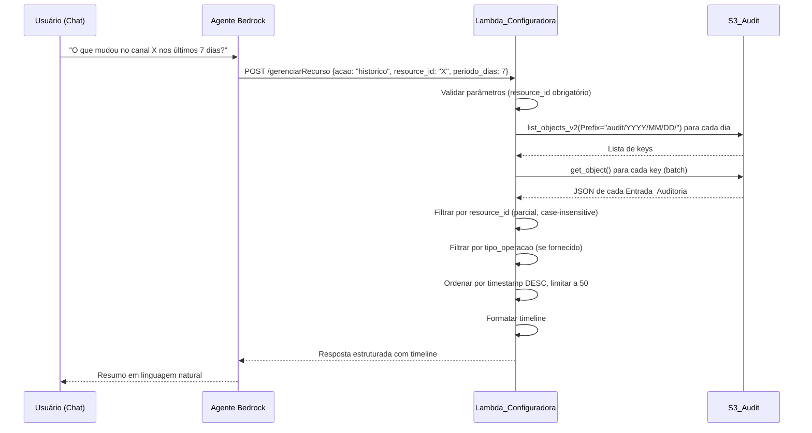

# Design — Histórico de Auditoria (audit-history)

## Visão Geral

Esta funcionalidade adiciona a capacidade de consultar o histórico de auditoria de recursos de streaming diretamente pelo chatbot. O sistema reutiliza o endpoint `/gerenciarRecurso` com uma nova ação `historico`, que aciona um módulo `Consultor_Historico` dentro da Lambda_Configuradora. Esse módulo lista objetos no S3_Audit, filtra por recurso e tipo de operação, e retorna uma timeline ordenada cronologicamente (mais recente primeiro).

A abordagem é minimalista: todo o código novo fica em `lambdas/configuradora/handler.py`, sem criar novos paths na OpenAPI (respeitando o limite de 9 paths do Bedrock Action Group). A única mudança de infraestrutura é adicionar `grant_read` no `audit_bucket` para a Lambda_Configuradora no CDK.

## Arquitetura



### Decisões de Design

1. **Sem novo path na OpenAPI**: Reutilizamos `/gerenciarRecurso` adicionando `historico` ao enum `acao`. Isso evita atingir o limite de 9 paths do Bedrock Action Group.

2. **Filtragem client-side**: Os logs são listados por prefixo de data no S3 e filtrados em memória na Lambda. Isso é viável porque o volume esperado é baixo (dezenas a centenas de logs por dia) e evita a necessidade de um banco de dados adicional.

3. **Busca parcial no resource_id**: A filtragem usa `in` case-insensitive, permitindo buscar por nome parcial (ex: "WARNER" encontra "0001_WARNER_CHANNEL"). Também busca dentro de `configuracao_json_aplicada` para cobrir casos onde o resource_id do log é um ID numérico mas o usuário busca por nome.

4. **Limite de 50 entradas**: Evita respostas excessivamente longas que ultrapassem limites do Bedrock Agent. O total real é informado ao usuário.

## Componentes e Interfaces

### 1. Roteamento no Handler (`handler.py`)

Dentro do bloco `if api_path == "/gerenciarRecurso"`, adicionar um novo branch para `acao == "historico"`:

```python
# --- HISTORICO ---
if acao == "historico":
    if not resource_id:
        return _bedrock_response(event, 400, {
            "erro": "Para acao=historico, parâmetro obrigatório: resource_id",
        })
    periodo_dias = int(parameters.get("periodo_dias", 7))
    tipo_operacao = parameters.get("tipo_operacao", "")
    try:
        result = consultar_historico(resource_id, periodo_dias, tipo_operacao)
        return _bedrock_response(event, 200, result)
    except ClientError as exc:
        code = exc.response["Error"].get("Code", "")
        msg = exc.response["Error"].get("Message", "")
        return _bedrock_response(event, 500, {
            "erro": f"Erro ao acessar logs de auditoria: [{code}] {msg}",
        })
```

### 2. Módulo Consultor_Historico (`handler.py`)

Três funções principais:

#### `listar_audit_keys(periodo_dias: int) -> list[str]`
- Calcula os prefixos de data para os últimos N dias
- Usa `list_objects_v2` com paginação (continuation token) para cada prefixo
- Retorna lista de S3 keys

#### `carregar_entradas_auditoria(keys: list[str]) -> list[dict]`
- Faz `get_object` para cada key
- Parseia o JSON de cada objeto
- Retorna lista de dicts (Entrada_Auditoria)

#### `consultar_historico(resource_id: str, periodo_dias: int, tipo_operacao: str) -> dict`
- Orquestra a consulta completa:
  1. Lista keys via `listar_audit_keys`
  2. Carrega entradas via `carregar_entradas_auditoria`
  3. Filtra por `resource_id` (parcial, case-insensitive) — busca em `resource_id` e em campos de nome dentro de `configuracao_json_aplicada`
  4. Filtra por `tipo_operacao` se fornecido
  5. Ordena por `timestamp` DESC
  6. Limita a 50 entradas
  7. Formata cada entrada para a timeline
- Retorna dict com: `mensagem`, `recurso`, `periodo`, `total_encontrado`, `timeline`

#### `formatar_entrada_timeline(entrada: dict) -> dict`
- Converte timestamp ISO para formato pt-BR legível
- Extrai campos relevantes: `data_hora`, `operacao`, `servico`, `recurso`, `resultado`, `usuario`, `detalhes`
- Inclui `erro` se `resultado == "falha"`
- Inclui `rollback` se `rollback_info` não for nulo

### 3. Atualização da OpenAPI (`openapi-config-v2.json`)

- Adicionar `"historico"` ao enum `acao` em `/gerenciarRecurso`
- Adicionar parâmetros `periodo_dias` (integer, default 7) e `tipo_operacao` (string, opcional)
- Atualizar description para incluir a ação historico

### 4. Atualização CDK (`stacks/main_stack.py`)

- Adicionar `audit_bucket.grant_read(configuradora_fn)` após o `grant_put` existente

## Modelos de Dados

### Entrada_Auditoria (existente no S3)

```json
{
  "timestamp": "2025-01-15T14:30:00+00:00",
  "usuario_id": "bedrock-agent",
  "tipo_operacao": "modificacao",
  "servico_aws": "MediaLive",
  "tipo_recurso": "channel",
  "resource_id": "1020856",
  "configuracao_json_aplicada": { "...campos alterados..." },
  "resultado": "sucesso",
  "erro": null,
  "rollback_info": null
}
```

### Chave S3 do Audit Log

Formato: `audit/YYYY/MM/DD/YYYYMMDDTHHMMSSz-{operation_id}.json`

Exemplo: `audit/2025/01/15/20250115T143000Z-a1b2c3d4e5f6.json`

### Entrada_Timeline (saída formatada)

```json
{
  "data_hora": "15/01/2025 14:30:00 UTC",
  "operacao": "modificacao",
  "servico": "MediaLive",
  "recurso": "1020856",
  "resultado": "sucesso",
  "usuario": "bedrock-agent",
  "detalhes": "Alteração em channel: EncoderSettings.VideoDescriptions..."
}
```

### Resposta da Consulta

```json
{
  "mensagem": "Encontradas 12 alterações para '1020856' nos últimos 7 dias.",
  "recurso": "1020856",
  "periodo": "últimos 7 dias",
  "total_encontrado": 12,
  "timeline": [ "...lista de Entrada_Timeline..." ]
}
```

### Resposta Vazia

```json
{
  "mensagem": "Nenhuma alteração encontrada para 'CANAL_XYZ' nos últimos 7 dias.",
  "recurso": "CANAL_XYZ",
  "periodo": "últimos 7 dias",
  "total_encontrado": 0,
  "timeline": []
}
```

### Resposta Truncada (>50 entradas)

```json
{
  "mensagem": "Exibindo as 50 alterações mais recentes de 127 encontradas para '1020856' nos últimos 30 dias.",
  "recurso": "1020856",
  "periodo": "últimos 30 dias",
  "total_encontrado": 127,
  "timeline": [ "...50 entradas..." ]
}
```


## Propriedades de Corretude

*Uma propriedade é uma característica ou comportamento que deve ser verdadeiro em todas as execuções válidas de um sistema — essencialmente, uma declaração formal sobre o que o sistema deve fazer. Propriedades servem como ponte entre especificações legíveis por humanos e garantias de corretude verificáveis por máquina.*

### Propriedade 1: Geração de prefixos de data

*Para qualquer* valor inteiro positivo N de `periodo_dias`, a função `listar_audit_keys` SHALL gerar exatamente N prefixos de data no formato `audit/YYYY/MM/DD/`, cobrindo os últimos N dias (inclusive o dia atual), sem duplicatas e sem lacunas.

**Valida: Requisitos 2.1**

### Propriedade 2: Filtragem por recurso

*Para qualquer* conjunto de Entrada_Auditoria e qualquer string de filtro `resource_id`, todas as entradas retornadas pela filtragem SHALL conter o valor do filtro (case-insensitive) no campo `resource_id` da entrada OU em algum campo de nome (`Name`, `Id`, `ChannelName`, `nome_canal`) dentro de `configuracao_json_aplicada`. Nenhuma entrada que não satisfaça nenhuma dessas condições SHALL aparecer no resultado.

**Valida: Requisitos 3.1, 3.2**

### Propriedade 3: Filtragem por tipo de operação

*Para qualquer* conjunto de Entrada_Auditoria e qualquer valor de `tipo_operacao`, quando o filtro for fornecido, todas as entradas retornadas SHALL ter `tipo_operacao` correspondente (case-insensitive). Quando o filtro não for fornecido (string vazia), todas as entradas que passaram no filtro de recurso SHALL ser retornadas sem filtragem adicional.

**Valida: Requisitos 4.1, 4.2**

### Propriedade 4: Ordenação cronológica reversa

*Para qualquer* conjunto de Entrada_Auditoria retornado pela consulta, a lista SHALL estar ordenada pelo campo `timestamp` em ordem decrescente — ou seja, para todo par consecutivo de entradas (i, i+1) na timeline, `timestamp[i] >= timestamp[i+1]`.

**Valida: Requisitos 5.1**

### Propriedade 5: Formatação completa das entradas

*Para qualquer* Entrada_Auditoria válida, a saída de `formatar_entrada_timeline` SHALL conter os campos `data_hora`, `operacao`, `servico`, `recurso`, `resultado`, `usuario` e `detalhes`. Adicionalmente, se `resultado == "falha"` e `erro` não for nulo, o campo `erro` SHALL estar presente na saída. Se `rollback_info` não for nulo, o campo `rollback` SHALL estar presente na saída.

**Valida: Requisitos 5.2, 6.2, 6.3**

### Propriedade 6: Truncamento e contagem total

*Para qualquer* conjunto de Entrada_Auditoria filtrado, a timeline retornada SHALL conter no máximo 50 entradas. O campo `total_encontrado` SHALL ser igual ao número total de entradas que passaram nos filtros (antes do truncamento). Quando `total_encontrado > 50`, a mensagem SHALL conter o texto "Exibindo as 50 alterações mais recentes de {total} encontradas".

**Valida: Requisitos 5.3, 5.4**

## Tratamento de Erros

| Cenário | Código | Mensagem |
|---------|--------|----------|
| `acao=historico` sem `resource_id` | 400 | "Para acao=historico, parâmetro obrigatório: resource_id" |
| Erro de acesso ao S3_Audit | 500 | "Erro ao acessar logs de auditoria: [{code}] {msg}" |
| Nenhuma entrada encontrada | 200 | "Nenhuma alteração encontrada para '{resource_id}' nos últimos {periodo_dias} dias." |
| JSON de audit log corrompido | — | Log de warning, entrada ignorada (skip silencioso) |
| `periodo_dias` inválido (≤0) | 400 | "periodo_dias deve ser um inteiro positivo" |

## Estratégia de Testes

### Testes Unitários (pytest)

- Validação de parâmetros: `resource_id` ausente retorna 400
- Default de `periodo_dias` = 7 quando não fornecido
- Resposta vazia quando nenhuma entrada corresponde ao filtro
- Erro 500 quando S3 retorna `ClientError`
- JSON corrompido no S3 é ignorado sem quebrar a consulta
- Entradas com `resultado=falha` incluem campo `erro`
- Entradas com `rollback_info` incluem campo `rollback`

### Testes de Propriedade (Hypothesis)

Biblioteca: **Hypothesis** (Python)

Cada teste de propriedade deve rodar no mínimo 100 iterações e referenciar a propriedade do design:

- **Feature: audit-history, Property 1**: Geração de prefixos de data — gerar `periodo_dias` aleatório (1-365), verificar quantidade e formato dos prefixos
- **Feature: audit-history, Property 2**: Filtragem por recurso — gerar entradas aleatórias e filtros, verificar que todas as entradas retornadas satisfazem o critério de match
- **Feature: audit-history, Property 3**: Filtragem por tipo de operação — gerar entradas com tipos variados, verificar filtragem correta
- **Feature: audit-history, Property 4**: Ordenação cronológica — gerar entradas com timestamps aleatórios, verificar que a saída está ordenada DESC
- **Feature: audit-history, Property 5**: Formatação completa — gerar entradas aleatórias (com/sem erro, com/sem rollback), verificar presença de todos os campos obrigatórios e condicionais
- **Feature: audit-history, Property 6**: Truncamento — gerar listas de tamanho variável (0-200), verificar que timeline ≤ 50 e `total_encontrado` é correto

### Testes de Integração

- Verificar que `grant_read` está presente no CDK para o `audit_bucket`
- Verificar que a OpenAPI contém `historico` no enum `acao`
- Teste end-to-end com S3 mockado (moto) para o fluxo completo de consulta

### Configuração dos Testes de Propriedade

```python
from hypothesis import given, settings, strategies as st

@settings(max_examples=100)
@given(...)
def test_property_N(...):
    # Feature: audit-history, Property N: <título>
    ...
```
