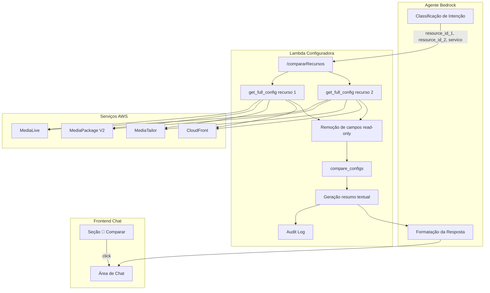

# Documento de Design — Comparação de Canais

## Visão Geral

Este design descreve a adição de um endpoint `/compararRecursos` à Lambda_Configuradora que permite comparar lado a lado as configurações de dois recursos de streaming. O endpoint recebe dois identificadores de recurso (nomes parciais ou IDs numéricos), busca a configuração completa de ambos via `get_full_config()`, executa uma comparação recursiva campo a campo e retorna uma `Comparação_Estruturada` com campos iguais, diferentes e exclusivos.

A solução reutiliza toda a infraestrutura existente: busca fuzzy (`_resolve_medialive_channel`, `_resolve_mediatailor_config`, `_resolve_mpv2_channel`), remoção de campos read-only (`_strip_keys`, `_ML_STRIP_FIELDS`), formato de resposta Bedrock (`_bedrock_response`), e auditoria (`build_audit_log`, `store_audit_log`). O novo path é adicionado ao schema OpenAPI do Action_Group_Config (de 6 para 7 paths, dentro do limite de 9).

### Decisões de Design

1. **Função pura de comparação**: O algoritmo `compare_configs(dict, dict)` é uma função pura sem side effects — recebe dois dicts e retorna a estrutura de diferenças. Isso facilita testes unitários e property-based testing.
2. **Reutilização de `get_full_config()`**: Ambos os recursos são buscados pela mesma função existente, garantindo consistência com o endpoint `/obterConfiguracao`.
3. **Campos ignorados configuráveis**: Um set `_COMPARISON_IGNORE_FIELDS` define campos de metadados read-only a serem excluídos da comparação (Arn, Id, State, Tags, ResponseMetadata, etc.), similar ao padrão `_ML_STRIP_FIELDS`.
4. **Comparação de listas por índice**: Listas são comparadas elemento a elemento por posição (índice), não por conteúdo. Isso é consistente com a estrutura dos JSONs da AWS onde a ordem dos elementos em arrays como `VideoDescriptions`, `AudioDescriptions` e `OutputGroups` é significativa.
5. **Limite de 50 diferenças**: Para evitar respostas excessivamente longas que excedam limites de token do Bedrock, apenas os 50 campos mais relevantes são incluídos quando há muitas diferenças.
6. **Resumo textual por categoria**: O campo `resumo_textual` agrupa diferenças por categoria (vídeo, áudio, legendas, outputs, inputs, DRM, failover, rede) para facilitar a leitura pelo operador de NOC.
7. **Serviço padrão MediaLive/channel**: Quando `servico` não é fornecido, assume-se MediaLive channel, que é o caso de uso mais comum.

## Arquitetura



### Fluxo de Comparação

1. Usuário envia mensagem com intenção de comparação (ex: "compare o canal WARNER com o ESPN")
2. Agente Bedrock classifica a intenção e extrai `resource_id_1`, `resource_id_2` e `servico`
3. Lambda recebe requisição no path `/compararRecursos`
4. Para cada recurso: chama `get_full_config()` com busca fuzzy
5. Se algum recurso retorna `multiplos_resultados`, retorna candidatos para desambiguação
6. Remove campos read-only de ambas as configurações
7. Executa `compare_configs()` — comparação recursiva campo a campo
8. Gera `resumo_textual` agrupado por categoria
9. Aplica limite de 50 diferenças se necessário
10. Registra audit log e retorna `Comparação_Estruturada`

## Componentes e Interfaces

### 1. Função `compare_configs(config_a, config_b, path="")`

Função pura recursiva que compara dois dicts aninhados.

```python
def compare_configs(
    config_a: dict[str, Any],
    config_b: dict[str, Any],
    path: str = "",
) -> dict[str, Any]:
    """Compara recursivamente dois dicts de configuração.

    Returns:
        {
            "campos_iguais": ["path.to.field", ...],
            "campos_diferentes": [
                {"campo": "path.to.field", "valor_1": ..., "valor_2": ...},
                ...
            ],
            "campos_exclusivos": [
                {"campo": "path.to.field", "presente_em": "recurso_1"},
                ...
            ],
        }
    """
```

**Regras de recursão:**
- Se ambos os valores são `dict`: recursa com path atualizado
- Se ambos os valores são `list`: compara por índice, recursa em elementos dict
- Se valores escalares iguais: adiciona a `campos_iguais`
- Se valores escalares diferentes: adiciona a `campos_diferentes`
- Se chave existe em apenas um: adiciona a `campos_exclusivos`

### 2. Função `_build_comparison_summary(result, name_1, name_2)`

Gera o `resumo_textual` em português agrupando diferenças por categoria.

```python
CATEGORY_PREFIXES = {
    "vídeo": ["EncoderSettings.VideoDescriptions", "Width", "Height", "Bitrate", "Codec"],
    "áudio": ["EncoderSettings.AudioDescriptions", "AudioSelector"],
    "legendas": ["CaptionDescriptions", "CaptionSelector", "DvbSub"],
    "outputs": ["EncoderSettings.OutputGroups", "OutputGroup", "Destination"],
    "inputs": ["InputAttachments", "InputSpecification", "InputSettings"],
    "drm": ["Encryption", "SpekeKeyProvider", "DrmSystems"],
    "failover": ["AutomaticInputFailoverSettings", "Failover"],
    "rede": ["Vpc", "SecurityGroup", "Subnet"],
}
```

### 3. Função `_strip_comparison_fields(config)`

Remove campos de metadados read-only antes da comparação.

```python
_COMPARISON_IGNORE_FIELDS = {
    "Arn", "Id", "ChannelId", "State", "Tags",
    "ResponseMetadata", "PipelinesRunningCount",
    "EgressEndpoints", "Maintenance", "ETag",
    "CreatedAt", "ModifiedAt",
}
```

### 4. Rota no Handler

Novo bloco `if api_path == "/compararRecursos":` no `handler()`, seguindo o padrão existente.

```python
if api_path == "/compararRecursos":
    resource_id_1 = parameters.get("resource_id_1", "")
    resource_id_2 = parameters.get("resource_id_2", "")
    servico = parameters.get("servico", "") or "MediaLive"
    tipo_recurso = parameters.get("tipo_recurso", "") or "channel"
    # ... fetch, compare, return
```

### 5. Schema OpenAPI — novo path `/compararRecursos`

Adicionado ao `openapi-config-v2.json` com parâmetros `resource_id_1`, `resource_id_2`, `servico` (opcional) e `tipo_recurso` (opcional).

### 6. Prompt do Agente Bedrock

Nova rota de prioridade no prompt com palavras-chave: "comparar", "compare", "diferença entre", "diff", "versus", "vs".

### 7. Frontend — Seção de Sugestões

Nova seção `🔀 Comparar` na sidebar do `chat.html` com botões de sugestão.

## Modelos de Dados

### Entrada — Parâmetros da Requisição

```json
{
    "resource_id_1": "WARNER",
    "resource_id_2": "ESPN",
    "servico": "MediaLive",
    "tipo_recurso": "channel"
}
```

### Saída — Comparação_Estruturada

```json
{
    "recurso_1": "0001_WARNER_CHANNEL",
    "recurso_2": "0002_ESPN_CHANNEL",
    "servico": "MediaLive",
    "tipo_recurso": "channel",
    "total_campos_iguais": 42,
    "total_campos_diferentes": 8,
    "total_campos_exclusivos": 3,
    "campos_iguais": [
        "EncoderSettings.VideoDescriptions[0].CodecSettings.H264Settings.Profile"
    ],
    "campos_diferentes": [
        {
            "campo": "EncoderSettings.VideoDescriptions[0].CodecSettings.H264Settings.Bitrate",
            "valor_recurso_1": 5000000,
            "valor_recurso_2": 3000000
        }
    ],
    "campos_exclusivos": [
        {
            "campo": "EncoderSettings.CaptionDescriptions",
            "presente_em": "recurso_1"
        }
    ],
    "resumo_textual": "Diferenças encontradas entre 0001_WARNER_CHANNEL e 0002_ESPN_CHANNEL:\n\n**Vídeo**: Bitrate diferente (5000000 vs 3000000), Resolução diferente (1920x1080 vs 1280x720)\n**Áudio**: Canal WARNER tem 3 áudios, ESPN tem 2\n**Legendas**: Canal WARNER possui legendas DVB_SUB, ESPN não possui"
}
```

### Resposta de Desambiguação

Quando um dos recursos retorna múltiplos candidatos:

```json
{
    "multiplos_resultados": true,
    "recurso_ambiguo": "recurso_1",
    "mensagem": "Encontrei 3 canais com 'WARNER' no nome. Qual deles usar na comparação?",
    "candidatos": [
        {"channel_id": "1234", "nome": "0001_WARNER_CHANNEL", "estado": "RUNNING"},
        {"channel_id": "5678", "nome": "0001_WARNER_CHANNEL_BACKUP", "estado": "IDLE"}
    ]
}
```

### Resposta de Erro — Serviços Incompatíveis

```json
{
    "erro": "Não é possível comparar recursos de tipos diferentes. Recurso 1 é MediaLive/channel e Recurso 2 é MediaPackage/origin_endpoint."
}
```


## Propriedades de Corretude

*Uma propriedade é uma característica ou comportamento que deve ser verdadeiro em todas as execuções válidas de um sistema — essencialmente, uma declaração formal sobre o que o sistema deve fazer. Propriedades servem como ponte entre especificações legíveis por humanos e garantias de corretude verificáveis por máquina.*

### Propriedade 1: Particionamento completo dos campos

*Para quaisquer* dois dicionários de configuração `config_a` e `config_b`, após executar `compare_configs(config_a, config_b)`, todo caminho de campo folha presente em `config_a` ou `config_b` SHALL aparecer em exatamente uma das três categorias de saída: `campos_iguais`, `campos_diferentes` ou `campos_exclusivos`. Nenhum campo deve ser omitido e nenhum campo deve aparecer em mais de uma categoria.

**Validates: Requirements 1.2, 2.1, 2.2, 2.3, 2.4, 2.5**

### Propriedade 2: Exclusão de campos ignorados

*Para qualquer* dicionário de configuração que contenha campos presentes em `_COMPARISON_IGNORE_FIELDS` (Arn, Id, State, Tags, ResponseMetadata, etc.), após a remoção desses campos e execução da comparação, nenhum dos campos ignorados SHALL aparecer em qualquer categoria da saída (`campos_iguais`, `campos_diferentes` ou `campos_exclusivos`).

**Validates: Requirements 2.6**

### Propriedade 3: Consistência estrutural dos contadores

*Para quaisquer* dois dicionários de configuração, a resposta da comparação SHALL ter `total_campos_iguais` igual ao comprimento da lista `campos_iguais`, `total_campos_diferentes` igual ao comprimento da lista `campos_diferentes` (ou ao total real quando truncado), e `total_campos_exclusivos` igual ao comprimento da lista `campos_exclusivos`.

**Validates: Requirements 5.1, 5.2**

### Propriedade 4: Truncamento a 50 diferenças

*Para quaisquer* dois dicionários de configuração que produzam mais de 50 campos diferentes, a lista `campos_diferentes` na resposta SHALL conter no máximo 50 entradas, e o campo `total_campos_diferentes` SHALL refletir o número real (não truncado) de diferenças encontradas.

**Validates: Requirements 5.3**

## Tratamento de Erros

| Cenário | Comportamento | Código HTTP |
|---------|--------------|-------------|
| `resource_id_1` ou `resource_id_2` ausente | Retorna erro com mensagem de parâmetros obrigatórios | 400 |
| Recurso não encontrado (ValueError de `get_full_config`) | Retorna erro indicando qual recurso não foi encontrado | 400 |
| Múltiplos candidatos para um recurso | Retorna `multiplos_resultados: true` com candidatos e indicação de qual recurso precisa desambiguação | 200 |
| Erro AWS (ClientError) ao buscar configuração | Retorna erro com código AWS e indicação de qual recurso falhou | 500 |
| Tipos de recurso incompatíveis | Retorna erro informando que apenas recursos do mesmo serviço/tipo podem ser comparados | 400 |
| Mais de 50 diferenças | Trunca `campos_diferentes` a 50 entradas, mantém total real no contador | 200 |

Todos os erros e operações bem-sucedidas são registrados via `build_audit_log()` + `store_audit_log()` no S3_Audit, seguindo o padrão existente.

## Estratégia de Testes

### Testes Property-Based (Hypothesis)

A função `compare_configs()` é uma função pura ideal para property-based testing. Usaremos a biblioteca **Hypothesis** (já utilizada no projeto — ver `tests/test_property_metrics_resilience.py` e diretório `.hypothesis/`).

**Configuração**: Mínimo de 100 iterações por propriedade.

| Propriedade | Descrição | Tag |
|-------------|-----------|-----|
| 1 | Particionamento completo dos campos | `Feature: channel-comparison, Property 1: Complete field partitioning` |
| 2 | Exclusão de campos ignorados | `Feature: channel-comparison, Property 2: Ignored fields exclusion` |
| 3 | Consistência estrutural dos contadores | `Feature: channel-comparison, Property 3: Structural counter consistency` |
| 4 | Truncamento a 50 diferenças | `Feature: channel-comparison, Property 4: Truncation at 50 differences` |

**Estratégias de geração (Hypothesis strategies)**:
- `st.recursive()` para gerar dicts aninhados com profundidade variável
- `st.dictionaries()` com chaves string e valores escalares (int, float, str, bool, None)
- `st.lists()` para gerar listas de elementos mistos
- Estratégia customizada para injetar campos de `_COMPARISON_IGNORE_FIELDS` em dicts gerados

### Testes Unitários (pytest)

Testes de exemplo e edge cases para cenários específicos:

- **Defaults**: Verificar que `servico` vazio assume `MediaLive`/`channel`
- **Desambiguação**: Mock `get_full_config` retornando `multiplos_resultados` para um recurso
- **Erro AWS**: Mock `get_full_config` levantando `ClientError`
- **Tipos incompatíveis**: Tentar comparar MediaLive/channel com MediaPackage/origin_endpoint
- **Dicts idênticos**: Verificar que `campos_diferentes` e `campos_exclusivos` estão vazios
- **Dicts completamente diferentes**: Verificar que `campos_iguais` está vazio
- **Listas de tamanhos diferentes**: Verificar que elementos extras aparecem em `campos_exclusivos`
- **Serviços suportados**: Testar cada combinação serviço/tipo_recurso

### Testes de Integração

- Verificar que o schema OpenAPI contém `/compararRecursos` com parâmetros corretos
- Verificar que o total de paths no schema não excede 9
- Teste end-to-end com mocks AWS para o fluxo completo handler → compare → response
