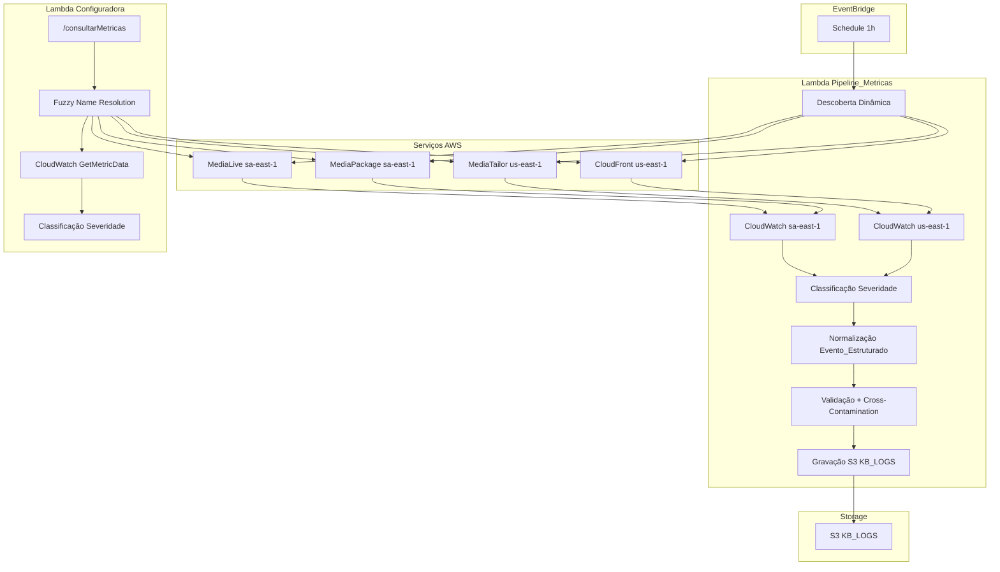

# Documento de Design — Ingestão de Métricas CloudWatch

## Visão Geral

Este design descreve a transformação da Lambda `Pipeline_Logs` (que atualmente tenta ler CloudWatch Logs inexistentes) em um `Pipeline_Metricas` que coleta métricas numéricas do CloudWatch para os quatro serviços de streaming: MediaLive, MediaPackage V2, MediaTailor e CloudFront. Adicionalmente, a Lambda `Configuradora` ganha um novo endpoint `/consultarMetricas` para consultas sob demanda via chat.

A solução mantém o formato `Evento_Estruturado` existente, reutiliza os módulos `validators.py` e `normalizers.py`, e armazena eventos no bucket `KB_LOGS` para consumo pelo RAG e pela `Exportadora`.

### Decisões de Design

1. **Substituição in-place**: O handler `lambdas/pipeline_logs/handler.py` é reescrito completamente — não criamos uma nova Lambda. O CDK atualiza apenas permissões e variáveis de ambiente.
2. **Descoberta dinâmica**: Recursos são listados via APIs AWS antes de cada coleta. Nenhum ID é hardcoded.
3. **Cross-region com clientes separados**: Dois clientes CloudWatch — um para `sa-east-1` (MediaLive, MediaPackage) e outro para `us-east-1` (MediaTailor, CloudFront).
4. **Thresholds em dicionário Python**: Configuração de severidade fica no código-fonte como constante, sem dependência de banco ou SSM.
5. **Resiliência por serviço e por recurso**: Falha em um serviço ou recurso individual não interrompe a coleta dos demais.
6. **Reutilização de fuzzy resolution**: O endpoint `/consultarMetricas` reutiliza `_resolve_medialive_channel`, `_resolve_mpv2_channel`, `_resolve_mediatailor_config` e a lógica de múltiplos candidatos já existente na Configuradora.

## Arquitetura



### Fluxo do Pipeline (EventBridge → S3)

1. EventBridge dispara a Lambda a cada 1 hora
2. **Descoberta**: Lista recursos ativos de cada serviço (clientes regionais separados)
3. **Coleta**: Para cada recurso, chama `GetMetricData` com as métricas definidas, período de 1h, granularidade 300s
4. **Classificação**: Aplica thresholds de severidade a cada data point
5. **Normalização**: Gera `Evento_Estruturado` com campos obrigatórios + contexto de métrica
6. **Validação**: `validate_evento_estruturado()` + `detect_cross_contamination()`
7. **Armazenamento**: Grava JSON individual no S3 `KB_LOGS`

### Fluxo On-Demand (Chat → Configuradora)

1. Bedrock Agent aciona Action Group com `/consultarMetricas`
2. Configuradora resolve o `resource_id` via fuzzy search existente
3. Consulta `GetMetricData` em tempo real com período e granularidade do usuário
4. Classifica severidade e retorna resumo compacto no formato `_bedrock_response`

## Componentes e Interfaces

### 1. Pipeline_Metricas (`lambdas/pipeline_logs/handler.py`)

Reescrita completa do handler existente. Mantém o mesmo path de deploy no CDK.

#### Funções Públicas

| Função | Entrada | Saída | Descrição |
|--------|---------|-------|-----------|
| `handler(event, context)` | EventBridge event | `dict` com resumo de execução | Entry point da Lambda |
| `discover_resources()` | — | `dict[str, list]` com recursos por serviço | Lista recursos ativos via APIs |
| `collect_metrics(service, resources)` | serviço + lista de recursos | `list[dict]` métricas brutas | Consulta CloudWatch GetMetricData |
| `classify_severity(metric_name, value, service)` | nome da métrica, valor, serviço | `tuple[str, str]` (severidade, tipo_erro) | Aplica thresholds |
| `build_evento_estruturado(metric_data, resource_info, severity_info)` | dados da métrica + info do recurso + classificação | `dict` Evento_Estruturado | Normaliza para formato padrão |

#### Constantes

```python
# Thresholds de severidade por serviço e métrica
SEVERITY_THRESHOLDS = {
    "MediaLive": {
        "ActiveAlerts": [
            (lambda v: v > 0, "ERROR", "ALERTA_ATIVO"),
        ],
        "InputLossSeconds": [
            (lambda v: v > 0, "WARNING", "INPUT_LOSS"),
        ],
        "DroppedFrames": [
            (lambda v: v > 0, "WARNING", "FRAMES_PERDIDOS"),
        ],
        "Output4xxErrors": [
            (lambda v: v > 0, "ERROR", "OUTPUT_ERROR"),
        ],
        "Output5xxErrors": [
            (lambda v: v > 0, "ERROR", "OUTPUT_ERROR"),
        ],
        "PrimaryInputActive": [
            (lambda v: v == 0, "CRITICAL", "FAILOVER_DETECTADO"),
        ],
        # ...
    },
    "MediaPackage": { ... },
    "MediaTailor": { ... },
    "CloudFront": { ... },
}

# Métricas por serviço com estatísticas apropriadas
METRICS_CONFIG = {
    "MediaLive": {
        "namespace": "AWS/MediaLive",
        "region": "sa-east-1",
        "metrics": [
            ("ActiveAlerts", "Maximum"),
            ("InputLossSeconds", "Sum"),
            ("InputVideoFrameRate", "Average"),
            ("DroppedFrames", "Sum"),
            ("FillMsec", "Sum"),
            ("NetworkIn", "Sum"),
            ("NetworkOut", "Sum"),
            ("Output4xxErrors", "Sum"),
            ("Output5xxErrors", "Sum"),
            ("PrimaryInputActive", "Minimum"),
            ("ChannelInputErrorSeconds", "Sum"),
            ("RtpPacketsLost", "Sum"),
        ],
    },
    # ... MediaPackage, MediaTailor, CloudFront
}
```


#### Descrições e Recomendações por Tipo de Erro

```python
ENRICHMENT_MAP = {
    "ALERTA_ATIVO": {
        "descricao_template": "Canal {canal} possui {valor} alerta(s) ativo(s)",
        "causa_provavel": "Alerta ativo detectado via métrica ActiveAlerts",
        "recomendacao": "Verificar alertas no console MediaLive e resolver a causa raiz",
    },
    "INPUT_LOSS": {
        "descricao_template": "Canal {canal} apresentou {valor}s de perda de input nos últimos {periodo} minutos",
        "causa_provavel": "Perda de sinal de entrada detectada via métrica InputLossSeconds",
        "recomendacao": "Verificar fonte de entrada e conectividade de rede do canal",
    },
    "FRAMES_PERDIDOS": {
        "descricao_template": "Canal {canal} perdeu {valor} frames nos últimos {periodo} minutos",
        "causa_provavel": "Frames descartados detectados via métrica DroppedFrames",
        "recomendacao": "Verificar capacidade de processamento e bitrate de entrada",
    },
    "OUTPUT_ERROR": {
        "descricao_template": "Canal {canal} apresentou {valor} erros de output ({metrica})",
        "causa_provavel": "Erros HTTP na saída do canal detectados via métricas Output4xx/5xxErrors",
        "recomendacao": "Verificar destino de output e configuração de empacotamento",
    },
    "FAILOVER_DETECTADO": {
        "descricao_template": "Canal {canal} está operando em pipeline secundário (failover ativo)",
        "causa_provavel": "Pipeline primário inativo detectado via métrica PrimaryInputActive=0",
        "recomendacao": "Investigar pipeline primário imediatamente — verificar input e encoder",
    },
    "EGRESS_5XX": {
        "descricao_template": "Canal {canal} apresentou {valor} erros 5xx no egress do MediaPackage",
        "causa_provavel": "Erros de servidor no empacotamento/distribuição",
        "recomendacao": "Verificar saúde do origin endpoint e logs do MediaPackage",
    },
    "EGRESS_4XX": {
        "descricao_template": "Canal {canal} apresentou {valor} erros 4xx no egress do MediaPackage",
        "causa_provavel": "Requisições inválidas no egress do MediaPackage",
        "recomendacao": "Verificar configuração de endpoints e permissões de acesso",
    },
    "LATENCIA_ALTA": {
        "descricao_template": "Canal {canal} com latência média de {valor}ms no egress",
        "causa_provavel": "Tempo de resposta elevado no MediaPackage",
        "recomendacao": "Verificar carga do endpoint e configuração de segmentos",
    },
    "INGESTAO_PARADA": {
        "descricao_template": "Canal {canal} sem bytes de ingestão por mais de um período consecutivo",
        "causa_provavel": "Nenhum dado sendo ingerido pelo MediaPackage",
        "recomendacao": "Verificar se o canal MediaLive está transmitindo para o endpoint de ingestão",
    },
    "AD_SERVER_ERROR": {
        "descricao_template": "Configuração {canal} apresentou {valor} erros no ad decision server",
        "causa_provavel": "Falhas na comunicação com o servidor de decisão de anúncios",
        "recomendacao": "Verificar URL e disponibilidade do ad decision server",
    },
    "AD_SERVER_TIMEOUT": {
        "descricao_template": "Configuração {canal} apresentou {valor} timeouts no ad decision server",
        "causa_provavel": "Servidor de anúncios não respondendo dentro do tempo limite",
        "recomendacao": "Verificar latência do ad server e considerar aumentar timeout",
    },
    "FILL_RATE_BAIXO": {
        "descricao_template": "Configuração {canal} com fill rate de {valor}% (abaixo de 80%)",
        "causa_provavel": "Taxa de preenchimento de avails abaixo do esperado",
        "recomendacao": "Verificar inventário de anúncios e configuração de avails",
    },
    "FILL_RATE_CRITICO": {
        "descricao_template": "Configuração {canal} com fill rate de {valor}% (abaixo de 50%)",
        "causa_provavel": "Taxa de preenchimento de avails criticamente baixa",
        "recomendacao": "Ação imediata: verificar ad server, inventário e configuração de slate",
    },
    "CDN_5XX_ALTO": {
        "descricao_template": "Distribuição {canal} com taxa de erros 5xx de {valor}% (acima de 5%)",
        "causa_provavel": "Taxa elevada de erros de servidor na CDN",
        "recomendacao": "Verificar saúde das origins e configuração do CloudFront",
    },
    "CDN_4XX_ALTO": {
        "descricao_template": "Distribuição {canal} com taxa de erros 4xx de {valor}% (acima de 10%)",
        "causa_provavel": "Taxa elevada de erros de cliente na CDN",
        "recomendacao": "Verificar URLs de acesso e configuração de cache behaviors",
    },
    "CDN_ERROR_CRITICO": {
        "descricao_template": "Distribuição {canal} com taxa total de erros de {valor}% (acima de 15%)",
        "causa_provavel": "Taxa total de erros da CDN em nível crítico",
        "recomendacao": "Ação imediata: verificar origins, cache e configuração de distribuição",
    },
    "METRICAS_NORMAIS": {
        "descricao_template": "Recurso {canal} operando normalmente — todas as métricas dentro dos limites",
        "causa_provavel": "Nenhuma anomalia detectada",
        "recomendacao": "Nenhuma ação necessária",
    },
}
```

### 2. Endpoint `/consultarMetricas` (`lambdas/configuradora/handler.py`)

Novo bloco no handler existente, seguindo o padrão dos endpoints `/obterConfiguracao` e `/criarCanalOrquestrado`.

#### Interface

```python
# Parâmetros de entrada (via Bedrock Action Group)
{
    "servico": "MediaLive",           # obrigatório
    "resource_id": "Warner",          # obrigatório (fuzzy)
    "periodo_minutos": 60,            # opcional, default 60
    "granularidade_segundos": 300,    # opcional, default 300
    "metricas": ["ActiveAlerts", "InputLossSeconds"]  # opcional
}

# Resposta de sucesso (formato _bedrock_response)
{
    "mensagem": "Métricas do canal Warner_HD coletadas com sucesso",
    "recurso": "Warner_HD",
    "servico": "MediaLive",
    "periodo": "últimos 60 minutos",
    "resumo": {
        "severidade_geral": "WARNING",
        "alertas": [...],
        "metricas": {
            "ActiveAlerts": {"atual": 0, "max": 0, "media": 0},
            "InputLossSeconds": {"atual": 5.2, "max": 12.0, "media": 3.1},
            ...
        }
    }
}

# Resposta com múltiplos candidatos (mesmo padrão do obterConfiguracao)
{
    "multiplos_resultados": True,
    "mensagem": "Encontrei 3 canais com 'Warner' no nome. Qual deles?",
    "candidatos": [...]
}
```

### 3. CDK Stack (`stacks/main_stack.py`)

Alterações na seção "7. Pipeline Logs Lambda":

- **Permissões IAM**: Substituir `logs:*` por:
  - `cloudwatch:GetMetricData`, `cloudwatch:ListMetrics`
  - `medialive:ListChannels`, `medialive:DescribeChannel`
  - `mediapackagev2:ListChannelGroups`, `mediapackagev2:ListChannels`, `mediapackagev2:ListOriginEndpoints`
  - `mediatailor:ListPlaybackConfigurations`
  - `cloudfront:ListDistributions`
- **Variáveis de ambiente**: Adicionar `MEDIATAILOR_REGION=us-east-1`, `CLOUDFRONT_REGION=us-east-1`
- **Permissões Configuradora**: Adicionar `cloudwatch:GetMetricData`, `cloudwatch:ListMetrics` (para o endpoint on-demand)

### 4. OpenAPI Schema (Bedrock Agent)

Nova ação `consultarMetricas` no Action Group da Configuradora:

```yaml
/consultarMetricas:
  post:
    summary: Consulta métricas CloudWatch em tempo real para um recurso de streaming
    operationId: consultarMetricas
    requestBody:
      content:
        application/json:
          schema:
            type: object
            required: [servico, resource_id]
            properties:
              servico:
                type: string
                enum: [MediaLive, MediaPackage, MediaTailor, CloudFront]
              resource_id:
                type: string
                description: Nome parcial ou ID do recurso
              periodo_minutos:
                type: integer
                default: 60
              granularidade_segundos:
                type: integer
                default: 300
              metricas:
                type: array
                items:
                  type: string
```

## Modelos de Dados

### Evento_Estruturado (formato existente + campos de contexto de métrica)

```python
{
    # Campos obrigatórios existentes (validados por validate_evento_estruturado)
    "timestamp": "2024-01-15T14:30:00Z",       # ISO 8601 UTC — timestamp do data point
    "canal": "Warner_HD",                        # identificador do recurso
    "severidade": "WARNING",                     # INFO | WARNING | ERROR | CRITICAL
    "tipo_erro": "INPUT_LOSS",                   # classificação do evento
    "descricao": "Canal Warner_HD apresentou 15 segundos de perda de input nos últimos 5 minutos",
    "causa_provavel": "Perda de sinal de entrada detectada via métrica InputLossSeconds",
    "recomendacao_correcao": "Verificar fonte de entrada e conectividade de rede do canal",

    # Campo existente
    "servico_origem": "MediaLive",               # MediaLive | MediaPackage | MediaTailor | CloudFront

    # Campos adicionais de contexto de métrica (novos)
    "metrica_nome": "InputLossSeconds",
    "metrica_valor": 15.0,
    "metrica_unidade": "Seconds",
    "metrica_periodo": 300,
    "metrica_estatistica": "Sum"
}
```

### Resumo de Execução (retorno do handler)

```python
{
    "statusCode": 200,
    "body": {
        "total_eventos_armazenados": 42,
        "total_erros": 1,
        "total_rejeitados_validacao": 0,
        "total_rejeitados_contaminacao": 0,
        "servicos_processados": ["MediaLive", "MediaPackage", "MediaTailor", "CloudFront"],
        "erros": [
            {"service": "CloudFront", "resource_id": "E1234", "reason": "ThrottlingException"}
        ]
    }
}
```

### Resumo de Métricas On-Demand (retorno do `/consultarMetricas`)

```python
{
    "severidade_geral": "WARNING",   # maior severidade encontrada
    "alertas": [
        {
            "metrica": "InputLossSeconds",
            "valor": 15.0,
            "severidade": "WARNING",
            "tipo_erro": "INPUT_LOSS",
            "descricao": "15 segundos de perda de input"
        }
    ],
    "metricas": {
        "ActiveAlerts": {"atual": 0, "max": 0, "media": 0.0, "unidade": "Count"},
        "InputLossSeconds": {"atual": 5.2, "max": 15.0, "media": 3.1, "unidade": "Seconds"},
        # ...
    }
}
```

### Chave S3 para Armazenamento

```
{KB_LOGS_PREFIX}{servico}/{canal}_{timestamp_execucao}.json
```

Exemplo: `kb-logs/MediaLive/Warner_HD_20240115T143000Z.json`


## Propriedades de Corretude

*Uma propriedade é uma característica ou comportamento que deve ser verdadeiro em todas as execuções válidas de um sistema — essencialmente, uma declaração formal sobre o que o sistema deve fazer. Propriedades servem como ponte entre especificações legíveis por humanos e garantias de corretude verificáveis por máquina.*

### Propriedade 1: Classificação de severidade é correta para qualquer valor de métrica

*Para qualquer* combinação de (serviço, nome_métrica, valor_numérico), a função `classify_severity` SHALL retornar a tupla (severidade, tipo_erro) correta de acordo com as regras de threshold definidas, e quando um valor ultrapassar múltiplos thresholds, a severidade mais alta aplicável SHALL ser selecionada. A severidade retornada SHALL ser sempre um dos quatro valores válidos: INFO, WARNING, ERROR ou CRITICAL.

**Validates: Requirements 2.4, 2.5, 2.6, 2.7, 2.8, 2.9, 3.4, 3.5, 3.6, 3.7, 4.3, 4.4, 4.5, 4.6, 5.3, 5.4, 5.5, 5.6, 7.1, 7.4**

### Propriedade 2: Eventos normalizados passam na validação existente

*Para qualquer* dado de métrica válido (com serviço, canal, timestamp, nome de métrica, valor e estatística), a função `build_evento_estruturado` SHALL produzir um dicionário que passa na validação de `validate_evento_estruturado`, contendo todos os campos obrigatórios (timestamp ISO 8601, canal não-vazio, severidade válida, tipo_erro não-vazio, descricao não-vazia, causa_provavel, recomendacao_correcao) e o campo servico_origem com valor em {MediaLive, MediaPackage, MediaTailor, CloudFront}.

**Validates: Requirements 6.1, 6.2, 6.3, 6.4, 6.5, 6.6, 6.7, 6.8, 9.1, 9.3, 9.4, 9.5**

### Propriedade 3: Contagem de eventos por recurso é correta

*Para qualquer* conjunto de métricas de um recurso, o pipeline SHALL gerar exatamente um evento separado para cada métrica que ultrapassar um threshold, OU exatamente um único evento INFO consolidado quando nenhuma métrica ultrapassar thresholds. O número total de eventos gerados SHALL ser igual ao número de métricas anômalas, ou 1 se todas estiverem normais.

**Validates: Requirements 7.3, 7.5, 2.9, 5.6**

### Propriedade 4: Pipeline é resiliente a falhas parciais

*Para qualquer* subconjunto de serviços ou recursos que falhem durante a coleta, o pipeline SHALL continuar processando os serviços e recursos restantes, registrar cada erro no resultado, e o resumo final SHALL refletir corretamente o total de eventos armazenados e erros encontrados.

**Validates: Requirements 1.6, 11.1, 11.2, 11.4**

### Propriedade 5: Round-trip de serialização JSON preserva dados

*Para qualquer* Evento_Estruturado gerado pelo pipeline, serializar para JSON (com `ensure_ascii=False`) e desserializar de volta SHALL produzir um dicionário equivalente ao original. Campos numéricos (metrica_valor, metrica_periodo) SHALL ser serializados como números JSON (não strings), e caracteres Unicode em português SHALL ser preservados.

**Validates: Requirements 12.1, 12.2, 12.3, 12.4, 8.4**

### Propriedade 6: Formato da chave S3 é correto

*Para qualquer* combinação de (serviço, canal, timestamp_execução), a chave S3 gerada SHALL seguir o padrão `{KB_LOGS_PREFIX}{servico}/{canal}_{timestamp_execucao}.json`, onde servico é um dos quatro valores válidos e o timestamp está no formato `YYYYMMDDTHHMMSSz`.

**Validates: Requirements 8.2, 9.2**

### Propriedade 7: Resposta de consulta on-demand contém estrutura completa

*Para qualquer* resultado válido de consulta de métricas CloudWatch, o endpoint `/consultarMetricas` SHALL retornar um resumo contendo: severidade_geral (a maior severidade encontrada), lista de alertas (cada um com metrica, valor, severidade, tipo_erro, descricao), e dicionário de métricas (cada uma com atual, max, media, unidade).

**Validates: Requirements 13.5**

## Tratamento de Erros

### Erros de API AWS (Descoberta e Coleta)

| Cenário | Comportamento | Severidade do Log |
|---------|---------------|-------------------|
| `ListChannels` falha para um serviço | Registra erro, continua com demais serviços | ERROR |
| `GetMetricData` falha para um recurso | Registra erro, continua com próximo recurso | ERROR |
| `GetMetricData` retorna dados parciais | Processa dados disponíveis, registra aviso | WARNING |
| `TooManyRequestsException` (throttling) | Backoff exponencial (1s, 2s, 4s) com até 3 tentativas | WARNING → ERROR |
| `AccessDeniedException` | Registra erro com detalhes de permissão, continua | ERROR |

### Erros de Armazenamento S3

| Cenário | Comportamento | Severidade do Log |
|---------|---------------|-------------------|
| `PutObject` falha para um evento | Registra erro, continua com próximo evento | ERROR |
| Bucket não existe | Registra erro, todos os eventos falham | CRITICAL |

### Erros de Validação

| Cenário | Comportamento | Severidade do Log |
|---------|---------------|-------------------|
| `validate_evento_estruturado` rejeita evento | Incrementa contador `rejeitados_validacao`, não armazena | WARNING |
| `detect_cross_contamination` detecta contaminação | Incrementa contador `rejeitados_contaminacao`, não armazena | WARNING |

### Erros no Endpoint `/consultarMetricas`

| Cenário | HTTP Status | Resposta |
|---------|-------------|----------|
| Parâmetros obrigatórios ausentes (servico, resource_id) | 400 | `{"erro": "Parâmetros obrigatórios: servico, resource_id"}` |
| Recurso não encontrado (fuzzy search sem resultados) | 400 | `{"erro": "Nenhum canal encontrado com 'X' no nome"}` |
| Múltiplos candidatos | 200 | `{"multiplos_resultados": true, "candidatos": [...]}` |
| Serviço inválido | 400 | `{"erro": "Serviço inválido: 'X'. Válidos: [...]"}` |
| Erro AWS na consulta de métricas | 500 | `{"erro": "Erro AWS: [Code] Message"}` |

## Estratégia de Testes

### Abordagem Dual: Testes Unitários + Testes de Propriedade

A estratégia combina testes unitários para cenários específicos e edge cases com testes de propriedade (PBT) para verificar propriedades universais com cobertura ampla de inputs.

### Testes de Propriedade (Hypothesis)

Biblioteca: **Hypothesis** (Python) — já presente no projeto (diretório `.hypothesis/` existente).

Cada propriedade do design será implementada como um teste de propriedade com mínimo de 100 iterações:

| Propriedade | Tag | Gerador |
|-------------|-----|---------|
| P1: Classificação de severidade | `Feature: cloudwatch-metrics-ingestion, Property 1: severity classification` | `st.sampled_from(services) × st.sampled_from(metrics) × st.floats(0, 10000)` |
| P2: Eventos passam validação | `Feature: cloudwatch-metrics-ingestion, Property 2: event validation` | `st.text() × st.sampled_from(services) × st.floats() × st.datetimes()` |
| P3: Contagem de eventos | `Feature: cloudwatch-metrics-ingestion, Property 3: event count` | `st.dictionaries(metric_names, st.floats(0, 10000))` |
| P4: Resiliência a falhas | `Feature: cloudwatch-metrics-ingestion, Property 4: resilience` | `st.lists(st.sampled_from(services), unique=True)` para serviços que falham |
| P5: Round-trip JSON | `Feature: cloudwatch-metrics-ingestion, Property 5: JSON round-trip` | Gerador de Evento_Estruturado completo |
| P6: Formato chave S3 | `Feature: cloudwatch-metrics-ingestion, Property 6: S3 key format` | `st.sampled_from(services) × st.text(min_size=1) × st.datetimes()` |
| P7: Resposta on-demand | `Feature: cloudwatch-metrics-ingestion, Property 7: on-demand response` | Gerador de resultados de métricas CloudWatch |

Configuração: `@settings(max_examples=100)` em cada teste.

### Testes Unitários (pytest)

| Área | Testes | Tipo |
|------|--------|------|
| Descoberta de recursos | Mock de APIs de listagem, verificar estrutura de retorno | INTEGRATION (mocked) |
| Coleta de métricas | Mock de GetMetricData, verificar queries corretas | INTEGRATION (mocked) |
| Thresholds específicos | Valores exatos nos limites (ex: FillRate=50, FillRate=49.9) | EDGE_CASE |
| Backoff exponencial | Mock de throttling, verificar retries | EXAMPLE |
| Endpoint /consultarMetricas | Mock de CloudWatch + fuzzy resolution | EXAMPLE |
| Múltiplos candidatos | Fuzzy search com resultado ambíguo | EXAMPLE |
| Dados parciais | GetMetricData com StatusCode parcial | EDGE_CASE |
| IngressBytes consecutivos zero | Sequência de períodos sem ingestão | EDGE_CASE |

### Testes de Infraestrutura (CDK)

- **Snapshot test**: `cdk synth` para verificar que as permissões IAM e variáveis de ambiente estão corretas
- **Assertion test**: Verificar que a Lambda Pipeline_Logs tem as permissões `cloudwatch:GetMetricData`, `medialive:ListChannels`, etc.

