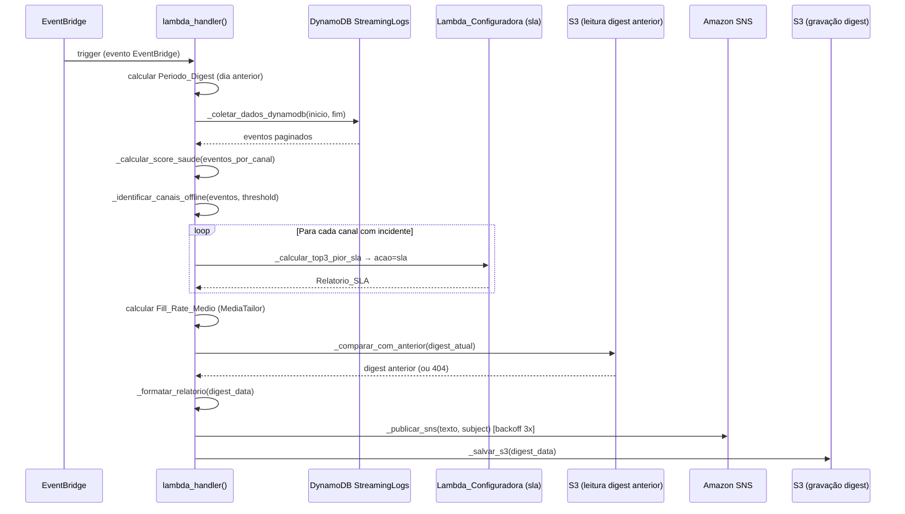

# Documento de Design — Daily Digest

## Visão Geral

Este design descreve a implementação do Daily Digest, um relatório diário automático gerado toda manhã pela nova `Lambda_DailyDigest`. A Lambda é acionada via EventBridge Schedule (padrão: 08:00 BRT / 11:00 UTC), coleta dados do DynamoDB StreamingLogs do dia anterior, calcula métricas consolidadas (score de saúde, incidentes, top 3 pior SLA, canais offline, fill rate de ad delivery), formata um relatório com emojis e publica no `Topico_SNS_Alertas` existente (criado pelo spec proactive-alerts). O digest é armazenado no S3 com chave `digest/YYYY/MM/DD/digest.json` para consulta histórica via chatbot.

### Decisões de Design

1. **Nova Lambda isolada**: A Lambda_DailyDigest é criada como função independente (`lambdas/daily_digest/handler.py`), sem modificar o pipeline existente. Isso garante que falhas no digest não afetam a coleta de métricas em tempo real.
2. **Reutilização do Calculador_SLA**: O módulo Calculador_SLA (spec sla-tracking) é importado diretamente dentro da Lambda_Configuradora. A Lambda_DailyDigest invoca a Lambda_Configuradora com `acao=sla` para calcular o uptime por canal, evitando duplicação de lógica.
3. **Reutilização do Topico_SNS_Alertas**: O digest é publicado no mesmo tópico SNS dos alertas proativos, evitando que o operador precise assinar um novo tópico.
4. **Armazenamento S3 para histórico**: Cada digest é armazenado como `digest/YYYY/MM/DD/digest.json` no bucket KB_LOGS, permitindo consulta histórica via chatbot sem dependência de banco de dados adicional.
5. **Ação `digest` na Lambda_Configuradora**: A consulta histórica via chatbot reutiliza o path `/gerenciarRecurso` existente com `acao=digest`, respeitando o limite de paths do Action_Group_Config.
6. **Fail-partial**: Falhas em serviços individuais (DynamoDB de um serviço, Calculador_SLA de um canal) não impedem a publicação do digest. O campo `status_geracao` indica se o digest é completo ou parcial.
7. **Backoff exponencial para SNS**: Consistente com o padrão já usado no spec proactive-alerts (3 tentativas, delays de 1s, 2s, 4s).
8. **Timeout guard a 240s**: A Lambda tem timeout de 300s; a 240s (80%) interrompe coletas pendentes e publica o digest parcial.

## Arquitetura

```mermaid
flowchart TB
    subgraph Trigger["Acionamento"]
        EB[EventBridge Schedule\ncron(0 11 * * ? *)]
    end

    subgraph Lambda_DailyDigest["Lambda_DailyDigest (nova)"]
        PERIODO[Calcular Periodo_Digest\ndia anterior 00:00-23:59 UTC]
        DDB[_coletar_dados_dynamodb\nStreamingLogs todos os serviços]
        SCORE[_calcular_score_saude\ncanais_sem_incidente / total]
        OFFLINE[_identificar_canais_offline\nInputLossSeconds > threshold]
        SLA[_calcular_top3_pior_sla\nvia Lambda_Configuradora acao=sla]
        AD[Calcular Fill_Rate_Medio\nMediaTailor Avail.FillRate]
        COMP[_comparar_com_anterior\nleitura S3 digest anterior]
        FMT[_formatar_relatorio\ntexto com emojis para SNS]
        SNS_PUB[_publicar_sns\nbackoff exponencial 3 tentativas]
        S3_SAVE[_salvar_s3\ndigest/YYYY/MM/DD/digest.json]
    end

    subgraph Destinos["Destinos"]
        SNS[Topico_SNS_Alertas\nStreamingAlertsNotifications]
        S3[S3 KB_LOGS\ndigest/YYYY/MM/DD/digest.json]
    end

    subgraph Consulta["Consulta Histórica"]
        CHAT[Chatbot / Agente_Bedrock]
        CONF[Lambda_Configuradora\nacao=digest]
        S3R[S3 KB_LOGS\nleitura digest.json]
    end

    EB --> PERIODO
    PERIODO --> DDB
    DDB --> SCORE
    DDB --> OFFLINE
    DDB --> SLA
    DDB --> AD
    SCORE --> COMP
    OFFLINE --> COMP
    SLA --> COMP
    AD --> COMP
    COMP --> FMT
    FMT --> SNS_PUB
    FMT --> S3_SAVE
    SNS_PUB --> SNS
    S3_SAVE --> S3

    CHAT --> CONF
    CONF --> S3R
    S3R --> CONF
    CONF --> CHAT
```

### Fluxo de Execução



## Componentes e Interfaces

### 1. Handler Principal (`lambda_handler`)

```python
def lambda_handler(event: dict, context: Any) -> dict:
    """Orquestra a geração do Daily Digest.

    1. Calcula Periodo_Digest (dia anterior 00:00:00Z a 23:59:59Z).
    2. Coleta dados do DynamoDB StreamingLogs.
    3. Calcula score de saúde, canais offline, top3 SLA, fill rate.
    4. Lê digest anterior do S3 para comparação.
    5. Formata relatório com emojis.
    6. Publica no SNS (com backoff).
    7. Salva no S3.
    8. Retorna status da execução.
    """
```

### 2. Coleta de Dados do DynamoDB

```python
def _coletar_dados_dynamodb(
    periodo_inicio: str,  # ISO 8601Z ex: "2024-01-14T00:00:00Z"
    periodo_fim: str,     # ISO 8601Z ex: "2024-01-14T23:59:59Z"
) -> dict[str, list[dict]]:
    """Consulta StreamingLogs para todos os serviços no período.

    Pagina automaticamente via LastEvaluatedKey.
    Usa ProjectionExpression para reduzir RCU.
    Retorna dict: {servico: [eventos]} com campos:
        timestamp, canal, severidade, tipo_erro,
        metrica_nome, metrica_valor, servico_origem.
    Em caso de falha por serviço, registra em servicos_com_erro
    e continua com os demais.
    """
```

### 3. Cálculo do Score de Saúde

```python
def _calcular_score_saude(
    eventos_por_canal: dict[str, list[dict]],
    # chave: "{servico}#{canal}", valor: lista de eventos
) -> dict:
    """Calcula score de saúde geral e por serviço.

    Returns:
        {
            "score_saude": float | None,          # 0.0-100.0, 1 casa decimal
            "total_canais_monitorados": int,
            "canais_sem_incidente": int,
            "canais_com_incidente": int,
            "score_saude_por_servico": {
                "MediaLive": float | None,
                "MediaPackage": float | None,
                "MediaTailor": float | None,
                "CloudFront": float | None,
            },
            "aviso_sem_dados": str | None,        # quando total = 0
        }
    """
```

### 4. Identificação de Canais Offline

```python
def _identificar_canais_offline(
    eventos: list[dict],
    threshold_minutos: int = 30,
) -> list[dict]:
    """Identifica canais com InputLossSeconds acumulado > threshold.

    Agrupa eventos com metrica_nome="InputLossSeconds" por canal,
    soma os valores e compara com threshold_minutos * 60.

    Returns lista ordenada por tempo_offline_minutos decrescente:
        [{"canal": str, "servico": str,
          "tempo_offline_minutos": int,
          "tempo_offline_formatado": str}]
    """
```

### 5. Cálculo do Top 3 Pior SLA

```python
def _calcular_top3_pior_sla(
    canais_com_incidente: list[str],
    # lista de "{servico}#{canal}"
    lambda_client,
    configuradora_fn_name: str,
) -> list[dict]:
    """Invoca Lambda_Configuradora com acao=sla para cada canal.

    Ordena por uptime_percentual crescente e retorna os 3 primeiros.
    Falhas individuais são registradas e o canal é excluído do top3.

    Returns:
        [{"canal": str, "servico": str,
          "uptime_percentual": float,
          "total_incidentes": int,
          "tempo_total_degradacao_formatado": str}]
    """
```

### 6. Comparação com Digest Anterior

```python
def _comparar_com_anterior(
    digest_atual: dict,
    s3_client,
    bucket: str,
    periodo_inicio: str,  # para calcular data do dia anterior
) -> dict | None:
    """Lê digest anterior do S3 e calcula deltas.

    Chave S3: digest/{YYYY}/{MM}/{DD}/digest.json do dia anterior.
    Retorna None se não encontrado ou em caso de erro de I/O.

    Returns:
        {
            "score_saude_delta": float,
            "total_incidentes_delta": int,
            "canais_afetados_delta": int,
            "tendencia": "melhora" | "piora" | "estavel",
            "fill_rate_delta": float | None,
        }
    """
```

### 7. Formatação do Relatório

```python
def _formatar_relatorio(digest_data: dict) -> str:
    """Gera texto formatado com emojis para publicação no SNS.

    Seções em ordem:
        📊 Cabeçalho com data e score de saúde (🟢/🟡/🔴)
        📺 Totais por serviço
        🚨 Resumo de incidentes
        📉 Top 3 canais com pior SLA
        🔴 Canais offline
        📢 Métricas de ad delivery (se disponível)
        📈/📉 Comparação com dia anterior

    Trunca a 256KB preservando seções de maior prioridade.
    Inclui rodapé com timestamp de geração e versão.
    """
```

### 8. Publicação no SNS

```python
def _publicar_sns(
    texto: str,
    subject: str,
    sns_client,
    topic_arn: str,
) -> bool:
    """Publica no SNS com backoff exponencial.

    Subject: "[DAILY DIGEST] Streaming Platform - DD/MM/YYYY"
    Até 3 tentativas com delays de 1s, 2s, 4s.
    Retorna True se sucesso, False se falha após 3 tentativas.
    """
```

### 9. Armazenamento no S3

```python
def _salvar_s3(
    digest_data: dict,
    s3_client,
    bucket: str,
    periodo_inicio: str,  # para calcular chave YYYY/MM/DD
) -> str:
    """Serializa e armazena digest no S3.

    Chave: digest/{YYYY}/{MM}/{DD}/digest.json
    Content-Type: application/json
    Serialização: json.dumps(ensure_ascii=False, indent=2)
    Comportamento: upsert (sobrescreve se já existir).
    Retorna a chave S3 completa.
    """
```

### 10. Ação `digest` na Lambda_Configuradora

```python
# Em lambdas/configuradora/handler.py, dentro do bloco acao == "digest":

def _handle_acao_digest(
    parameters: dict,
    s3_client,
    bucket: str,
) -> dict:
    """Lê digest do S3 e retorna para o Agente_Bedrock.

    Parâmetros:
        data (opcional): "DD/MM" ou "DD/MM/YYYY"
                         Padrão: dia anterior à execução.

    Retorna o Digest_Diario completo, incluindo texto_formatado.
    Erro 404 se digest não encontrado.
    """
```

## Modelos de Dados

### Digest_Diario (estrutura JSON completa)

```python
{
    # Identificação
    "versao": "1.0",
    "periodo_inicio": "2024-01-14T00:00:00Z",   # ISO 8601Z
    "periodo_fim": "2024-01-14T23:59:59Z",       # ISO 8601Z
    "gerado_em": "2024-01-15T11:00:42Z",         # ISO 8601Z
    "s3_key": "digest/2024/01/14/digest.json",
    "status_geracao": "completo",                # "completo" | "parcial" | "erro"
    "tempo_geracao_segundos": 12.4,              # float
    "servicos_com_erro": [],                     # lista de serviços com falha

    # Score de Saúde (Requisito 3)
    "score_saude": 87.5,                         # float, 1 casa decimal, ou null
    "total_canais_monitorados": 24,              # int
    "canais_sem_incidente": 21,                  # int
    "canais_com_incidente": 3,                   # int
    "aviso_sem_dados": None,                     # str ou null
    "score_saude_por_servico": {
        "MediaLive": 85.0,
        "MediaPackage": 100.0,
        "MediaTailor": 90.0,
        "CloudFront": 100.0,
    },

    # Resumo de Incidentes (Requisito 5)
    "resumo_incidentes": {
        "total_incidentes": 7,
        "canais_afetados": ["CANAL_01", "CANAL_05", "CANAL_12"],
        "duracao_total_minutos": 272,
        "duracao_total_formatada": "4h32min",
        "incidentes_por_severidade": {"ERROR": 5, "CRITICAL": 2},
    },

    # Top 3 Pior SLA (Requisito 4)
    "top3_pior_sla": [
        {
            "canal": "CANAL_01",
            "servico": "MediaLive",
            "uptime_percentual": 94.2,
            "total_incidentes": 3,
            "tempo_total_degradacao_formatado": "1h23min",
        },
    ],
    "mensagem_top3": None,                       # str quando array vazio

    # Canais Offline (Requisito 8)
    "canais_offline": [
        {
            "canal": "CANAL_05",
            "servico": "MediaLive",
            "tempo_offline_minutos": 105,
            "tempo_offline_formatado": "1h45min",
        },
    ],

    # Ad Delivery (Requisito 6)
    "ad_delivery": {
        "fill_rate_medio": 78.45,                # float, 2 casas decimais, ou null
        "disponivel": True,                      # bool
        "total_configuracoes_tailor": 8,         # int
        "variacao_fill_rate": 2.3,               # float ou null
    },

    # Comparação com Dia Anterior (Requisito 7)
    "comparacao_dia_anterior": {
        "score_saude_delta": 3.5,
        "total_incidentes_delta": -2,
        "canais_afetados_delta": -1,
        "tendencia": "melhora",
        "fill_rate_delta": 2.3,
    },
    "aviso_sem_historico": None,                 # str quando sem digest anterior

    # Relatório Formatado (Requisito 9)
    "texto_formatado": "📊 DAILY DIGEST...",     # string completa para SNS
    "truncado": False,                           # bool
}
```

### Chave S3 do Digest

```
digest/{YYYY}/{MM}/{DD}/digest.json

Exemplos:
  digest/2024/01/14/digest.json   → dia 14/01/2024
  digest/2024/12/31/digest.json   → dia 31/12/2024
```

### Formato do Relatório SNS

```
════════════════════════════════════════
📊 DAILY DIGEST — Streaming Platform
Data: 14/01/2024 (dia anterior)
════════════════════════════════════════

🟡 Score de Saúde: 87.5%
   24 canais monitorados | 21 sem incidente | 3 com incidente

📺 Totais por Serviço:
   MediaLive: 85.0% | MediaPackage: 100.0%
   MediaTailor: 90.0% | CloudFront: 100.0%

🚨 Resumo de Incidentes:
   Total: 7 incidentes | Duração: 4h32min
   Canais afetados: CANAL_01, CANAL_05, CANAL_12
   Por severidade: ERROR=5, CRITICAL=2

📉 Top 3 Canais com Pior SLA:
   1. CANAL_01 (MediaLive) — 94.2% uptime | 3 incidentes | 1h23min
   2. CANAL_05 (MediaLive) — 96.1% uptime | 2 incidentes | 55min
   3. CANAL_12 (MediaLive) — 97.8% uptime | 2 incidentes | 32min

🔴 Canais Offline (> 30min):
   CANAL_05 — 1h45min offline

📢 Ad Delivery (MediaTailor):
   Fill Rate Médio: 78.45% (▲ +2.3% vs ontem)
   Configurações monitoradas: 8

📈 Comparação com Ontem:
   Score de Saúde: +3.5% (melhora)
   Incidentes: -2 | Canais afetados: -1

────────────────────────────────────────
Gerado em 2024-01-15T11:00:42Z | v1.0
```

### Variáveis de Ambiente da Lambda_DailyDigest

| Variável | Descrição | Padrão |
|---|---|---|
| `SNS_TOPIC_ARN` | ARN do Topico_SNS_Alertas | — (obrigatório) |
| `DYNAMODB_TABLE_NAME` | Nome da tabela StreamingLogs | — (obrigatório) |
| `S3_BUCKET_LOGS` | Nome do bucket KB_LOGS | — (obrigatório) |
| `DIGEST_OFFLINE_THRESHOLD_MINUTES` | Threshold para Canal_Offline (minutos) | `"30"` |
| `DIGEST_SCHEDULE_CRON` | Expressão cron do EventBridge | `"cron(0 11 * * ? *)"` |
| `CONFIGURADORA_FUNCTION_NAME` | Nome da Lambda_Configuradora (para invocar acao=sla) | — (obrigatório) |

## Propriedades de Corretude

*Uma propriedade é uma característica ou comportamento que deve ser verdadeiro em todas as execuções válidas de um sistema — essencialmente, uma declaração formal sobre o que o sistema deve fazer. Propriedades servem como ponte entre especificações legíveis por humanos e garantias de corretude verificáveis por máquina.*

### Propriedade 1: Cálculo correto do Periodo_Digest

*Para qualquer* data de execução da Lambda, o Periodo_Digest calculado SHALL ter `periodo_inicio` igual a `00:00:00Z` do dia anterior e `periodo_fim` igual a `23:59:59Z` do mesmo dia anterior, independente do horário de execução ou fuso horário local.

**Valida: Requisitos 1.4, 12.3**

### Propriedade 2: Score de Saúde segue a fórmula e hierarquia de severidade

*Para qualquer* conjunto de eventos por canal onde cada canal tem zero ou mais eventos com severidades variadas (INFO, WARNING, ERROR, CRITICAL), o Score_Saude calculado SHALL ser igual a `round((canais_sem_incidente / total_canais_monitorados) * 100, 1)`, onde `canais_sem_incidente` é o número de canais sem nenhum evento ERROR ou CRITICAL, e o indicador visual SHALL ser 🟢 quando >= 95%, 🟡 quando >= 80% e < 95%, e 🔴 quando < 80%.

**Valida: Requisitos 3.1, 3.2, 3.4, 3.5, 9.4**

### Propriedade 3: Identificação e ordenação de canais offline

*Para qualquer* lista de eventos com `metrica_nome="InputLossSeconds"` e *para qualquer* threshold em minutos, um canal SHALL ser classificado como offline se e somente se a soma de seus valores de `InputLossSeconds` exceder `threshold * 60`, e a lista `canais_offline` SHALL estar ordenada por `tempo_offline_minutos` decrescente.

**Valida: Requisitos 8.1, 8.2, 8.4**

### Propriedade 4: Top 3 contém os canais com menor uptime

*Para qualquer* lista de canais com `uptime_percentual` calculado pelo Calculador_SLA, o campo `top3_pior_sla` SHALL conter no máximo 3 canais, todos com `uptime_percentual` menor ou igual ao de qualquer canal não incluído na lista, e SHALL estar ordenado por `uptime_percentual` crescente.

**Valida: Requisitos 4.2, 4.3, 4.4**

### Propriedade 5: Cálculo correto do Fill Rate Médio

*Para qualquer* lista de eventos com `servico_origem="MediaTailor"` e `metrica_nome="Avail.FillRate"`, o `fill_rate_medio` calculado SHALL ser igual a `round(mean(valores_metrica_valor), 2)`, e quando a lista for vazia, `fill_rate_medio` SHALL ser null e `disponivel` SHALL ser false.

**Valida: Requisitos 6.1, 6.3**

### Propriedade 6: Comparação com dia anterior segue regra de tendência

*Para qualquer* par de digests (atual e anterior), os deltas calculados SHALL ser `atual - anterior` para cada campo numérico, e `tendencia` SHALL ser "melhora" quando `score_saude_delta > 0`, "piora" quando `score_saude_delta < 0`, e "estavel" quando `score_saude_delta == 0`.

**Valida: Requisitos 7.2, 7.3**

### Propriedade 7: Relatório formatado contém todas as seções obrigatórias com emojis corretos

*Para qualquer* Digest_Diario válido, o `texto_formatado` gerado SHALL conter as seções na ordem: cabeçalho (📊), totais por serviço (📺), resumo de incidentes (🚨), top 3 pior SLA (📉), canais offline (🔴), ad delivery quando disponível (📢), comparação quando disponível (📈 ou 📉), e rodapé com timestamp de geração. O tamanho do texto SHALL ser menor ou igual a 256 KB (262144 bytes em UTF-8).

**Valida: Requisitos 9.1, 9.2, 9.3, 9.5, 9.6**

### Propriedade 8: Subject SNS no formato correto

*Para qualquer* data de Periodo_Digest, o subject da mensagem SNS SHALL seguir exatamente o formato `"[DAILY DIGEST] Streaming Platform - DD/MM/YYYY"`, onde DD, MM e YYYY correspondem à data do Periodo_Digest.

**Valida: Requisito 10.2**

### Propriedade 9: Chave S3 gerada corretamente a partir da data do período

*Para qualquer* data de Periodo_Digest, a chave S3 gerada SHALL seguir o formato `"digest/{YYYY}/{MM}/{DD}/digest.json"`, onde YYYY, MM e DD correspondem à data do Periodo_Digest com zero-padding.

**Valida: Requisitos 11.1, 11.6**

### Propriedade 10: Conversão de data para chave S3 na Lambda_Configuradora

*Para qualquer* string de data no formato `"DD/MM"` ou `"DD/MM/YYYY"`, a função de conversão SHALL produzir a chave S3 correta `"digest/{YYYY}/{MM}/{DD}/digest.json"`, e para o caso sem data, SHALL usar o dia anterior à execução.

**Valida: Requisitos 12.3, 12.4**

### Propriedade 11: Paginação completa do DynamoDB

*Para qualquer* número N de páginas retornadas pelo DynamoDB (com `LastEvaluatedKey` presente em todas exceto a última), a função `_coletar_dados_dynamodb` SHALL retornar exatamente a soma de todos os itens de todas as N páginas, sem duplicatas e sem omissões.

**Valida: Requisito 2.2**

### Propriedade 12: Round-trip de serialização do Digest_Diario

*Para qualquer* Digest_Diario gerado pela Lambda_DailyDigest, serializar com `json.dumps(ensure_ascii=False, indent=2)` e desserializar com `json.loads` SHALL produzir um dicionário equivalente ao original, preservando: números como números JSON (não strings), booleanos como booleanos JSON nativos, timestamps como strings ISO 8601Z, e caracteres Unicode em português sem escape.

**Valida: Requisitos 18.1, 18.2, 18.3, 18.4, 18.5**

## Tratamento de Erros

| Cenário | Comportamento | Requisito |
|---|---|---|
| DynamoDB indisponível para um serviço | Registra erro, inclui serviço em `servicos_com_erro`, continua com demais serviços | 17.2 |
| DynamoDB indisponível para todos os serviços | Registra erro, define `status_geracao="erro"`, publica digest vazio com `erro_coleta` | 2.5 |
| Calculador_SLA falha para um canal | Registra erro, exclui canal do top3, continua com demais canais | 17.1 |
| Digest anterior não encontrado no S3 (404) | Define `comparacao_dia_anterior=null`, inclui `aviso_sem_historico` | 7.4 |
| Leitura do digest anterior falha (I/O) | Registra erro, define `comparacao_dia_anterior=null`, continua | 7.5 |
| SNS_TOPIC_ARN ausente/vazio | Ignora etapa SNS, registra aviso, continua para S3 | 10.5 |
| Publicação SNS falha (throttling) | Backoff exponencial: 1s, 2s, 4s — até 3 tentativas | 10.3 |
| Publicação SNS falha após 3 tentativas | Registra erro, continua para armazenamento S3 | 10.4 |
| Armazenamento S3 falha | Registra erro com ARN do bucket e chave tentada, retorna status de erro | 11.5 |
| Tempo de execução >= 240s | Interrompe coletas pendentes, define `status_geracao="parcial"`, publica com dados disponíveis | 17.4 |
| Texto formatado excede 256KB | Trunca seções menos prioritárias (offline, ad delivery), inclui nota de truncamento, define `truncado=true` | 9.5 |
| DIGEST_OFFLINE_THRESHOLD_MINUTES ausente | Usa 30 minutos como padrão | 8.6 |
| Digest para a data solicitada não existe no S3 | Lambda_Configuradora retorna 404 com mensagem específica | 12.5 |

## Estratégia de Testes

### Testes Unitários (pytest)

- Cálculo do Periodo_Digest com datas específicas (início/fim de mês, ano bissexto)
- Score de saúde com zero canais (retorna null)
- Score de saúde com todos os canais saudáveis (retorna 100.0)
- Identificação de canais offline com threshold exato (borda)
- Top3 com menos de 3 canais com incidente
- Fill rate médio com lista vazia (retorna null, disponivel=false)
- Comparação com digest anterior ausente (retorna null)
- Formatação de subject SNS com data específica
- Geração de chave S3 com data específica
- Conversão de "DD/MM" e "DD/MM/YYYY" para chave S3
- Comportamento fail-open quando SNS_TOPIC_ARN ausente
- Backoff exponencial com mock de throttling SNS (3 retries)
- Armazenamento S3 com mock de falha

### Testes de Propriedade (Hypothesis)

Biblioteca: **Hypothesis** (já utilizada no projeto — diretório `.hypothesis/` existente)

Configuração: mínimo 100 iterações por propriedade (`@settings(max_examples=100)`)

Tag format: **Feature: daily-digest, Property {N}: {título}**

Propriedades a implementar:
1. P1 — Cálculo correto do Periodo_Digest
2. P2 — Score de Saúde segue fórmula e hierarquia de severidade
3. P3 — Identificação e ordenação de canais offline
4. P4 — Top 3 contém os canais com menor uptime
5. P5 — Cálculo correto do Fill Rate Médio
6. P6 — Comparação com dia anterior segue regra de tendência
7. P7 — Relatório formatado contém seções obrigatórias e respeita 256KB
8. P8 — Subject SNS no formato correto
9. P9 — Chave S3 gerada corretamente
10. P10 — Conversão de data para chave S3
11. P11 — Paginação completa do DynamoDB
12. P12 — Round-trip de serialização do Digest_Diario

### Testes de Infraestrutura (CDK Assertions)

- Verificar criação da Lambda_DailyDigest com runtime Python 3.12, timeout 300s, memória 256MB
- Verificar criação da regra EventBridge com expressão cron correta
- Verificar permissão de invocação do EventBridge para a Lambda
- Verificar permissões IAM: `dynamodb:Query`, `dynamodb:Scan`, `sns:Publish`, `s3:GetObject`, `s3:PutObject`
- Verificar variáveis de ambiente obrigatórias
- Verificar output CloudFormation `DailyDigestLambdaArn`

### Testes de Integração

- Execução real da Lambda_DailyDigest em ambiente de staging com dados de teste no DynamoDB
- Verificação de publicação no SNS e armazenamento no S3
- Consulta histórica via Lambda_Configuradora com `acao=digest`
