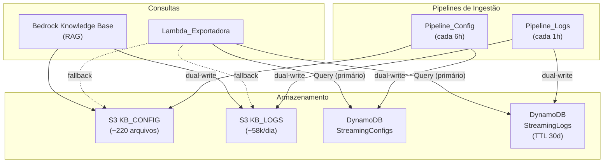

# Documento de Design — Migração S3 → DynamoDB

## Visão Geral

Este design descreve a adição de DynamoDB como camada de consulta rápida para o chatbot de streaming, substituindo as leituras massivas de S3 na Exportadora por queries DynamoDB de baixa latência (<100ms). O S3 continua como destino de gravação (dual-write) para manter o Bedrock Knowledge Base funcional.

### Decisões de Design

1. **Dual-write (S3 + DynamoDB)**: As pipelines gravam em ambos os destinos. O S3 alimenta o Bedrock KB (RAG), o DynamoDB alimenta as consultas diretas. Falha no DynamoDB não bloqueia o S3 (fail-open).
2. **PAY_PER_REQUEST**: Billing on-demand evita provisionar capacidade. Com ~58k writes/dia + consultas esporádicas do chatbot, o custo é mínimo (~$2-5/mês).
3. **TTL de 30 dias nos logs**: Logs antigos são expirados automaticamente pelo DynamoDB. O S3 mantém o histórico completo.
4. **Fallback para S3**: Se o DynamoDB falhar, a Exportadora cai de volta para a leitura do S3 (comportamento atual). Garante resiliência.
5. **GSI mínimos**: Apenas 2 GSIs (NomeCanal e Severidade) para cobrir os padrões de acesso mais comuns sem custo excessivo.

## Arquitetura



## Modelo de Dados

### Tabela StreamingConfigs

| Atributo | Tipo | Descrição |
|----------|------|-----------|
| `PK` | String (Partition Key) | `{servico}#{tipo_recurso}` ex: `MediaLive#channel` |
| `SK` | String (Sort Key) | `{resource_id}` ex: `1234567` |
| `servico` | String | MediaLive, MediaPackage, MediaTailor, CloudFront |
| `nome_canal` | String | Nome legível do canal/recurso |
| `channel_id` | String | ID do recurso na AWS |
| `tipo` | String | Tipo do recurso (channel, input, distribution, etc.) |
| `estado` | String | Estado atual (RUNNING, IDLE, etc.) |
| `regiao` | String | Região AWS |
| `data` | Map | Registro completo da Config_Enriquecida |
| `updated_at` | String | ISO 8601 timestamp da última atualização |

**GSI_NomeCanal:**
| Atributo | Tipo | Descrição |
|----------|------|-----------|
| `servico` | String (Partition Key) | Serviço AWS |
| `nome_canal` | String (Sort Key) | Nome do canal (permite `begins_with`) |

**Estimativa de itens:** ~285 (220 MediaLive + 30 MediaPackage + 15 MediaTailor + 20 CloudFront)
**Tamanho médio por item:** ~2-5 KB (config completa)
**Custo de escrita:** ~285 items × 4 vezes/dia = ~1.140 WCU/dia = ~$0.001/dia

### Tabela StreamingLogs

| Atributo | Tipo | Descrição |
|----------|------|-----------|
| `PK` | String (Partition Key) | `{servico}#{canal}` ex: `MediaLive#0001_WARNER` |
| `SK` | String (Sort Key) | `{timestamp}#{metrica_nome}` ex: `2024-01-15T10:30:00Z#ActiveAlerts` |
| `severidade` | String | INFO, WARNING, ERROR, CRITICAL |
| `tipo_erro` | String | Tipo do erro (ALERTA_ATIVO, INPUT_LOSS, etc.) |
| `canal` | String | Nome do canal |
| `servico_origem` | String | Serviço de origem |
| `metrica_nome` | String | Nome da métrica |
| `metrica_valor` | Number | Valor da métrica |
| `descricao` | String | Descrição do evento |
| `causa_provavel` | String | Causa provável |
| `recomendacao_correcao` | String | Recomendação de correção |
| `data` | Map | Registro completo do Evento_Estruturado |
| `ttl` | Number | Epoch timestamp para expiração (30 dias) |

**GSI_Severidade:**
| Atributo | Tipo | Descrição |
|----------|------|-----------|
| `severidade` | String (Partition Key) | Nível de severidade |
| `SK` | String (Sort Key) | Mesmo SK da tabela (timestamp#metrica) |

**Estimativa de itens:** ~58k/dia × 30 dias = ~1.74M itens
**Tamanho médio por item:** ~500 bytes
**Custo de escrita:** ~58k items/dia × $1.25/M WCU = ~$0.07/dia
**Custo de armazenamento:** ~1.74M × 500B = ~870MB = ~$0.22/mês

## Componentes e Alterações

### 1. CDK Stack — DynamoDB Tables (novo arquivo: `stacks/dynamodb_stack.py`)

```python
class DynamoDBStack(Stack):
    def __init__(self, scope, construct_id, **kwargs):
        # StreamingConfigs table
        self.configs_table = dynamodb.Table(
            self, "StreamingConfigs",
            partition_key=dynamodb.Attribute(name="PK", type=dynamodb.AttributeType.STRING),
            sort_key=dynamodb.Attribute(name="SK", type=dynamodb.AttributeType.STRING),
            billing_mode=dynamodb.BillingMode.PAY_PER_REQUEST,
            point_in_time_recovery=True,
            removal_policy=RemovalPolicy.DESTROY,
        )
        self.configs_table.add_global_secondary_index(
            index_name="GSI_NomeCanal",
            partition_key=dynamodb.Attribute(name="servico", type=dynamodb.AttributeType.STRING),
            sort_key=dynamodb.Attribute(name="nome_canal", type=dynamodb.AttributeType.STRING),
        )

        # StreamingLogs table
        self.logs_table = dynamodb.Table(
            self, "StreamingLogs",
            partition_key=dynamodb.Attribute(name="PK", type=dynamodb.AttributeType.STRING),
            sort_key=dynamodb.Attribute(name="SK", type=dynamodb.AttributeType.STRING),
            billing_mode=dynamodb.BillingMode.PAY_PER_REQUEST,
            time_to_live_attribute="ttl",
            removal_policy=RemovalPolicy.DESTROY,
        )
        self.logs_table.add_global_secondary_index(
            index_name="GSI_Severidade",
            partition_key=dynamodb.Attribute(name="severidade", type=dynamodb.AttributeType.STRING),
            sort_key=dynamodb.Attribute(name="SK", type=dynamodb.AttributeType.STRING),
        )
```

### 2. Pipeline_Config — Dual-Write

Adicionar ao final de `_store_record()` (ou equivalente):

```python
def _write_to_dynamodb(table_name, record):
    """Write config record to DynamoDB. Fail-open."""
    try:
        servico = record.get("servico", "Unknown")
        tipo = record.get("tipo", "channel")
        resource_id = record.get("channel_id", "")
        dynamodb_client.put_item(
            TableName=table_name,
            Item={
                "PK": {"S": f"{servico}#{tipo}"},
                "SK": {"S": str(resource_id)},
                "servico": {"S": servico},
                "nome_canal": {"S": record.get("nome_canal", "")},
                "channel_id": {"S": str(resource_id)},
                "tipo": {"S": tipo},
                "estado": {"S": record.get("estado", "")},
                "regiao": {"S": record.get("regiao", "")},
                "data": {"S": json.dumps(record, ensure_ascii=False)},
                "updated_at": {"S": datetime.now(timezone.utc).isoformat()},
            },
        )
    except Exception as exc:
        logger.error("DynamoDB write failed (fail-open): %s", exc)
```

### 3. Pipeline_Logs — Dual-Write

Adicionar após a gravação no S3:

```python
def _write_log_to_dynamodb(table_name, evento):
    """Write log event to DynamoDB. Fail-open."""
    try:
        canal = evento.get("canal", "unknown")
        servico = evento.get("servico_origem", "Unknown")
        timestamp = evento.get("timestamp", "")
        metrica = evento.get("metrica_nome", "")
        ttl_epoch = int((datetime.now(timezone.utc) + timedelta(days=30)).timestamp())
        dynamodb_client.put_item(
            TableName=table_name,
            Item={
                "PK": {"S": f"{servico}#{canal}"},
                "SK": {"S": f"{timestamp}#{metrica}"},
                "severidade": {"S": evento.get("severidade", "INFO")},
                "tipo_erro": {"S": evento.get("tipo_erro", "")},
                "canal": {"S": canal},
                "servico_origem": {"S": servico},
                "metrica_nome": {"S": metrica},
                "metrica_valor": {"N": str(evento.get("metrica_valor", 0))},
                "descricao": {"S": evento.get("descricao", "")},
                "data": {"S": json.dumps(evento, ensure_ascii=False)},
                "ttl": {"N": str(ttl_epoch)},
            },
        )
    except Exception as exc:
        logger.error("DynamoDB write failed (fail-open): %s", exc)
```

### 4. Exportadora — Query DynamoDB com Fallback S3

```python
def query_dynamodb_configs(table_name, filtros):
    """Query StreamingConfigs table. Returns list of records."""
    servico = filtros.get("servico")
    nome_contains = filtros.get("nome_canal_contains")

    if servico:
        # Query by PK
        tipo = _service_to_tipo(servico)
        response = dynamodb.query(
            TableName=table_name,
            KeyConditionExpression="PK = :pk",
            ExpressionAttributeValues={":pk": {"S": f"{servico}#{tipo}"}},
        )
    elif nome_contains:
        # Scan with filter (GSI could help but contains isn't supported in key condition)
        response = dynamodb.scan(
            TableName=table_name,
            FilterExpression="contains(nome_canal, :nome)",
            ExpressionAttributeValues={":nome": {"S": nome_contains.upper()}},
        )
    else:
        # Full scan
        response = dynamodb.scan(TableName=table_name)

    return [json.loads(item["data"]["S"]) for item in response.get("Items", [])]


def query_dynamodb_logs(table_name, filtros):
    """Query StreamingLogs table. Returns list of records."""
    canal = filtros.get("canal")
    servico = filtros.get("servico") or filtros.get("servico_origem")
    periodo = filtros.get("periodo", {})
    severidade = filtros.get("severidade")

    if canal and servico:
        # Query by PK + SK range
        pk = f"{servico}#{canal}"
        key_cond = "PK = :pk"
        values = {":pk": {"S": pk}}
        if periodo.get("inicio") and periodo.get("fim"):
            key_cond += " AND SK BETWEEN :start AND :end"
            values[":start"] = {"S": periodo["inicio"]}
            values[":end"] = {"S": periodo["fim"] + "~"}
        response = dynamodb.query(
            TableName=table_name,
            KeyConditionExpression=key_cond,
            ExpressionAttributeValues=values,
        )
    elif severidade:
        # Query GSI_Severidade
        key_cond = "severidade = :sev"
        values = {":sev": {"S": severidade}}
        if periodo.get("inicio") and periodo.get("fim"):
            key_cond += " AND SK BETWEEN :start AND :end"
            values[":start"] = {"S": periodo["inicio"]}
            values[":end"] = {"S": periodo["fim"] + "~"}
        response = dynamodb.query(
            TableName=table_name,
            IndexName="GSI_Severidade",
            KeyConditionExpression=key_cond,
            ExpressionAttributeValues=values,
        )
    else:
        # Scan with period filter
        response = dynamodb.scan(TableName=table_name)

    return [json.loads(item["data"]["S"]) for item in response.get("Items", [])]
```

### 5. Script de Migração (`scripts/migrate_s3_to_dynamodb.py`)

Script one-time que:
1. Lista todos os JSONs no KB_CONFIG e KB_LOGS
2. Lê cada arquivo
3. Transforma no formato DynamoDB
4. Grava em batch (batch_write_item, 25 itens por vez)
5. Loga progresso

## Padrões de Acesso e Performance

| Padrão de Acesso | Antes (S3) | Depois (DynamoDB) | Operação |
|---|---|---|---|
| Listar todos os canais MediaLive | ~30s (list + read 220 files) | <500ms | Query PK=`MediaLive#channel` |
| Buscar canal por nome "WARNER" | ~30s (read all + filter) | <200ms | GSI_NomeCanal begins_with |
| Logs de um canal nas últimas 24h | ~60-120s (list + read ~2400 files) | <500ms | Query PK=`MediaLive#CANAL` SK between |
| Logs por severidade ERROR | ~60-120s (read all + filter) | <1s | Query GSI_Severidade PK=`ERROR` |
| Exportar todos os canais | ~30s | <2s | Scan (285 items) |

## Tratamento de Erros

| Cenário | Comportamento |
|---|---|
| DynamoDB write falha na Pipeline | Log ERROR, continua gravação no S3 (fail-open) |
| DynamoDB query falha na Exportadora | Log WARNING, fallback para query S3 (comportamento atual) |
| DynamoDB throttling | Boto3 retry automático (adaptive mode) |
| Tabela não existe | Fallback para S3, log CRITICAL |
| Item > 400KB | Gravar apenas campos indexáveis + referência S3 key |

## Estimativa de Custo Mensal

| Componente | Volume | Custo |
|---|---|---|
| StreamingConfigs writes | ~1.140/dia × 30 = 34.2k | ~$0.04 |
| StreamingConfigs reads | ~500/dia × 30 = 15k | ~$0.004 |
| StreamingConfigs storage | ~285 items × 3KB = 855KB | ~$0.00 |
| StreamingLogs writes | ~58k/dia × 30 = 1.74M | ~$2.18 |
| StreamingLogs reads | ~2k/dia × 30 = 60k | ~$0.015 |
| StreamingLogs storage | ~1.74M × 500B = 870MB | ~$0.22 |
| GSIs (2) | Proporcional | ~$0.50 |
| **Total** | | **~$3/mês** |
