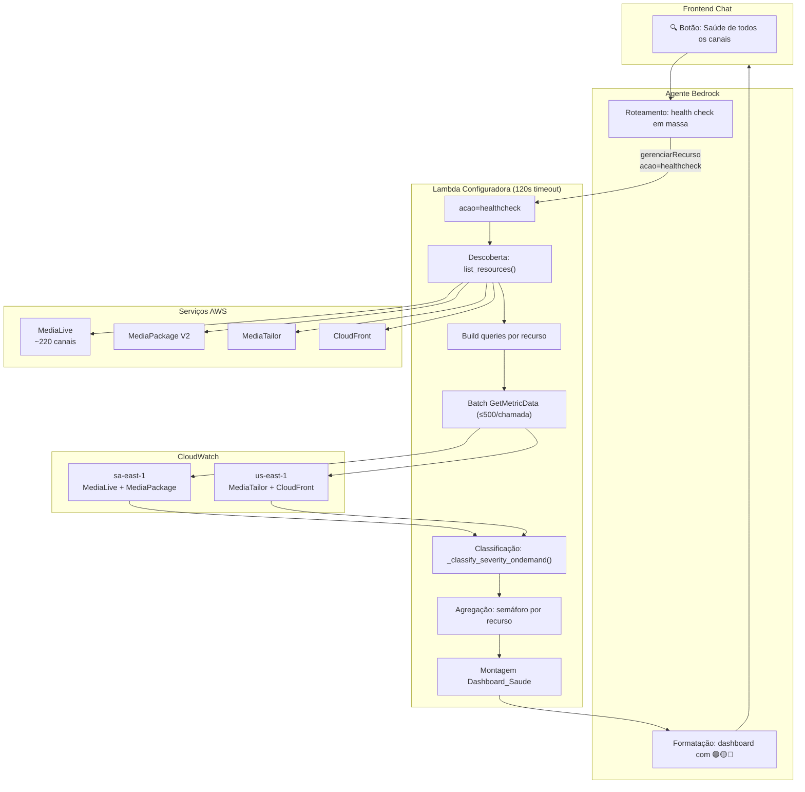

# Documento de Design — Health Check em Massa

## Visão Geral

Este design descreve a implementação do health check em massa na Lambda_Configuradora, permitindo consultar métricas CloudWatch de TODOS os recursos de streaming em batch e retornar um dashboard de saúde com classificação semáforo (🟢🟡🔴), score geral e lista de problemas.

A funcionalidade é acionada via `/gerenciarRecurso` com `acao=healthcheck`, reutilizando a infraestrutura existente: `list_resources()` para descoberta, `_classify_severity_ondemand()` para classificação, e `_ONDEMAND_SEVERITY_THRESHOLDS` para thresholds. A diferença principal é que em vez de consultar UM recurso por vez (como `/consultarMetricas`), o health check consulta TODOS os recursos em batch usando chamadas `GetMetricData` otimizadas com até 500 queries por chamada.

### Decisões de Design

1. **Reutilização do path `/gerenciarRecurso`**: Adiciona `acao=healthcheck` ao enum existente em vez de criar um novo path OpenAPI, mantendo o schema compacto (limite de 9 paths no Action Group).
2. **Dicionário `_HEALTHCHECK_METRICS` separado**: Subconjunto reduzido de métricas por serviço (5 para MediaLive, 2 para MediaPackage, 2 para MediaTailor, 2 para CloudFront) para caber no limite de 500 queries/chamada com ~220 canais.
3. **Batching por região**: Queries agrupadas por região (sa-east-1 para MediaLive/MediaPackage, us-east-1 para MediaTailor/CloudFront) e divididas em chunks de 500 para respeitar o limite da API CloudWatch.
4. **Timeout safety**: Monitoramento do tempo de execução com corte em ~100s para garantir resposta dentro do timeout de 120s da Lambda.
5. **Resiliência por serviço**: Falha em um serviço não impede o dashboard dos demais — erros são registrados e incluídos na resposta.
6. **Classificação semáforo por pior métrica**: A cor de cada recurso é determinada pela severidade mais alta entre todas as suas métricas, usando `_SEVERITY_ORDER` existente.

## Arquitetura



### Fluxo de Execução

1. Usuário pede "Qual a saúde de todos os canais?" no chat
2. Agente Bedrock roteia para `/gerenciarRecurso` com `acao=healthcheck`
3. Lambda descobre recursos via `list_resources()` para cada serviço
4. Para cada recurso, constrói `MetricDataQueries` usando `_HEALTHCHECK_METRICS`
5. Agrupa queries em batches de ≤500 por região e chama `GetMetricData`
6. Classifica cada métrica via `_classify_severity_ondemand()`
7. Determina cor semáforo por recurso (pior severidade)
8. Monta `Dashboard_Saude` com totais, score, listas de problemas
9. Agente formata resposta com emojis semáforo e retorna ao chat

### Estimativa de Queries

| Serviço | Recursos (est.) | Métricas/recurso | Queries/recurso | Total queries |
|---------|-----------------|-------------------|-----------------|---------------|
| MediaLive | 220 | 5 | 10 (×2 pipelines) | 2.200 |
| MediaPackage | 30 | 2 | 2 | 60 |
| MediaTailor | 15 | 2 | 2 | 30 |
| CloudFront | 20 | 2 | 2 | 40 |
| **Total** | | | | **~2.330** |

Com batches de 500: ~5 chamadas `GetMetricData` para sa-east-1 e 1 para us-east-1.

## Componentes e Interfaces

### 1. Função `_execute_healthcheck()` (nova)

Orquestra todo o fluxo do health check em massa.

```python
def _execute_healthcheck(
    servico_filtro: str | None,
    periodo_minutos: int = 15,
) -> dict[str, Any]:
    """Executa health check em massa e retorna Dashboard_Saude."""
```

| Parâmetro | Tipo | Descrição |
|-----------|------|-----------|
| `servico_filtro` | `str \| None` | Serviço específico ou None para todos |
| `periodo_minutos` | `int` | Período de consulta (padrão 15) |
| **Retorno** | `dict` | Dashboard_Saude completo |

### 2. Função `_healthcheck_discover_resources()` (nova)

Descobre recursos de todos os serviços solicitados.

```python
def _healthcheck_discover_resources(
    servicos: list[str],
) -> tuple[dict[str, list[dict]], list[dict]]:
    """Retorna (recursos_por_servico, erros)."""
```

Reutiliza `list_resources()` existente com mapeamento:
- MediaLive → `list_resources("MediaLive", "channel")`
- MediaPackage → `list_resources("MediaPackage", "channel_v2")`
- MediaTailor → `list_resources("MediaTailor", "playback_configuration")`
- CloudFront → `list_resources("CloudFront", "distribution")`

### 3. Função `_healthcheck_build_queries()` (nova)

Constrói MetricDataQueries para um conjunto de recursos de um serviço.

```python
def _healthcheck_build_queries(
    servico: str,
    recursos: list[dict],
) -> list[dict[str, Any]]:
    """Constrói queries CloudWatch para todos os recursos de um serviço."""
```

Usa `_HEALTHCHECK_METRICS` (subconjunto reduzido) em vez de `_ONDEMAND_METRICS_CONFIG`.

### 4. Função `_healthcheck_batch_get_metrics()` (nova)

Executa chamadas `GetMetricData` em batches de ≤500 queries.

```python
def _healthcheck_batch_get_metrics(
    queries: list[dict],
    region: str,
    start_time: datetime,
    end_time: datetime,
) -> tuple[list[dict], list[dict]]:
    """Retorna (metric_results, erros). Faz batching e retry com backoff."""
```

### 5. Função `_healthcheck_classify_resources()` (nova)

Classifica cada recurso com cor semáforo baseado nas métricas coletadas.

```python
def _healthcheck_classify_resources(
    servico: str,
    recursos: list[dict],
    metric_results: list[dict],
) -> list[dict]:
    """Retorna lista de recursos classificados com cor e alertas."""
```

### 6. Função `_healthcheck_build_dashboard()` (nova)

Monta o Dashboard_Saude final.

```python
def _healthcheck_build_dashboard(
    recursos_classificados: list[dict],
    servicos_consultados: list[str],
    periodo_minutos: int,
    erros: list[dict],
    parcial: bool = False,
) -> dict[str, Any]:
    """Monta Dashboard_Saude com totais, score, listas e mensagem."""
```

### 7. Constante `_HEALTHCHECK_METRICS` (nova)

```python
_HEALTHCHECK_METRICS = {
    "MediaLive": {
        "namespace": "AWS/MediaLive",
        "region": "sa-east-1",
        "dimension_key": "ChannelId",
        "has_pipeline": True,
        "metrics": [
            ("ActiveAlerts", "Maximum"),
            ("InputLossSeconds", "Sum"),
            ("DroppedFrames", "Sum"),
            ("Output4xxErrors", "Sum"),
            ("Output5xxErrors", "Sum"),
        ],
    },
    "MediaPackage": {
        "namespace": "AWS/MediaPackage",
        "region": "sa-east-1",
        "dimension_key": "Channel",
        "has_pipeline": False,
        "metrics": [
            ("EgressResponseTime", "Average"),
            ("IngressBytes", "Sum"),
        ],
    },
    "MediaTailor": {
        "namespace": "AWS/MediaTailor",
        "region": "us-east-1",
        "dimension_key": "ConfigurationName",
        "has_pipeline": False,
        "metrics": [
            ("AdDecisionServer.Errors", "Sum"),
            ("Avail.FillRate", "Average"),
        ],
    },
    "CloudFront": {
        "namespace": "AWS/CloudFront",
        "region": "us-east-1",
        "dimension_key": "DistributionId",
        "has_pipeline": False,
        "metrics": [
            ("5xxErrorRate", "Average"),
            ("TotalErrorRate", "Average"),
        ],
    },
}
```

### 8. Alterações no Handler Existente

No bloco `if api_path in ("/gerenciarRecurso", ...)`, adicionar tratamento para `acao == "healthcheck"`:

```python
# --- HEALTHCHECK ---
if acao == "healthcheck":
    periodo_minutos = int(parameters.get("periodo_minutos", 15))
    try:
        dashboard = _execute_healthcheck(
            servico_filtro=servico or None,
            periodo_minutos=periodo_minutos,
        )
        return _bedrock_response(event, 200, dashboard)
    except Exception as exc:
        logger.error("Healthcheck error: %s", exc)
        return _bedrock_response(event, 500, {
            "erro": f"Erro no health check: {exc}",
        })
```

### 9. Alterações no Schema OpenAPI

Adicionar `healthcheck` ao enum de `acao` e `periodo_minutos` ao path `/gerenciarRecurso`:

```json
{
  "acao": {
    "type": "string",
    "enum": ["deletar", "start", "stop", "listar", "healthcheck"],
    "description": "Acao a executar. healthcheck executa health check em massa de todos os recursos"
  },
  "periodo_minutos": {
    "type": "integer",
    "default": 15,
    "description": "Periodo de consulta em minutos para healthcheck. Padrao 15"
  }
}
```

### 10. Alterações no Frontend (`chat.html`)

Adicionar botões de sugestão na seção "🔍 Logs & Métricas":

```javascript
// Novos botões na sidebar
"Qual a saúde de todos os canais?"
"Health check de todos os canais MediaLive"
"Dashboard de saúde geral"
```

## Modelos de Dados

### Dashboard_Saude (resposta do health check)

```python
{
    "timestamp": "2024-01-15T14:30:00Z",        # ISO 8601 UTC
    "periodo": 15,                                # minutos consultados
    "servicos_consultados": ["MediaLive", "MediaPackage", "MediaTailor", "CloudFront"],
    "total_recursos": 220,
    "totais": {
        "verde": 195,
        "amarelo": 15,
        "vermelho": 10,
    },
    "score_saude": 88.6,                          # (195/220) * 100, 1 casa decimal
    "recursos_vermelho": [
        {
            "nome": "Canal_Warner_HD",
            "servico": "MediaLive",
            "severidade": "CRITICAL",
            "alertas": [
                {
                    "metrica": "ActiveAlerts",
                    "valor": 2.0,
                    "severidade": "ERROR",
                    "tipo_erro": "ALERTA_ATIVO",
                },
            ],
        },
    ],
    "recursos_amarelo": [
        {
            "nome": "Canal_Band_News",
            "servico": "MediaLive",
            "alertas": [
                {
                    "metrica": "InputLossSeconds",
                    "valor": 5.2,
                    "severidade": "WARNING",
                    "tipo_erro": "INPUT_LOSS",
                },
            ],
        },
    ],
    "erros": [
        {"servico": "CloudFront", "mensagem": "ThrottlingException após 3 tentativas"},
    ],
    "parcial": False,                             # True se timeout safety ativou
    "mensagem_resumo": "Dashboard de saúde: 195 verdes, 15 amarelos, 10 vermelhos de 220 recursos. Score: 88.6%",
}
```

### Recurso Classificado (estrutura interna)

```python
{
    "nome": "Canal_Warner_HD",
    "servico": "MediaLive",
    "resource_id": "1234567",
    "cor": "vermelho",                            # verde | amarelo | vermelho
    "severidade": "CRITICAL",                     # INFO | WARNING | ERROR | CRITICAL
    "alertas": [...],                             # lista de alertas (vazia se verde)
    "nota": None,                                 # "sem dados no período" se aplicável
}
```

### Mapeamento Severidade → Cor

| Severidade mais alta | Cor |
|---------------------|-----|
| INFO (ou sem dados) | verde 🟢 |
| WARNING | amarelo 🟡 |
| ERROR | vermelho 🔴 |
| CRITICAL | vermelho 🔴 |


## Propriedades de Corretude

*Uma propriedade é uma característica ou comportamento que deve ser verdadeiro em todas as execuções válidas de um sistema — essencialmente, uma declaração formal sobre o que o sistema deve fazer. Propriedades servem como ponte entre especificações legíveis por humanos e garantias de corretude verificáveis por máquina.*

### Propriedade 1: Cor semáforo é determinada pela pior severidade

*Para qualquer* recurso com um conjunto de métricas classificadas, a cor semáforo SHALL ser determinada pela severidade mais alta entre todas as métricas: se todas são INFO → verde, se a pior é WARNING → amarelo, se a pior é ERROR ou CRITICAL → vermelho. Recursos sem dados de métricas SHALL ser classificados como verde.

**Validates: Requirements 4.2, 4.3, 4.4, 4.5, 4.6**

### Propriedade 2: Filtro de serviço restringe resultados ao serviço solicitado

*Para qualquer* serviço válido passado como filtro, o Dashboard_Saude SHALL conter apenas recursos daquele serviço em `recursos_vermelho`, `recursos_amarelo`, e nos totais. O campo `servicos_consultados` SHALL conter apenas o serviço filtrado.

**Validates: Requirements 1.2**

### Propriedade 3: Batches de queries nunca excedem 500

*Para qualquer* número de recursos e métricas por serviço, cada chamada `GetMetricData` SHALL conter no máximo 500 `MetricDataQueries`. Se o total de queries exceder 500, SHALL ser dividido em múltiplas chamadas sequenciais, cada uma com ≤500 queries.

**Validates: Requirements 3.2, 3.3**

### Propriedade 4: Score de saúde é calculado corretamente

*Para quaisquer* contagens de recursos verde, amarelo e vermelho (com total > 0), o `score_saude` SHALL ser igual a `round(verde / total * 100, 1)`. Quando `total_recursos` é 0, o `score_saude` SHALL ser 100.0.

**Validates: Requirements 5.2, 10.5**

### Propriedade 5: Ordenação do dashboard é correta

*Para qualquer* lista de recursos classificados, `recursos_vermelho` SHALL estar ordenado por severidade decrescente (CRITICAL antes de ERROR), e `recursos_amarelo` SHALL estar ordenado por nome do recurso em ordem alfabética.

**Validates: Requirements 5.5**

### Propriedade 6: Dashboard contém todos os campos obrigatórios

*Para qualquer* conjunto de recursos classificados e erros, o Dashboard_Saude SHALL conter todos os campos obrigatórios: `timestamp` (ISO 8601 com sufixo Z), `periodo` (inteiro), `servicos_consultados` (lista), `total_recursos` (inteiro), `totais` (com verde, amarelo, vermelho), `score_saude` (float), `recursos_vermelho` (lista com nome, servico, severidade, alertas), `recursos_amarelo` (lista com nome, servico, alertas), `erros` (lista), `parcial` (bool), e `mensagem_resumo` (string em português).

**Validates: Requirements 5.1, 5.3, 5.4, 5.6, 10.4**

### Propriedade 7: Round-trip JSON preserva dados do Dashboard

*Para qualquer* Dashboard_Saude válido, serializar para JSON com `ensure_ascii=False` e desserializar de volta SHALL produzir um dicionário equivalente ao original. Campos numéricos (`score_saude`, `total_recursos`, valores em `totais`) SHALL ser serializados como números JSON, e caracteres Unicode em português SHALL ser preservados.

**Validates: Requirements 11.1, 11.2, 11.3, 11.4**

## Tratamento de Erros

### Erros de Descoberta de Recursos

| Cenário | Comportamento | Severidade do Log |
|---------|---------------|-------------------|
| `list_resources()` falha para um serviço | Registra erro, continua com demais serviços, inclui no campo `erros` | ERROR |
| `list_resources()` retorna lista vazia | Serviço é incluído com 0 recursos, sem erro | INFO |
| Todos os serviços falham na descoberta | Retorna Dashboard_Saude vazio com `total_recursos=0`, `score_saude=100.0` | ERROR |

### Erros de Consulta CloudWatch

| Cenário | Comportamento | Severidade do Log |
|---------|---------------|-------------------|
| `GetMetricData` falha para um batch | Registra erro, continua com próximo batch, inclui no campo `erros` | ERROR |
| `TooManyRequestsException` (throttling) | Backoff exponencial (1s, 2s, 4s) com até 3 tentativas | WARNING → ERROR |
| `GetMetricData` retorna `NextToken` | Pagina automaticamente para obter todos os resultados | INFO |
| `GetMetricData` retorna dados parciais (StatusCode != Complete) | Processa dados disponíveis, registra aviso | WARNING |
| Recurso sem data points no período | Classifica como verde com nota "sem dados no período" | INFO |

### Erros de Timeout

| Cenário | Comportamento | Severidade do Log |
|---------|---------------|-------------------|
| Tempo de execução atinge ~100s | Interrompe consultas pendentes, retorna Dashboard_Saude parcial com `parcial=True` | WARNING |
| Dashboard parcial | Inclui nota na `mensagem_resumo` indicando resultado parcial e quais serviços foram processados | WARNING |

### Erros de Parâmetros

| Cenário | HTTP Status | Resposta |
|---------|-------------|----------|
| `acao=healthcheck` com `servico` inválido | 400 | `{"erro": "Serviço inválido: 'X'. Válidos: MediaLive, MediaPackage, MediaTailor, CloudFront"}` |
| `periodo_minutos` negativo ou zero | 400 | `{"erro": "periodo_minutos deve ser um inteiro positivo"}` |
| Erro inesperado no healthcheck | 500 | `{"erro": "Erro no health check: <detalhes>"}` |

## Estratégia de Testes

### Abordagem Dual: Testes Unitários + Testes de Propriedade

A estratégia combina testes unitários para cenários específicos e edge cases com testes de propriedade (PBT) para verificar propriedades universais com cobertura ampla de inputs.

### Testes de Propriedade (Hypothesis)

Biblioteca: **Hypothesis** (Python) — já presente no projeto (diretório `.hypothesis/` existente).

Cada propriedade do design será implementada como um teste de propriedade com mínimo de 100 iterações:

| Propriedade | Tag | Gerador |
|-------------|-----|---------|
| P1: Cor semáforo = pior severidade | `Feature: mass-health-check, Property 1: semaphore color is worst severity` | `st.lists(st.sampled_from(["INFO","WARNING","ERROR","CRITICAL"]))` para severidades de métricas |
| P2: Filtro de serviço | `Feature: mass-health-check, Property 2: service filter restricts results` | `st.sampled_from(["MediaLive","MediaPackage","MediaTailor","CloudFront"])` × recursos gerados |
| P3: Batch ≤500 | `Feature: mass-health-check, Property 3: batch size never exceeds 500` | `st.integers(min_value=1, max_value=2000)` para número de queries |
| P4: Score de saúde | `Feature: mass-health-check, Property 4: health score calculation` | `st.integers(0, 500)` para contagens verde/amarelo/vermelho |
| P5: Ordenação do dashboard | `Feature: mass-health-check, Property 5: dashboard ordering` | `st.lists(recurso_classificado_strategy)` para listas de recursos |
| P6: Estrutura do dashboard | `Feature: mass-health-check, Property 6: dashboard structure completeness` | Gerador de recursos classificados + erros |
| P7: Round-trip JSON | `Feature: mass-health-check, Property 7: JSON round-trip` | Gerador de Dashboard_Saude completo com texto em português |

Configuração: `@settings(max_examples=100)` em cada teste.

### Testes Unitários (pytest)

| Área | Testes | Tipo |
|------|--------|------|
| Roteamento `acao=healthcheck` | Mock event com acao=healthcheck, verificar invocação do fluxo | EXAMPLE |
| Descoberta por serviço | Mock de `list_resources()` para cada serviço, verificar extração de campos | EXAMPLE |
| Métricas-chave por serviço | Verificar `_HEALTHCHECK_METRICS` contém métricas corretas por serviço | EXAMPLE |
| Separação de configs | Verificar `_HEALTHCHECK_METRICS` é separado de `_ONDEMAND_METRICS_CONFIG` | EXAMPLE |
| Região por serviço | Verificar mapeamento de região em `_HEALTHCHECK_METRICS` | EXAMPLE |
| Paginação NextToken | Mock de `GetMetricData` com NextToken, verificar todas as páginas | EXAMPLE |
| Backoff exponencial | Mock de throttling, verificar 3 retries com backoff | EXAMPLE |
| Timeout safety | Mock de time para simular execução lenta, verificar dashboard parcial | EXAMPLE |
| Recurso sem dados | Recurso sem data points → verde com nota | EDGE_CASE |
| Nenhum recurso encontrado | Lista vazia → dashboard vazio com score 100.0 | EDGE_CASE |
| Período padrão | Sem `periodo_minutos` → usa 15 | EXAMPLE |
| Schema OpenAPI | Verificar `healthcheck` no enum de `acao` | EXAMPLE |
| Botões frontend | Verificar botões de sugestão no `chat.html` | EXAMPLE |
