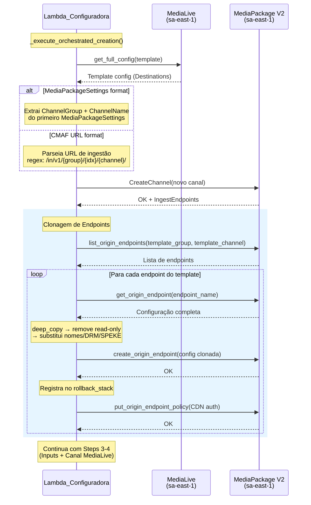
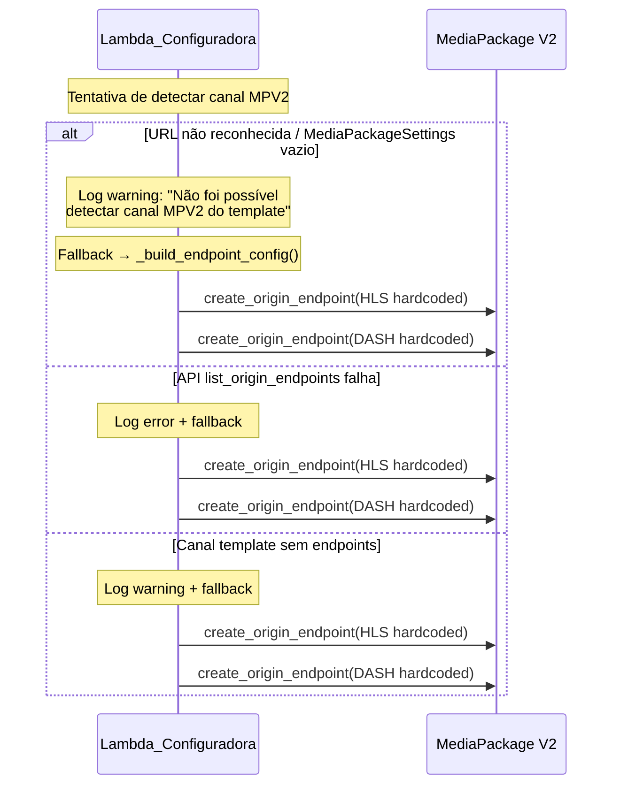

# Documento de Design — Clonagem de Endpoints MPV2 a partir de Template

## Visão Geral

Este documento descreve o design técnico para aprimorar o fluxo de criação orquestrada (`_execute_orchestrated_creation`) na Lambda Configuradora, substituindo a criação de endpoints MPV2 com parâmetros hardcoded (`_build_endpoint_config`) por um mecanismo de clonagem que copia a configuração completa dos endpoints do canal MPV2 associado ao template MediaLive.

O fluxo atual cria endpoints HLS e DASH com valores fixos de segment duration, manifest settings e DRM. Com esta mudança, o sistema detecta automaticamente o canal MPV2 do template (via `MediaPackageSettings` ou URL de ingestão CMAF), busca seus endpoints existentes via API, e clona cada um deles — preservando segment settings, manifest configs, SCTE filters e encryption method — substituindo apenas os campos específicos do novo canal (nomes, DRM ResourceId, SPEKE URL/RoleArn).

### Decisões de Design Principais

1. **Detecção dual de canal MPV2**: Suporte a dois formatos de Destination do MediaLive — `MediaPackageSettings` (integração direta, ex: `AWS_LL_CHANNEL`) e `Settings` com URL CMAF (ex: `0001_WARNER_CHANNEL`). A detecção é feita por inspeção das Destinations do template já carregado em memória.

2. **Fallback gracioso**: Se a detecção do canal MPV2 falhar (URL não reconhecida, API indisponível, canal sem endpoints), o sistema cai para `_build_endpoint_config` existente sem interromper a criação. Isso garante retrocompatibilidade total.

3. **Deep copy com substituição cirúrgica**: A configuração do endpoint template é copiada via `copy.deepcopy()`, e apenas os campos de identificação e credenciais são substituídos. Campos read-only retornados pela API `get_origin_endpoint` são removidos antes da criação.

4. **Clonagem de todos os endpoints**: Em vez de assumir apenas HLS+DASH, o sistema clona todos os endpoints encontrados no template (incluindo `LowLatencyHlsManifests`), suportando templates com 2, 3 ou mais endpoints.

5. **Geração de nomes por substituição de prefixo**: O `OriginEndpointName` do clone é gerado substituindo o nome do canal template pelo nome do novo canal no nome original do endpoint, preservando sufixos como `_HLS`, `_DASH`, `_CBCS`, `_CENC`.

6. **Reutilização do rollback existente**: Cada endpoint clonado é registrado na `rollback_stack` com `RollbackEntry` existente, sem alterações no mecanismo de rollback.

## Arquitetura

### Diagrama de Sequência — Clonagem de Endpoints



### Diagrama de Sequência — Fallback



## Componentes e Interfaces

### 1. Função `_detect_template_mpv2_channel()` (Nova)

**Responsabilidade**: Extrair `ChannelGroup` e `ChannelName` do canal MPV2 associado ao template MediaLive, a partir das Destinations.

**Localização**: `lambdas/configuradora/handler.py`

**Assinatura**:
```python
def _detect_template_mpv2_channel(
    template_destinations: list[dict[str, Any]],
) -> tuple[str, str] | None:
    """Detect the MPV2 channel associated with a MediaLive template.

    Inspects Destinations to find either:
    1. MediaPackageSettings with ChannelGroup + ChannelName
    2. Settings with CMAF ingest URL matching MPV2 pattern

    Returns:
        (channel_group, channel_name) or None if not detected.
    """
```

**Lógica**:
1. Iterar `template_destinations`
2. Para cada destination, verificar se `MediaPackageSettings` é uma lista não-vazia:
   - Extrair `ChannelGroup` e `ChannelName` do primeiro item
   - Retornar `(channel_group, channel_name)`
3. Se não encontrou via MediaPackageSettings, verificar `Settings`:
   - Para cada `Setting`, aplicar regex na `Url`:
     ```
     https://.+\.mediapackagev2\..+\.amazonaws\.com/in/v1/([^/]+)/\d+/([^/]+)/.*
     ```
   - Grupo 1 = `ChannelGroup`, Grupo 2 = `ChannelName`
   - Retornar `(channel_group, channel_name)`
4. Se nenhum formato reconhecido, retornar `None`

### 2. Função `_fetch_template_endpoints()` (Nova)

**Responsabilidade**: Listar e buscar a configuração completa de todos os endpoints do canal MPV2 template.

**Localização**: `lambdas/configuradora/handler.py`

**Assinatura**:
```python
def _fetch_template_endpoints(
    channel_group: str,
    channel_name: str,
) -> list[dict[str, Any]]:
    """Fetch full configuration of all endpoints from a template MPV2 channel.

    Returns:
        List of endpoint configurations (from get_origin_endpoint).
        Empty list if no endpoints found or API error.
    """
```

**Lógica**:
1. Chamar `mediapackagev2_client.list_origin_endpoints(ChannelGroupName=channel_group, ChannelName=channel_name)`
2. Para cada endpoint na resposta, chamar `mediapackagev2_client.get_origin_endpoint(...)` para obter a configuração completa
3. Retornar lista de configurações
4. Em caso de `ClientError`, logar o erro e retornar lista vazia

### 3. Função `_clone_endpoint_config()` (Nova)

**Responsabilidade**: Criar uma cópia da configuração do endpoint template com os campos específicos do novo canal substituídos e campos read-only removidos.

**Localização**: `lambdas/configuradora/handler.py`

**Assinatura**:
```python
def _clone_endpoint_config(
    template_config: dict[str, Any],
    template_channel_name: str,
    new_channel_name: str,
    new_channel_group: str,
    drm_resource_id: str,
) -> dict[str, Any]:
    """Clone an endpoint configuration for a new channel.

    Performs deep copy, removes read-only fields, and substitutes
    channel-specific fields (names, DRM credentials, SPEKE config).

    Returns:
        New endpoint configuration ready for create_origin_endpoint().
    """
```

**Lógica**:
1. `deepcopy(template_config)`
2. Remover campos read-only: `Arn`, `CreatedAt`, `ModifiedAt`, `ETag`, `Tags`, `MssManifests` (se vazio)
3. Remover `Url` de cada manifest em `HlsManifests`, `LowLatencyHlsManifests`, `DashManifests`
4. Substituir:
   - `ChannelGroupName` → `new_channel_group`
   - `ChannelName` → `new_channel_name`
   - `OriginEndpointName` → gerado por `_generate_cloned_endpoint_name()`
5. Se `Segment.Encryption.SpekeKeyProvider` existe:
   - `ResourceId` → `drm_resource_id`
   - `RoleArn` → `SPEKE_ROLE_ARN` (env var)
   - `Url` → `SPEKE_URL` (env var)
6. Retornar config limpa

### 4. Função `_generate_cloned_endpoint_name()` (Nova)

**Responsabilidade**: Gerar o nome do endpoint clonado seguindo as regras de nomenclatura do ambiente.

**Localização**: `lambdas/configuradora/handler.py`

**Regras de Nomenclatura**:
- **Canais padrão** (sem "LL" no nome): sufixos `_HLS` e `_DASH`
  - Ex: `0001_WARNER_CHANNEL` → endpoints `0001_WARNER_CHANNEL_HLS`, `0001_WARNER_CHANNEL_DASH`
- **Canais Low-Latency** (com "LL" no nome): sufixos baseados na encryption `_CBCS` e `_CENC`
  - Ex: `0008_BAND_NEWS_LL` → endpoints `0008_BAND_NEWS_LL_CBCS`, `0008_BAND_NEWS_LL_CENC`
  - `_CBCS` = HLS/FAIRPLAY, `_CENC` = DASH/PLAYREADY+WIDEVINE

**Assinatura**:
```python
def _generate_cloned_endpoint_name(
    template_endpoint_config: dict[str, Any],
    template_channel_name: str,
    new_channel_name: str,
) -> str:
    """Generate the cloned endpoint name based on naming conventions.

    Standard channels (no 'LL' in name): suffix _HLS or _DASH
    Low-Latency channels ('LL' in name): suffix _CBCS or _CENC
    based on the encryption method of the template endpoint.

    Examples:
        Standard channel:
          template="0001_WARNER_CHANNEL_HLS" → "NOVO_CANAL_HLS"
          template="0001_WARNER_CHANNEL_DASH" → "NOVO_CANAL_DASH"
        Low-Latency channel:
          template="0008_BAND_NEWS_LL_CBCS" → "NOVO_CANAL_LL_CBCS"
          template="0008_BAND_NEWS_LL_CENC" → "NOVO_CANAL_LL_CENC"
    """
```

**Lógica**:
1. Extrair o sufixo do endpoint original (parte após o nome do canal template)
2. Se o novo canal contém "LL" no nome:
   - Detectar o `CmafEncryptionMethod` do endpoint template (`CBCS` ou `CENC`)
   - Sufixo = `_CBCS` ou `_CENC`
3. Se o novo canal NÃO contém "LL":
   - Detectar o tipo de manifest do endpoint (HLS ou DASH)
   - Sufixo = `_HLS` ou `_DASH`
4. Retornar `{new_channel_name}{sufixo}`

### 5. Modificação de `_execute_orchestrated_creation()` (Existente)

**Mudança**: Substituir a Etapa 2 (criação de endpoints HLS+DASH via `_build_endpoint_config`) por lógica de clonagem com fallback.

**Nova Etapa 2**:
```python
# ---- Step 2: Clone or create endpoints -------------------------
template_mpv2 = _detect_template_mpv2_channel(template_destinations)

if template_mpv2:
    template_cg, template_cn = template_mpv2
    template_endpoints = _fetch_template_endpoints(template_cg, template_cn)
else:
    template_endpoints = []

if template_endpoints:
    # Clone each endpoint from template
    drm_resource_id = params.drm_resource_id or f"Live_{params.nome_canal}"
    for ep_config in template_endpoints:
        cloned = _clone_endpoint_config(
            ep_config, template_cn, params.nome_canal,
            params.channel_group, drm_resource_id,
        )
        ep_result = create_resource("MediaPackage", "origin_endpoint_v2", cloned)
        ep_name = cloned["OriginEndpointName"]
        rollback_stack.append(RollbackEntry(
            servico="MediaPackage",
            tipo_recurso="origin_endpoint_v2",
            resource_id=ep_result["resource_id"],
            channel_group=params.channel_group,
            channel_name=params.nome_canal,
            endpoint_name=ep_name,
        ))
        # Apply CDN auth policy (same as current)
        _apply_cdn_auth_policy(params, ep_name)
else:
    # Fallback: use _build_endpoint_config (current behavior)
    logger.warning("Clonagem não disponível, usando _build_endpoint_config")
    for ep_type in ("HLS", "DASH"):
        ep_config = _build_endpoint_config(params, ep_type)
        ep_result = create_resource("MediaPackage", "origin_endpoint_v2", ep_config)
        # ... (same rollback + CDN auth as current)
```

### 6. Função `_apply_cdn_auth_policy()` (Refatoração)

**Responsabilidade**: Extrair a lógica de CDN auth policy existente (inline no loop de endpoints) para uma função reutilizável.

**Assinatura**:
```python
def _apply_cdn_auth_policy(
    params: OrchestrationParams,
    endpoint_name: str,
) -> None:
    """Apply CDN auth policy to an endpoint. Logs warning on failure."""
```

## Modelos de Dados

### Estrutura de um Endpoint Template (get_origin_endpoint response)

Campos retornados pela API que precisam ser tratados:

```python
{
    # Read-only — REMOVER antes de criar
    "Arn": "arn:aws:mediapackagev2:...",
    "CreatedAt": 1776096640.0,
    "ModifiedAt": 1776096640.0,
    "ETag": "...",
    "Tags": {},

    # Identificação — SUBSTITUIR
    "ChannelGroupName": "VRIO_CHANNELS",       # → novo channel_group
    "ChannelName": "0008_BAND_NEWS_LL",         # → novo nome_canal
    "OriginEndpointName": "0008_BAND_NEWS_LL_CBCS",  # → gerado

    # Preservar sem alteração (Campos_Imutaveis_Template)
    "ContainerType": "CMAF",
    "StartoverWindowSeconds": 900,
    "Segment": {
        "SegmentDurationSeconds": 2,
        "SegmentName": "segment",
        "TsUseAudioRenditionGroup": True,
        "IncludeIframeOnlyStreams": False,
        "TsIncludeDvbSubtitles": True,
        "Scte": { ... },                        # Preservar integralmente
        "Encryption": {
            "EncryptionMethod": { ... },         # Preservar (CBCS ou CENC)
            "SpekeKeyProvider": {
                "EncryptionContractConfiguration": { ... },  # Preservar
                "DrmSystems": ["FAIRPLAY"],      # Preservar
                "ResourceId": "Live_0008",       # → SUBSTITUIR
                "RoleArn": "arn:...",             # → SUBSTITUIR (env var)
                "Url": "https://...",            # → SUBSTITUIR (env var)
            }
        }
    },

    # Manifests — Preservar estrutura, REMOVER campo Url de cada entry
    "HlsManifests": [],
    "LowLatencyHlsManifests": [
        {
            "ManifestName": "master",
            "Url": "https://...",               # → REMOVER
            "ManifestWindowSeconds": 7200,
            "ProgramDateTimeIntervalSeconds": 60,
            "ScteHls": { "AdMarkerHls": "DATERANGE" },
            "UrlEncodeChildManifest": False,
        }
    ],
    "DashManifests": [],
}
```

### Campos Read-Only a Remover

```python
_ENDPOINT_READONLY_FIELDS = {
    "Arn",
    "CreatedAt",
    "ModifiedAt",
    "ETag",
    "Tags",
}
```

### Campos de Manifest a Limpar

Para cada entry em `HlsManifests`, `LowLatencyHlsManifests`, `DashManifests`:
- Remover `Url` (gerado pela API ao criar)

### Regex para Parsing de URL CMAF

```python
import re

_MPV2_INGEST_URL_PATTERN = re.compile(
    r"https://.+\.mediapackagev2\..+\.amazonaws\.com"
    r"/in/v1/([^/]+)/\d+/([^/]+)/.*"
)
# Grupo 1: ChannelGroup
# Grupo 2: ChannelName
```

Exemplo de URL: `https://sx90ms-1.ingest.zmmkox.mediapackagev2.sa-east-1.amazonaws.com/in/v1/VRIO_CHANNELS/1/0001_WARNER_CHANNEL/index`
- Grupo 1: `VRIO_CHANNELS`
- Grupo 2: `0001_WARNER_CHANNEL`
