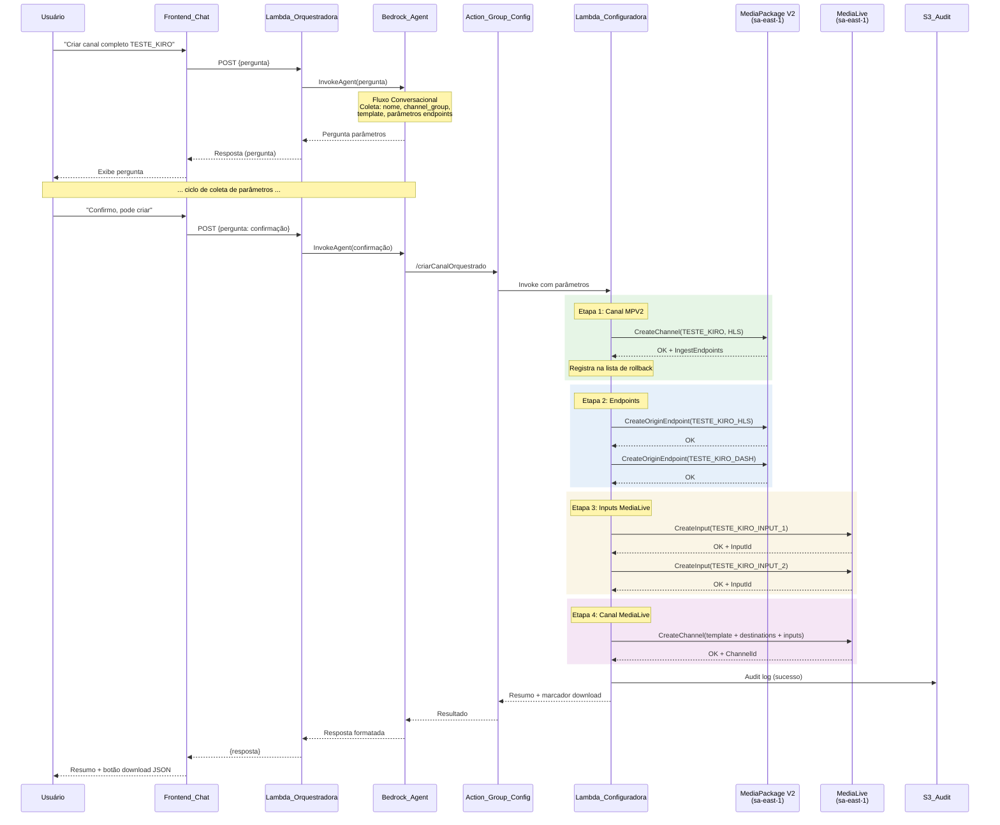
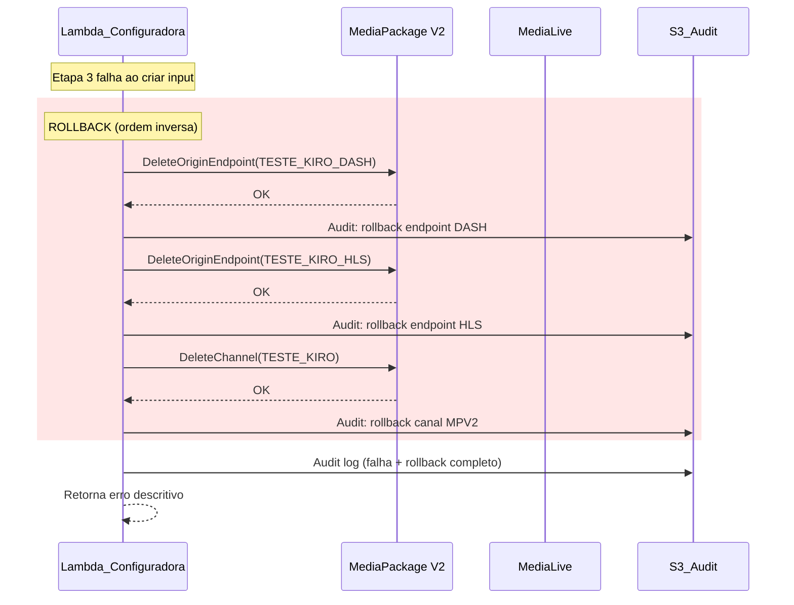

# Documento de Design — Criação Orquestrada de Canal

## Visão Geral

Este documento descreve o design técnico do fluxo de criação orquestrada de canal no Streaming Chatbot. A funcionalidade permite que um operador crie, via conversa natural com o Bedrock Agent, toda a cadeia de recursos necessários para um canal de streaming ao vivo: canal MediaPackage V2, endpoints HLS e DASH (com DRM), inputs MediaLive e canal MediaLive — tudo em sequência, com vinculação automática entre recursos e rollback em caso de falha.

O fluxo é implementado como um novo endpoint `/criarCanalOrquestrado` na Lambda_Configuradora existente, invocado pelo Bedrock Agent após coletar os parâmetros via conversa. A orquestração segue 4 etapas sequenciais: (1) Canal MPV2, (2) Endpoints HLS+DASH, (3) Inputs MediaLive, (4) Canal MediaLive. Cada recurso criado é registrado numa lista de rollback; se qualquer etapa falhar, todos os recursos anteriores são excluídos na ordem inversa.

### Decisões de Design Principais

1. **Endpoint único de orquestração**: Toda a lógica de sequenciamento, vinculação e rollback fica encapsulada no endpoint `/criarCanalOrquestrado` da Lambda_Configuradora, evitando múltiplas chamadas do Agent e simplificando o tratamento de erros.
2. **Reutilização de funções existentes**: O orquestrador reutiliza `_create_inputs_for_channel()`, `create_resource()`, `upload_config_json()`, `build_audit_log()`, `store_audit_log()`, `_bedrock_response()` e `get_full_config()` já implementados na Lambda_Configuradora.
3. **SpekeKeyProvider via variáveis de ambiente**: Os valores fixos de `RoleArn` e `Url` do SPEKE Key Provider são configurados como variáveis de ambiente (`SPEKE_ROLE_ARN`, `SPEKE_URL`) no CDK, não hardcoded no código.
4. **Rollback best-effort**: O rollback tenta excluir todos os recursos na ordem inversa. Se a exclusão de um recurso falhar, o erro é registrado no audit log e o rollback continua com os demais recursos.
5. **Suporte a MediaPackage V2**: Novas funções de criação e exclusão para `channel_v2` e `origin_endpoint_v2` são adicionadas ao `create_resource()` e a um novo `delete_resource()`, usando o cliente `mediapackagev2_client` já instanciado.
6. **Cross-region mantido**: MediaLive e MediaPackage V2 continuam em `sa-east-1` via `_STREAMING_REGION`. Bedrock/Lambdas em `us-east-1`.
7. **Timeout da Lambda_Configuradora**: Aumentado de 60s para 120s no CDK para acomodar a criação sequencial de 5+ recursos AWS.

## Arquitetura

### Diagrama de Sequência — Criação Orquestrada



### Diagrama de Sequência — Rollback



## Componentes e Interfaces

### 1. Endpoint `/criarCanalOrquestrado` (Lambda_Configuradora)

**Responsabilidade**: Orquestrar a criação sequencial de todos os recursos de um canal de streaming, com rollback automático em caso de falha.

**Localização**: `lambdas/configuradora/handler.py` — novo bloco no `handler()` existente.

**Parâmetros de Entrada**:

| Parâmetro | Tipo | Obrigatório | Padrão | Descrição |
|-----------|------|-------------|--------|-----------|
| `nome_canal` | string | Sim | — | Nome do canal (ex: "TESTE_KIRO") |
| `channel_group` | string | Sim | — | Channel Group do MPV2 (ex: "VRIO_CHANNELS") |
| `template_resource_id` | string | Sim | — | ID ou nome parcial do template MediaLive |
| `segment_duration` | int | Não | 6 | Duração do segmento em segundos |
| `drm_resource_id` | string | Não | "Live_{nome}" | Resource ID do DRM SPEKE |
| `manifest_window_seconds` | int | Não | 7200 | Janela do manifesto em segundos |
| `startover_window_hls_seconds` | int | Não | 900 | Startover window HLS |
| `startover_window_dash_seconds` | int | Não | 14460 | Startover window DASH |
| `ts_include_dvb_subtitles` | bool | Não | true | Incluir legendas DVB |
| `min_buffer_time_seconds` | int | Não | 2 | MinBufferTime DASH |
| `suggested_presentation_delay_seconds` | int | Não | 12 | SuggestedPresentationDelay DASH |

**Resposta de Sucesso** (HTTP 200):
```json
{
  "mensagem": "Canal TESTE_KIRO criado com sucesso!",
  "recursos_criados": {
    "canal_mpv2": "TESTE_KIRO",
    "endpoint_hls": "TESTE_KIRO_HLS",
    "endpoint_dash": "TESTE_KIRO_DASH",
    "inputs": ["TESTE_KIRO_INPUT_1", "TESTE_KIRO_INPUT_2"],
    "canal_medialive": "12345678"
  },
  "ingest_url": "https://xxx.ingest.mediapackagev2.sa-east-1.amazonaws.com/...",
  "dados_exportados": "{ ... JSON completo do canal MediaLive ... }",
  "formato_arquivo": "json",
  "marcador_download": "[DOWNLOAD_CONFIG:12345678:MediaLive:channel]"
}
```

**Resposta de Erro com Rollback** (HTTP 500):
```json
{
  "erro": "Falha na etapa 3 (Inputs MediaLive): [ValidationException] ...",
  "rollback": {
    "recursos_removidos": ["TESTE_KIRO_DASH", "TESTE_KIRO_HLS", "TESTE_KIRO"],
    "recursos_falha_remocao": []
  }
}
```

### 2. Função `delete_resource()` (Nova)

**Responsabilidade**: Excluir um recurso AWS criado durante a orquestração, usado pelo rollback.

**Localização**: `lambdas/configuradora/handler.py` — nova função auxiliar.

**Recursos suportados**:

| Serviço | Tipo | API boto3 |
|---------|------|-----------|
| MediaPackage V2 | channel_v2 | `mediapackagev2_client.delete_channel()` |
| MediaPackage V2 | origin_endpoint_v2 | `mediapackagev2_client.delete_origin_endpoint()` |
| MediaLive | input | `medialive_client.delete_input()` |
| MediaLive | channel | `medialive_client.delete_channel()` |

**Nota**: Para excluir um canal MPV2, é necessário primeiro excluir todos os seus endpoints. O rollback já garante essa ordem (inversa da criação).

### 3. Função `_build_endpoint_config()` (Nova)

**Responsabilidade**: Construir o payload JSON para criação de um origin endpoint MPV2 (HLS ou DASH) com base nos parâmetros do usuário.

**Localização**: `lambdas/configuradora/handler.py` — nova função auxiliar.

**Lógica**:
- Monta a estrutura `Segment` com `Encryption`, `SpekeKeyProvider` (usando env vars)
- Para HLS: `CmafEncryptionMethod=CBCS`, `DrmSystems=["FAIRPLAY"]`, `HlsManifests`
- Para DASH: `CmafEncryptionMethod=CENC`, `DrmSystems=["PLAYREADY","WIDEVINE"]`, `DashManifests` com todos os campos (PeriodTriggers, DrmSignaling, UtcTiming, etc.)

### 4. Função `_execute_orchestrated_creation()` (Nova)

**Responsabilidade**: Executar as 4 etapas de criação sequencial com gerenciamento de rollback.

**Localização**: `lambdas/configuradora/handler.py` — nova função principal da orquestração.

**Fluxo interno**:
```python
def _execute_orchestrated_creation(params: dict) -> dict:
    rollback_stack = []  # lista de (servico, tipo, identificador)
    try:
        # Etapa 1: Canal MPV2
        mpv2_result = _create_mpv2_channel(params)
        rollback_stack.append(("MediaPackage", "channel_v2", {...}))
        ingest_url = _extract_ingest_url(mpv2_result)

        # Etapa 2: Endpoints
        hls_result = _create_endpoint(params, "HLS")
        rollback_stack.append(("MediaPackage", "origin_endpoint_v2", {...}))
        dash_result = _create_endpoint(params, "DASH")
        rollback_stack.append(("MediaPackage", "origin_endpoint_v2", {...}))

        # Etapa 3: Inputs MediaLive
        inputs = _create_inputs_for_channel(...)
        for inp in inputs:
            rollback_stack.append(("MediaLive", "input", {...}))

        # Etapa 4: Canal MediaLive (template + destinations + inputs)
        channel_result = _create_medialive_from_template(...)
        rollback_stack.append(("MediaLive", "channel", {...}))

        return success_response(...)

    except Exception as e:
        _execute_rollback(rollback_stack)
        return error_response(e, rollback_stack)
```

### 5. Extensão do `create_resource()` Existente

**Mudança**: Adicionar suporte a `tipo_recurso="channel_v2"` e `tipo_recurso="origin_endpoint_v2"` no bloco `servico == "MediaPackage"`.

```python
# Dentro de create_resource(), bloco MediaPackage:
if tipo_recurso == "channel_v2":
    resp = mediapackagev2_client.create_channel(**config_json)
    return {"resource_id": resp.get("ChannelName", ""), "details": resp}
elif tipo_recurso == "origin_endpoint_v2":
    resp = mediapackagev2_client.create_origin_endpoint(**config_json)
    return {"resource_id": resp.get("OriginEndpointName", ""), "details": resp}
```

### 6. Extensão do OpenAPI Schema (Bedrock Agent)

**Mudança**: Adicionar o path `/criarCanalOrquestrado` ao schema OpenAPI do Action_Group_Config.

```yaml
/criarCanalOrquestrado:
  post:
    summary: Cria um canal completo de streaming (MPV2 + endpoints + inputs + MediaLive)
    operationId: criarCanalOrquestrado
    requestBody:
      content:
        application/json:
          schema:
            type: object
            required: [nome_canal, channel_group, template_resource_id]
            properties:
              nome_canal:
                type: string
                description: Nome do canal a ser criado
              channel_group:
                type: string
                description: Channel Group do MediaPackage V2
              template_resource_id:
                type: string
                description: ID ou nome parcial do template MediaLive
              segment_duration:
                type: integer
                default: 6
              drm_resource_id:
                type: string
              manifest_window_seconds:
                type: integer
                default: 7200
              startover_window_hls_seconds:
                type: integer
                default: 900
              startover_window_dash_seconds:
                type: integer
                default: 14460
              ts_include_dvb_subtitles:
                type: boolean
                default: true
              min_buffer_time_seconds:
                type: integer
                default: 2
              suggested_presentation_delay_seconds:
                type: integer
                default: 12
```

### 7. Extensão do CDK Stack

**Mudanças em `stacks/main_stack.py`**:

1. **Novas variáveis de ambiente** na Lambda_Configuradora:
   - `SPEKE_ROLE_ARN`: ARN do role para SpekeKeyProvider
   - `SPEKE_URL`: URL do SPEKE Key Provider

2. **Timeout aumentado**: Lambda_Configuradora de 60s para 120s.

### 8. Integração com Frontend

**Sem mudanças no frontend**. O fluxo já suporta:
- O marcador `[DOWNLOAD_CONFIG:...]` na resposta do Agent é detectado pelo `app.js` existente
- O botão de download JSON é gerado automaticamente
- O resumo textual é exibido como mensagem do bot

## Modelos de Dados

### RollbackEntry

Representa um recurso criado que pode precisar ser excluído em caso de rollback.

```python
@dataclass
class RollbackEntry:
    servico: str              # "MediaPackage" ou "MediaLive"
    tipo_recurso: str         # "channel_v2", "origin_endpoint_v2", "input", "channel"
    resource_id: str          # ID do recurso criado
    channel_group: str = ""   # Necessário para MPV2 (channel e endpoint)
    channel_name: str = ""    # Necessário para MPV2 endpoint
    endpoint_name: str = ""   # Necessário para MPV2 endpoint
```

### OrchestrationParams

Parâmetros validados e normalizados para a criação orquestrada.

```python
@dataclass
class OrchestrationParams:
    nome_canal: str
    channel_group: str
    template_resource_id: str
    segment_duration: int = 6
    drm_resource_id: str = ""       # Default: "Live_{nome_canal}"
    manifest_window_seconds: int = 7200
    startover_window_hls_seconds: int = 900
    startover_window_dash_seconds: int = 14460
    ts_include_dvb_subtitles: bool = True
    min_buffer_time_seconds: int = 2
    suggested_presentation_delay_seconds: int = 12
```

### OrchestrationResult

Resultado da criação orquestrada.

```python
@dataclass
class OrchestrationResult:
    success: bool
    recursos_criados: dict[str, Any]  # tipo -> identificador
    ingest_url: str = ""
    canal_medialive_id: str = ""
    erro: str = ""
    rollback_executado: bool = False
    recursos_removidos: list[str] = field(default_factory=list)
    recursos_falha_remocao: list[str] = field(default_factory=list)
```

### Estrutura do Endpoint HLS (referência)

Baseado no template `0001_WARNER_CHANNEL_HLS.json`:

```json
{
  "ChannelGroupName": "{channel_group}",
  "ChannelName": "{nome_canal}",
  "OriginEndpointName": "{nome_canal}_HLS",
  "ContainerType": "CMAF",
  "Segment": {
    "SegmentDurationSeconds": 6,
    "SegmentName": "segment",
    "TsUseAudioRenditionGroup": true,
    "IncludeIframeOnlyStreams": false,
    "TsIncludeDvbSubtitles": true,
    "Encryption": {
      "EncryptionMethod": { "CmafEncryptionMethod": "CBCS" },
      "SpekeKeyProvider": {
        "EncryptionContractConfiguration": {
          "PresetSpeke20Audio": "SHARED",
          "PresetSpeke20Video": "SHARED"
        },
        "ResourceId": "{drm_resource_id}",
        "DrmSystems": ["FAIRPLAY"],
        "RoleArn": "{SPEKE_ROLE_ARN}",
        "Url": "{SPEKE_URL}"
      }
    }
  },
  "StartoverWindowSeconds": 900,
  "HlsManifests": [{
    "ManifestName": "master",
    "ManifestWindowSeconds": 7200
  }]
}
```

### Estrutura do Endpoint DASH (referência)

Baseado no template `0001_WARNER_CHANNEL_DASH.json`:

```json
{
  "ChannelGroupName": "{channel_group}",
  "ChannelName": "{nome_canal}",
  "OriginEndpointName": "{nome_canal}_DASH",
  "ContainerType": "CMAF",
  "Segment": {
    "SegmentDurationSeconds": 6,
    "SegmentName": "segment",
    "TsUseAudioRenditionGroup": true,
    "IncludeIframeOnlyStreams": false,
    "TsIncludeDvbSubtitles": true,
    "Encryption": {
      "EncryptionMethod": { "CmafEncryptionMethod": "CENC" },
      "SpekeKeyProvider": {
        "EncryptionContractConfiguration": {
          "PresetSpeke20Audio": "SHARED",
          "PresetSpeke20Video": "SHARED"
        },
        "ResourceId": "{drm_resource_id}",
        "DrmSystems": ["PLAYREADY", "WIDEVINE"],
        "RoleArn": "{SPEKE_ROLE_ARN}",
        "Url": "{SPEKE_URL}"
      }
    }
  },
  "StartoverWindowSeconds": 14460,
  "DashManifests": [{
    "ManifestName": "manifest",
    "ManifestWindowSeconds": 7200,
    "MinUpdatePeriodSeconds": 6,
    "MinBufferTimeSeconds": 2,
    "SuggestedPresentationDelaySeconds": 12,
    "SegmentTemplateFormat": "NUMBER_WITH_TIMELINE",
    "PeriodTriggers": ["AVAILS", "DRM_KEY_ROTATION", "SOURCE_CHANGES", "SOURCE_DISRUPTIONS"],
    "DrmSignaling": "INDIVIDUAL",
    "UtcTiming": { "TimingMode": "UTC_DIRECT" }
  }]
}
```


## Propriedades de Corretude

*Uma propriedade é uma característica ou comportamento que deve ser verdadeiro em todas as execuções válidas de um sistema — essencialmente, uma declaração formal sobre o que o sistema deve fazer. Propriedades servem como ponte entre especificações legíveis por humanos e garantias de corretude verificáveis por máquina.*

### Propriedade 1: Construção de endpoint reflete parâmetros do usuário

*Para quaisquer* valores válidos de `segment_duration`, `drm_resource_id`, `manifest_window_seconds`, `startover_window_hls_seconds`, `startover_window_dash_seconds`, `ts_include_dvb_subtitles`, `min_buffer_time_seconds` e `suggested_presentation_delay_seconds`, os payloads JSON gerados por `_build_endpoint_config()` para HLS e DASH devem conter exatamente esses valores nos campos correspondentes da estrutura (`Segment.SegmentDurationSeconds`, `SpekeKeyProvider.ResourceId`, `HlsManifests[0].ManifestWindowSeconds`, `StartoverWindowSeconds`, `Segment.TsIncludeDvbSubtitles`, `DashManifests[0].MinBufferTimeSeconds`, `DashManifests[0].SuggestedPresentationDelaySeconds`), e o `DashManifests[0].MinUpdatePeriodSeconds` deve ser igual ao `segment_duration`.

**Valida: Requisitos 3.4, 3.8, 3.11, 3.15, 3.16, 3.18, 3.19, 3.20, 3.25, 3.26**

### Propriedade 2: Extração de Ingest URL

*Para qualquer* resposta válida da API `mediapackagev2:CreateChannel` contendo `IngestEndpoints` com URLs variadas, a função de extração de ingest URL deve retornar uma URL não-vazia que corresponda a um dos endpoints da resposta.

**Valida: Requisitos 2.5, 10.4**

### Propriedade 3: Completude e ordenação do rollback

*Para qualquer* ponto de falha durante a criação orquestrada (etapa 1, 2, 3 ou 4), a lista de recursos a serem excluídos no rollback deve conter exatamente os recursos criados com sucesso nas etapas anteriores, e a ordem de exclusão deve ser a inversa da ordem de criação.

**Valida: Requisitos 3.27, 4.6, 5.6, 6.1, 6.2**

### Propriedade 4: Resiliência do rollback

*Para qualquer* padrão de falhas durante a exclusão de recursos no rollback (nenhuma falha, todas falham, falhas aleatórias), o processo de rollback deve tentar excluir todos os recursos da lista, e o resultado deve listar corretamente quais recursos foram removidos com sucesso e quais falharam na remoção.

**Valida: Requisitos 6.4, 6.5**

### Propriedade 5: Convenções de nomenclatura

*Para qualquer* nome de canal válido (`nome_canal`), os nomes gerados devem seguir as convenções: endpoint HLS = `"{nome_canal}_HLS"`, endpoint DASH = `"{nome_canal}_DASH"`, inputs SINGLE_PIPELINE = `"{nome_canal}_INPUT_1"` e `"{nome_canal}_INPUT_2"`, input STANDARD = `"{nome_canal}_INPUT"`, e `Destinations.Id` = `nome_canal` com underscores substituídos por hífens.

**Valida: Requisitos 3.2, 4.2, 4.3, 5.4**

### Propriedade 6: Validação de parâmetros obrigatórios ausentes

*Para qualquer* subconjunto dos parâmetros obrigatórios (`nome_canal`, `channel_group`, `template_resource_id`) que esteja ausente, o endpoint deve retornar erro 400 e a mensagem de erro deve listar exatamente os parâmetros faltantes.

**Valida: Requisitos 8.4**

### Propriedade 7: Passthrough da Ingest URL para Destinations

*Para qualquer* ingest URL extraída do Canal MPV2, o payload de criação do Canal MediaLive deve conter essa URL em `Destinations[*].Settings[*].Url`.

**Valida: Requisitos 5.3**

## Tratamento de Erros

### Erros por Etapa

| Etapa | Erro Possível | Tratamento |
|-------|--------------|------------|
| 1 - Canal MPV2 | `ConflictException` (canal já existe) | Retorna erro descritivo, sem rollback (nada foi criado) |
| 1 - Canal MPV2 | `ValidationException` (parâmetros inválidos) | Retorna erro descritivo, sem rollback |
| 2 - Endpoints | `ConflictException` (endpoint já existe) | Rollback do Canal MPV2 |
| 2 - Endpoints | `ServiceException` (erro interno MPV2) | Rollback do Canal MPV2 + endpoint HLS (se já criado) |
| 3 - Inputs | `ValidationException` (tipo de input inválido) | Rollback de endpoints + Canal MPV2 |
| 3 - Inputs | `LimitExceededException` (limite de inputs) | Rollback de endpoints + Canal MPV2 + inputs já criados |
| 4 - Canal ML | `ValidationException` (config inválida) | Rollback completo (inputs + endpoints + Canal MPV2) |
| 4 - Canal ML | `UnprocessableEntityException` | Rollback completo |

### Erros de Rollback

- Se `delete_channel` do MPV2 falhar (ex: endpoints ainda existem), o erro é logado e o rollback continua
- Se `delete_origin_endpoint` falhar, o erro é logado e o rollback continua
- Se `delete_input` falhar (ex: input em uso), o erro é logado e o rollback continua
- Todos os erros de rollback são registrados no audit log com detalhes

### Erros de Validação

- Parâmetros obrigatórios ausentes → HTTP 400 com lista de parâmetros faltantes
- `segment_duration` ≤ 0 → HTTP 400
- `nome_canal` vazio ou com caracteres inválidos → HTTP 400
- Template não encontrado (fuzzy search sem resultados) → HTTP 400 com mensagem descritiva
- Template com múltiplos resultados → HTTP 200 com lista de candidatos (mesmo padrão do `get_full_config()` existente)

### Timeout

- Lambda_Configuradora timeout: 120s (aumentado de 60s)
- Se a criação de um recurso individual demorar mais que o esperado, o timeout da Lambda será atingido e o rollback **não** será executado (recursos órfãos possíveis)
- Mitigação: cada chamada boto3 tem timeout individual via `BotoConfig`

## Estratégia de Testes

### Testes Unitários

Testes com mocks dos clientes boto3 (`mediapackagev2_client`, `medialive_client`, `s3_client`):

1. **Fluxo completo com sucesso**: Mock de todas as APIs retornando sucesso, verificar que todos os recursos são criados na ordem correta e o resultado contém todos os identificadores.
2. **Falha na etapa 1**: Mock do `create_channel` MPV2 lançando exceção, verificar que nenhum outro recurso é criado.
3. **Falha na etapa 2 (HLS)**: Mock do `create_origin_endpoint` falhando no HLS, verificar rollback do Canal MPV2.
4. **Falha na etapa 2 (DASH)**: Mock do `create_origin_endpoint` falhando no DASH, verificar rollback do HLS + Canal MPV2.
5. **Falha na etapa 3**: Mock do `create_input` falhando, verificar rollback de endpoints + Canal MPV2.
6. **Falha na etapa 4**: Mock do `create_channel` MediaLive falhando, verificar rollback completo.
7. **Validação de parâmetros**: Testar com parâmetros ausentes, inválidos e com valores padrão.
8. **Valores padrão**: Verificar que parâmetros opcionais usam os defaults corretos.
9. **DRM config HLS vs DASH**: Verificar CBCS/FAIRPLAY para HLS e CENC/PLAYREADY+WIDEVINE para DASH.
10. **Campos fixos dos endpoints**: Verificar ContainerType, SegmentName, ManifestName, etc.

### Testes Property-Based

Biblioteca: **Hypothesis** (Python) — já presente no projeto (diretório `.hypothesis/` existente).

Configuração: mínimo 100 iterações por propriedade.

Cada teste property-based deve referenciar a propriedade do design:

- **Feature: orchestrated-channel-creation, Property 1**: Construção de endpoint reflete parâmetros do usuário
- **Feature: orchestrated-channel-creation, Property 2**: Extração de Ingest URL
- **Feature: orchestrated-channel-creation, Property 3**: Completude e ordenação do rollback
- **Feature: orchestrated-channel-creation, Property 4**: Resiliência do rollback
- **Feature: orchestrated-channel-creation, Property 5**: Convenções de nomenclatura
- **Feature: orchestrated-channel-creation, Property 6**: Validação de parâmetros obrigatórios ausentes
- **Feature: orchestrated-channel-creation, Property 7**: Passthrough da Ingest URL para Destinations

### Testes de Integração

1. **Criação completa em ambiente de staging**: Teste end-to-end criando um canal real (com cleanup posterior).
2. **Fluxo conversacional com Bedrock Agent**: Verificar que o Agent coleta parâmetros e invoca o endpoint corretamente.
3. **Frontend download**: Verificar que o marcador `[DOWNLOAD_CONFIG:...]` gera o botão de download no chat.
