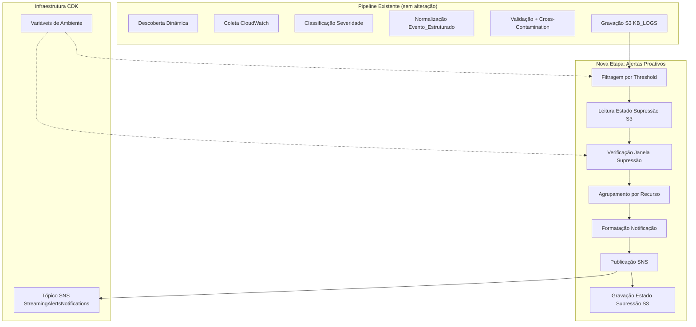
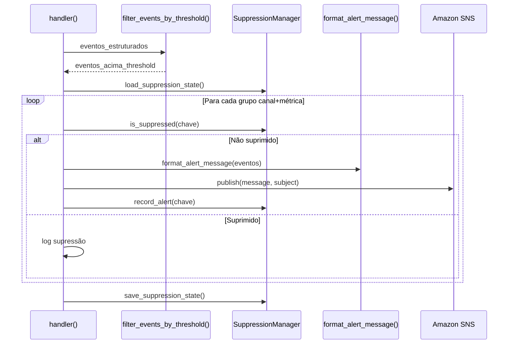

# Documento de Design — Alertas Proativos via SNS

## Visão Geral

Este design descreve a adição de alertas proativos ao pipeline de métricas existente (`Pipeline_Logs`). Após a etapa de armazenamento de eventos no S3, o pipeline verifica se existem eventos com severidade igual ou superior ao threshold configurado e publica notificações formatadas em um tópico SNS. Uma janela de supressão baseada em estado S3 evita fadiga de alertas.

### Decisões de Design

1. **Extensão in-place**: O código é adicionado ao `lambdas/pipeline_logs/handler.py` existente, após a etapa de armazenamento S3. Nenhuma Lambda nova é criada.
2. **Fail-open**: Falhas no sistema de alertas (SNS indisponível, estado de supressão corrompido) nunca interrompem o pipeline principal. O alerta é enviado ou logado, mas a coleta de métricas continua.
3. **Estado de supressão em S3**: Um único arquivo JSON no bucket KB_LOGS armazena timestamps de alertas enviados. Sem dependência de DynamoDB ou ElastiCache.
4. **Agrupamento por recurso**: Múltiplos eventos do mesmo canal/recurso são agrupados em uma única mensagem SNS para reduzir ruído.
5. **Threshold via variável de ambiente**: O nível mínimo de severidade é configurável via `ALERT_SEVERITY_THRESHOLD` sem redeploy de código.
6. **Backoff exponencial para throttling**: Até 3 tentativas com backoff exponencial ao publicar no SNS, consistente com o padrão já usado na coleta de métricas.

## Arquitetura



### Fluxo de Execução



## Componentes e Interfaces

### 1. Módulo de Filtragem por Threshold

```python
SEVERITY_ORDER = {"INFO": 0, "WARNING": 1, "ERROR": 2, "CRITICAL": 3}

def get_alert_threshold() -> str:
    """Lê ALERT_SEVERITY_THRESHOLD do env. Retorna 'ERROR' se ausente ou inválido."""

def filter_events_by_threshold(
    eventos: List[dict],
    threshold: str,
) -> List[dict]:
    """Retorna eventos com severidade >= threshold."""
```

### 2. Módulo de Supressão

```python
def build_suppression_key(canal: str, metrica_nome: str) -> str:
    """Retorna 'canal::metrica_nome'."""

class SuppressionManager:
    def __init__(self, s3_client, bucket: str, prefix: str, window_minutes: int):
        ...

    def load_state(self) -> None:
        """Lê suppression_state.json do S3. Trata falha como estado vazio."""

    def is_suppressed(self, key: str) -> bool:
        """Verifica se key foi alertada dentro da janela."""

    def record_alert(self, key: str) -> None:
        """Registra timestamp atual para key."""

    def cleanup_expired(self) -> None:
        """Remove entradas mais antigas que a janela."""

    def save_state(self) -> None:
        """Grava estado atualizado no S3."""
```

### 3. Módulo de Formatação

```python
def format_alert_message(
    eventos: List[dict],
    canal: str,
    servico: str,
) -> Tuple[str, str]:
    """Retorna (subject, body) formatados para SNS.
    
    Subject: '[SEVERIDADE] Alerta Streaming - canal - servico'
    Body: texto legível com emoji, seções separadas por linhas.
    Trunca a 256KB se necessário.
    """

def get_severity_emoji(severidade: str) -> str:
    """Retorna emoji: 🔴 CRITICAL, 🟠 ERROR, 🟡 WARNING."""

def serialize_alert_payload(eventos: List[dict]) -> str:
    """Serializa payload JSON com ensure_ascii=False, timestamps ISO 8601Z, números nativos."""
```

### 4. Módulo de Publicação SNS

```python
def publish_alert(
    sns_client,
    topic_arn: str,
    subject: str,
    message: str,
) -> bool:
    """Publica no SNS com backoff exponencial (3 tentativas). Retorna True se sucesso."""
```

### 5. Orquestração no Handler

A função `handler()` existente recebe uma nova etapa após o loop de armazenamento S3:

```python
# Após armazenamento S3 (etapa existente)
# Nova etapa: Alertas Proativos
all_stored_events = [...]  # coletados durante processamento
proactive_alerts_step(all_stored_events, summary)
```

```python
def proactive_alerts_step(
    eventos: List[dict],
    summary: Dict[str, Any],
) -> None:
    """Orquestra filtragem, supressão, formatação e publicação."""
```

## Modelos de Dados

### Evento_Estruturado (existente, sem alteração)

```python
{
    "timestamp": "2024-01-15T10:30:00Z",      # ISO 8601 UTC
    "canal": "CANAL_01",                        # nome do recurso
    "severidade": "ERROR",                      # INFO|WARNING|ERROR|CRITICAL
    "tipo_erro": "OUTPUT_ERROR",                # código do tipo de erro
    "descricao": "Canal CANAL_01 apresentou...", # texto pt-BR
    "causa_provavel": "Erros HTTP na saída...",  # texto pt-BR
    "recomendacao_correcao": "Verificar...",     # texto pt-BR
    "servico_origem": "MediaLive",               # serviço AWS
    "metrica_nome": "Output5xxErrors",           # nome da métrica CW
    "metrica_valor": 42,                         # valor numérico (JSON number)
    "metrica_unidade": "",                       # unidade CW
    "metrica_periodo": 300,                      # período em segundos
    "metrica_estatistica": "Sum"                 # estatística CW
}
```

### Estado de Supressão (novo)

Armazenado em `{KB_LOGS_PREFIX}alertas/suppression_state.json`:

```python
{
    "CANAL_01::Output5xxErrors": "2024-01-15T10:30:00Z",
    "CANAL_02::ActiveAlerts": "2024-01-15T09:15:00Z"
}
```

Mapa simples de `Chave_Supressao` → timestamp ISO 8601 do último alerta enviado.

### Mensagem SNS (novo)

```
Subject: "[🔴 CRITICAL] Alerta Streaming - CANAL_01 - MediaLive"

Body:
════════════════════════════════════════
🔴 ALERTA CRITICAL — MediaLive
Canal: CANAL_01
════════════════════════════════════════

▸ FAILOVER_DETECTADO
  Métrica: PrimaryInputActive = 0
  Descrição: Canal CANAL_01 está operando em pipeline secundário
  Causa provável: Pipeline primário inativo
  Recomendação: Investigar pipeline primário imediatamente
  Timestamp: 2024-01-15T10:30:00Z

▸ OUTPUT_ERROR
  Métrica: Output5xxErrors = 15
  Descrição: Canal CANAL_01 apresentou 15 erros de output
  Causa provável: Erros HTTP na saída do canal
  Recomendação: Verificar destino de output
  Timestamp: 2024-01-15T10:30:00Z

────────────────────────────────────────
Gerado por Pipeline_Metricas em 2024-01-15T10:35:00Z
```

### Contadores de Resumo (extensão do summary existente)

```python
summary["total_alertas_enviados"] = 0
summary["total_alertas_suprimidos"] = 0
summary["total_alertas_falha"] = 0
```


## Propriedades de Corretude

*Uma propriedade é uma característica ou comportamento que deve ser verdadeiro em todas as execuções válidas de um sistema — essencialmente, uma declaração formal sobre o que o sistema deve fazer. Propriedades servem como ponte entre especificações legíveis por humanos e garantias de corretude verificáveis por máquina.*

### Propriedade 1: Filtragem correta por threshold de severidade

*Para qualquer* lista de eventos estruturados com severidades variadas (INFO, WARNING, ERROR, CRITICAL) e *para qualquer* threshold válido (WARNING, ERROR, CRITICAL), a função de filtragem SHALL retornar exatamente os eventos cuja severidade é maior ou igual ao threshold, respeitando a hierarquia INFO < WARNING < ERROR < CRITICAL.

**Valida: Requisitos 1.1, 1.2**

### Propriedade 2: Threshold inválido retorna ERROR como padrão

*Para qualquer* string que não seja "WARNING", "ERROR" ou "CRITICAL", a função get_alert_threshold SHALL retornar "ERROR" como valor padrão.

**Valida: Requisitos 1.4**

### Propriedade 3: Mensagem formatada contém todos os campos obrigatórios

*Para qualquer* evento estruturado válido, a mensagem SNS formatada SHALL conter: canal, servico_origem, severidade, metrica_nome, metrica_valor, descricao, recomendacao_correcao, timestamp, emoji de severidade correto (🔴 CRITICAL, 🟠 ERROR, 🟡 WARNING), e separadores visuais entre seções.

**Valida: Requisitos 2.2, 2.4, 2.5, 6.1, 6.2, 6.3**

### Propriedade 4: Subject SNS no formato correto

*Para qualquer* combinação de severidade, canal e serviço de origem, o subject da mensagem SNS SHALL seguir o formato "[EMOJI SEVERIDADE] Alerta Streaming - canal - servico_origem".

**Valida: Requisitos 2.3**

### Propriedade 5: Agrupamento de eventos por recurso

*Para qualquer* lista de eventos onde múltiplos eventos pertencem ao mesmo canal, o agrupamento SHALL produzir exatamente uma mensagem por canal distinto, e cada mensagem SHALL conter todos os eventos daquele canal.

**Valida: Requisitos 2.7**

### Propriedade 6: Supressão correta dentro da janela

*Para qualquer* chave de supressão (canal::metrica_nome) e *para qualquer* estado de supressão com timestamps, se a chave foi alertada dentro da janela de supressão, o alerta SHALL ser suprimido. Se a chave não existe ou o timestamp é mais antigo que a janela, o alerta SHALL ser publicado.

**Valida: Requisitos 3.1, 3.2, 3.3**

### Propriedade 7: Limpeza de registros expirados

*Para qualquer* estado de supressão com entradas de diferentes idades e *para qualquer* janela de supressão em minutos, após a limpeza SHALL restar apenas entradas cujo timestamp está dentro da janela (mais recentes que now - janela_minutos).

**Valida: Requisitos 3.7**

### Propriedade 8: Contadores de resumo consistentes

*Para qualquer* execução do sistema de alertas com N eventos candidatos, a soma total_alertas_enviados + total_alertas_suprimidos + total_alertas_falha SHALL ser igual ao número total de grupos de alertas candidatos (após agrupamento por recurso).

**Valida: Requisitos 5.3**

### Propriedade 9: Mensagem limitada a 256KB

*Para qualquer* lista de eventos agrupados por recurso, a mensagem SNS formatada SHALL ter tamanho menor ou igual a 256KB (262144 bytes em UTF-8). Quando o conteúdo original excede o limite, a mensagem SHALL ser truncada e incluir nota informando quantos eventos foram omitidos.

**Valida: Requisitos 6.4**

### Propriedade 10: Round-trip de serialização JSON

*Para qualquer* payload de notificação gerado pelo sistema (contendo campos com caracteres em português, números e timestamps), serializar com json.dumps(ensure_ascii=False) e desserializar com json.loads SHALL produzir um dicionário equivalente ao original, preservando tipos (números como números, strings como strings).

**Valida: Requisitos 6.5, 7.1, 7.2, 7.4**

### Propriedade 11: Timestamps serializados em formato ISO 8601Z

*Para qualquer* timestamp gerado pelo sistema, a representação serializada SHALL corresponder ao formato ISO 8601 com sufixo Z (regex: `^\d{4}-\d{2}-\d{2}T\d{2}:\d{2}:\d{2}Z$`).

**Valida: Requisitos 7.3**

## Tratamento de Erros

| Cenário | Comportamento | Requisito |
|---------|--------------|-----------|
| SNS_TOPIC_ARN ausente/vazio | Ignora etapa de alertas, loga aviso | 2.6 |
| ALERT_SEVERITY_THRESHOLD inválido | Usa "ERROR" como padrão, loga aviso | 1.4 |
| ALERT_SUPPRESSION_MINUTES ausente | Usa 60 minutos como padrão | 3.6 |
| Falha ao publicar no SNS | Loga erro, incrementa total_alertas_falha, continua pipeline | 5.1 |
| Throttling do SNS | Backoff exponencial (1s, 2s, 4s) com até 3 tentativas | 5.5 |
| Falha ao ler estado de supressão do S3 | Trata como estado vazio (fail-open), loga erro | 3.8 |
| Falha ao gravar estado de supressão no S3 | Loga erro, continua (alertas já foram enviados) | 5.2 |
| Mensagem excede 256KB | Trunca eventos excedentes, inclui nota de omissão | 6.4 |

## Estratégia de Testes

### Testes Unitários (pytest)

- Validação de threshold padrão e inválido
- Formatação de subject e body com exemplos concretos
- Comportamento fail-open quando S3/SNS falham (mocks)
- Backoff exponencial com mock de throttling
- Agrupamento de eventos por recurso com exemplos específicos

### Testes de Propriedade (Hypothesis)

Biblioteca: **Hypothesis** (já utilizada no projeto — diretório `.hypothesis/` existente)

Configuração: mínimo 100 iterações por propriedade (`@settings(max_examples=100)`)

Cada teste de propriedade deve referenciar a propriedade do design:
- Tag format: **Feature: proactive-alerts, Property {N}: {título}**

Propriedades a implementar:
1. Filtragem correta por threshold (P1)
2. Threshold inválido retorna ERROR (P2)
3. Mensagem formatada contém campos obrigatórios (P3)
4. Subject no formato correto (P4)
5. Agrupamento por recurso (P5)
6. Supressão correta dentro da janela (P6)
7. Limpeza de registros expirados (P7)
8. Contadores de resumo consistentes (P8)
9. Mensagem limitada a 256KB (P9)
10. Round-trip de serialização JSON (P10)
11. Timestamps em formato ISO 8601Z (P11)

### Testes de Infraestrutura (CDK Assertions)

- Verificar criação do tópico SNS
- Verificar permissão sns:Publish na role da Lambda
- Verificar variáveis de ambiente adicionadas
- Verificar output CloudFormation exportado

### Testes de Integração

- Publicação real no SNS com tópico de teste (manual/staging)
- Leitura/gravação do estado de supressão no S3
