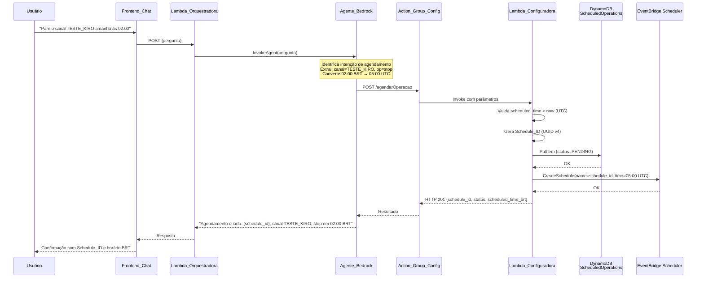
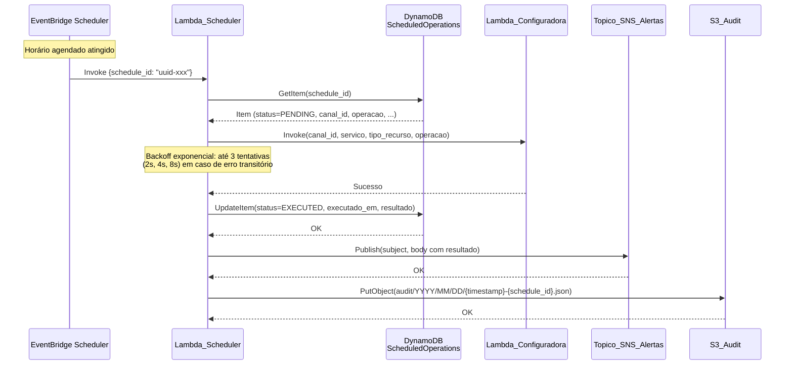
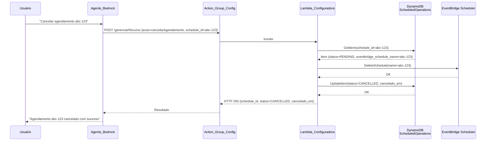

# Documento de Design — Agendamento de Operações (scheduled-operations)

## Visão Geral

Este documento descreve o design técnico do Agendamento de Operações no Streaming Chatbot. A funcionalidade permite que operadores de NOC agendem operações de streaming (start, stop, deletar) para execução futura usando linguagem natural no chat, sem precisar estar disponíveis no horário exato da manutenção.

A arquitetura introduz três componentes principais: (1) uma nova Lambda_Scheduler (`lambdas/scheduler/handler.py`) invocada pelo EventBridge Scheduler no horário agendado; (2) três novas funções na Lambda_Configuradora existente — `_criar_agendamento()`, `_listar_agendamentos()` e `_cancelar_agendamento()` — expostas via novos endpoints; e (3) uma tabela DynamoDB `ScheduledOperations` com dois GSIs para consultas eficientes por canal e por data.

O Agente_Bedrock interpreta horários em BRT (UTC-3), converte para UTC e roteia intenções de agendamento para os novos endpoints. Ao executar, a Lambda_Scheduler atualiza o status no DynamoDB, publica notificação SNS e registra auditoria no S3_Audit.

### Decisões de Design Principais

1. **EventBridge Scheduler (não Rules)**: Cada agendamento gera um schedule one-time independente nomeado com o Schedule_ID (UUID v4), permitindo cancelamento individual via `DeleteSchedule`.
2. **Lambda_Scheduler separada**: A execução dos agendamentos é isolada em uma Lambda dedicada, evitando que timeouts de operações longas afetem a Lambda_Configuradora.
3. **MaximumRetryAttempts=0 no EventBridge Scheduler**: A lógica de retry (backoff exponencial, 3 tentativas) é gerenciada internamente pela Lambda_Scheduler para evitar duplicação de operações destrutivas.
4. **Tabela DynamoDB dedicada**: `ScheduledOperations` separada da `StreamingConfigs` existente, com PK=`schedule_id` e SK=`status`, mais dois GSIs para consultas por canal e por data.
5. **Reutilização do Topico_SNS_Alertas**: O tópico SNS existente (criado pelo spec proactive-alerts) é reutilizado para notificações de execução de agendamentos.
6. **Conversão BRT↔UTC centralizada no Agente_Bedrock**: O agente converte horários para UTC antes de invocar os endpoints; a Lambda_Configuradora converte de volta para BRT apenas nas respostas ao usuário.
7. **Falhas de auditoria e SNS não bloqueantes**: Falhas no S3_Audit ou SNS são registradas no CloudWatch Logs mas não revertem a atualização de status no DynamoDB.

## Arquitetura

### Diagrama de Sequência — Criação de Agendamento



### Diagrama de Sequência — Execução do Agendamento



### Diagrama de Sequência — Cancelamento de Agendamento



## Componentes e Interfaces

### 1. Lambda_Scheduler (`lambdas/scheduler/handler.py`)

**Responsabilidade**: Executar a operação agendada no horário correto, atualizar o status no DynamoDB, publicar notificação SNS e registrar auditoria no S3_Audit.

**Runtime**: Python 3.12 | **Timeout**: 300s | **Memória**: 256 MB

**Variáveis de Ambiente**:

| Variável | Descrição |
|----------|-----------|
| `SCHEDULED_OPERATIONS_TABLE` | Nome da tabela DynamoDB ScheduledOperations |
| `SNS_TOPIC_ARN` | ARN do Topico_SNS_Alertas |
| `S3_AUDIT_BUCKET` | Nome do bucket S3_Audit |
| `CONFIGURADORA_FUNCTION_NAME` | Nome da Lambda_Configuradora |

**Função `lambda_handler(event, context)`**:

```python
def lambda_handler(event, context):
    schedule_id = event.get("schedule_id")
    # 1. Log início da execução com schedule_id
    # 2. GetItem no DynamoDB
    # 3. Verificar status == PENDING (ignorar se não for)
    # 4. Invocar Lambda_Configuradora com backoff exponencial (3 tentativas: 2s, 4s, 8s)
    # 5. Atualizar status (EXECUTED ou FAILED) no DynamoDB
    # 6. Publicar SNS (não bloqueante)
    # 7. Registrar S3_Audit (não bloqueante)
```

**Lógica de Retry com Backoff Exponencial**:

```python
def _invocar_configuradora_com_retry(params: dict) -> dict:
    delays = [2, 4, 8]
    for attempt, delay in enumerate(delays, 1):
        try:
            return _invocar_configuradora(params)
        except (ClientError, TimeoutError) as e:
            if attempt == len(delays):
                raise
            time.sleep(delay)
```

**Formato do Evento EventBridge Scheduler**:

```json
{
  "schedule_id": "550e8400-e29b-41d4-a716-446655440000"
}
```

### 2. Endpoint `/agendarOperacao` na Lambda_Configuradora

**Localização**: `lambdas/configuradora/handler.py` — novo bloco no `handler()` existente + função `_criar_agendamento()`.

**Parâmetros de Entrada** (POST):

| Parâmetro | Tipo | Obrigatório | Descrição |
|-----------|------|-------------|-----------|
| `canal_id` | string | Sim | ID do canal de streaming |
| `servico` | string | Sim | Serviço AWS (ex: "MediaLive") |
| `tipo_recurso` | string | Sim | Tipo do recurso (ex: "channel") |
| `operacao` | enum | Sim | `start`, `stop` ou `deletar` |
| `scheduled_time` | string | Sim | ISO 8601 UTC (ex: "2025-01-15T05:00:00Z") |
| `usuario_id` | string | Sim | ID do usuário que criou o agendamento |
| `parametros_adicionais` | object | Não | Parâmetros extras para a operação |
| `confirmacao_destrutiva` | boolean | Não | Obrigatório `true` quando `operacao=deletar` |

**Resposta de Sucesso** (HTTP 201):

```json
{
  "schedule_id": "550e8400-e29b-41d4-a716-446655440000",
  "status": "PENDING",
  "scheduled_time_utc": "2025-01-15T05:00:00Z",
  "scheduled_time_brt": "2025-01-15T02:00:00-03:00"
}
```

**Função `_criar_agendamento(params)`**:

```python
def _criar_agendamento(params: dict) -> dict:
    # 1. Validar parâmetros obrigatórios (retorna 400 com lista de faltantes)
    # 2. Validar operacao in {"start", "stop", "deletar"} (retorna 400)
    # 3. Validar scheduled_time > now + 1min UTC (retorna 400 com horário BRT)
    # 4. Validar confirmacao_destrutiva=true se operacao=deletar (retorna 400)
    # 5. Gerar schedule_id = str(uuid.uuid4())
    # 6. Calcular data_execucao = scheduled_time[:10] (YYYY-MM-DD)
    # 7. Calcular ttl_expiracao = scheduled_time + 90 dias (Unix timestamp)
    # 8. PutItem no DynamoDB com todos os atributos
    # 9. CreateSchedule no EventBridge Scheduler
    #    - Em caso de falha: UpdateItem(status=FAILED) + retorna 500
    # 10. Retorna HTTP 201 com schedule_id, status, scheduled_time_utc, scheduled_time_brt
```

### 3. Ação `listarAgendamentos` na Lambda_Configuradora

**Endpoint**: `POST /gerenciarRecurso` com `acao=listarAgendamentos`

**Filtros Opcionais**:

| Filtro | Tipo | Índice Utilizado |
|--------|------|-----------------|
| `canal_id` | string | GSI_Canal |
| `data_execucao` | string (YYYY-MM-DD) | GSI_Data |
| `servico` | string | Scan/Filter |
| `status` | enum | Scan/Filter |

**Função `_listar_agendamentos(filtros)`**:

```python
def _listar_agendamentos(filtros: dict) -> dict:
    # Se canal_id fornecido: Query GSI_Canal
    # Se data_execucao fornecido: Query GSI_Data
    # Caso contrário: Query tabela com FilterExpression status=PENDING
    # Ordenar por scheduled_time crescente
    # Limitar a 50 itens, incluir total_encontrado se houver mais
    # Converter scheduled_time e criado_em para BRT nos campos _brt
    # Retornar lista com campos: schedule_id, canal_id, servico, operacao,
    #   scheduled_time_brt, status, usuario_id, criado_em_brt
```

### 4. Ação `cancelarAgendamento` na Lambda_Configuradora

**Endpoint**: `POST /gerenciarRecurso` com `acao=cancelarAgendamento`

**Parâmetro Obrigatório**: `schedule_id` (string)

**Função `_cancelar_agendamento(schedule_id)`**:

```python
def _cancelar_agendamento(schedule_id: str) -> dict:
    # 1. GetItem no DynamoDB (retorna 404 se não encontrado)
    # 2. Verificar status == PENDING (retorna 409 se diferente)
    # 3. DeleteSchedule no EventBridge Scheduler (retorna 500 se falhar)
    # 4. UpdateItem(status=CANCELLED, cancelado_em=now_utc)
    # 5. Retorna HTTP 200 com schedule_id, status=CANCELLED, cancelado_em
```

### 5. Extensão do OpenAPI Schema (Action_Group_Config)

**Novo path `/agendarOperacao`** (POST):

```yaml
/agendarOperacao:
  post:
    summary: Agenda uma operação de streaming para execução futura
    operationId: agendarOperacao
    requestBody:
      content:
        application/json:
          schema:
            type: object
            required: [canal_id, servico, tipo_recurso, operacao, scheduled_time, usuario_id]
            properties:
              canal_id:
                type: string
              servico:
                type: string
              tipo_recurso:
                type: string
              operacao:
                type: string
                enum: [start, stop, deletar]
              scheduled_time:
                type: string
                description: ISO 8601 UTC (ex: 2025-01-15T05:00:00Z)
              usuario_id:
                type: string
              parametros_adicionais:
                type: object
              confirmacao_destrutiva:
                type: boolean
```

**Extensão do path `/gerenciarRecurso`**: Adicionar `listarAgendamentos` e `cancelarAgendamento` ao enum do parâmetro `acao`, com filtros opcionais para listagem e `schedule_id` obrigatório para cancelamento.

### 6. Atualização do Prompt do Agente_Bedrock

Adicionar ao prompt (`Help/agente-bedrock-prompt-v2.md`) três novas rotas:

- **Rota Criação de Agendamento**: palavras-chave "agendar", "programar", "às HH:MM", "amanhã", "na sexta", "no dia DD/MM" → extrai canal, operação, horário BRT → converte para UTC → invoca `/agendarOperacao`
- **Rota Listagem de Agendamentos**: palavras-chave "listar agendamentos", "o que está agendado", "agendamentos pendentes" → invoca `/gerenciarRecurso` com `acao=listarAgendamentos`
- **Rota Cancelamento de Agendamento**: palavras-chave "cancelar agendamento", "desagendar", "remover agendamento" → invoca `/gerenciarRecurso` com `acao=cancelarAgendamento`

### 7. Atualização do Frontend_Chat

Adicionar seção "⏰ Agendamentos" na sidebar do `frontend/chat.html`, posicionada após a seção de start/stop e antes das seções de criação/modificação, com os botões:

- "Agendar parada de canal para amanhã"
- "Agendar início de canal para sexta"
- "Listar agendamentos pendentes"
- "Cancelar agendamento"

### 8. Infraestrutura CDK (`stacks/main_stack.py`)

**Novos recursos**:
- Tabela DynamoDB `ScheduledOperations` com GSI_Canal e GSI_Data
- Lambda_Scheduler com runtime Python 3.12, timeout 300s, memória 256 MB
- Role IAM `EventBridgeSchedulerRole` com trust policy para `scheduler.amazonaws.com`

**Permissões adicionais à Lambda_Configuradora**:
- `dynamodb:PutItem`, `dynamodb:GetItem`, `dynamodb:UpdateItem`, `dynamodb:Query` na tabela ScheduledOperations
- `scheduler:CreateSchedule`, `scheduler:DeleteSchedule`, `scheduler:GetSchedule`
- `iam:PassRole` para a EventBridgeSchedulerRole

**Permissões da Lambda_Scheduler**:
- `dynamodb:GetItem`, `dynamodb:UpdateItem` na tabela ScheduledOperations
- `lambda:InvokeFunction` na Lambda_Configuradora
- `sns:Publish` no Topico_SNS_Alertas
- `s3:PutObject` no S3_Audit com prefixo `audit/*`

## Modelos de Dados

### Tabela DynamoDB: ScheduledOperations

**Chave Primária**: PK=`schedule_id` (String), SK=`status` (String)

**GSI_Canal**: PK=`canal_id` (String), SK=`scheduled_time` (String ISO 8601) — projeção ALL

**GSI_Data**: PK=`data_execucao` (String, formato `YYYY-MM-DD`), SK=`scheduled_time` (String ISO 8601) — projeção ALL

**Billing Mode**: PAY_PER_REQUEST

**TTL**: atributo `ttl_expiracao` (Unix timestamp), valor padrão = scheduled_time + 90 dias

**Atributos por Item**:

| Atributo | Tipo | Descrição |
|----------|------|-----------|
| `schedule_id` | String | UUID v4, PK da tabela e nome do EventBridge schedule |
| `status` | String | `PENDING`, `EXECUTED`, `CANCELLED`, `FAILED` |
| `canal_id` | String | ID do canal de streaming |
| `servico` | String | Serviço AWS (ex: "MediaLive") |
| `tipo_recurso` | String | Tipo do recurso (ex: "channel") |
| `operacao` | String | `start`, `stop` ou `deletar` |
| `scheduled_time` | String | ISO 8601 UTC com sufixo Z |
| `data_execucao` | String | YYYY-MM-DD derivado de `scheduled_time` |
| `usuario_id` | String | ID do usuário que criou o agendamento |
| `criado_em` | String | ISO 8601 UTC com sufixo Z |
| `executado_em` | String | ISO 8601 UTC, preenchido após execução |
| `resultado` | Map | Objeto JSON com detalhes da execução |
| `parametros_adicionais` | String | JSON serializado (string) |
| `eventbridge_schedule_name` | String | Nome do schedule no EventBridge (= schedule_id) |
| `ttl_expiracao` | Number | Unix timestamp para TTL (90 dias após scheduled_time) |
| `confirmacao_destrutiva` | Boolean | true se operacao=deletar e confirmado |

### Dataclass `ScheduledOperation`

```python
@dataclass
class ScheduledOperation:
    schedule_id: str           # UUID v4
    status: str                # PENDING | EXECUTED | CANCELLED | FAILED
    canal_id: str
    servico: str
    tipo_recurso: str
    operacao: str              # start | stop | deletar
    scheduled_time: str        # ISO 8601 UTC com Z
    data_execucao: str         # YYYY-MM-DD
    usuario_id: str
    criado_em: str             # ISO 8601 UTC com Z
    eventbridge_schedule_name: str
    ttl_expiracao: int         # Unix timestamp
    executado_em: str = ""
    resultado: dict = field(default_factory=dict)
    parametros_adicionais: str = "{}"  # JSON serializado
    confirmacao_destrutiva: bool = False
```

### Estrutura do Registro de Auditoria S3

**Chave S3**: `audit/YYYY/MM/DD/{YYYYMMDDTHHMMSSz}-{schedule_id}.json`

```json
{
  "timestamp": "2025-01-15T05:00:05Z",
  "schedule_id": "550e8400-e29b-41d4-a716-446655440000",
  "tipo_execucao": "agendado",
  "agendado_por": "operador@empresa.com",
  "canal_id": "TESTE_KIRO",
  "servico": "MediaLive",
  "tipo_recurso": "channel",
  "operacao": "stop",
  "scheduled_time": "2025-01-15T05:00:00Z",
  "executado_em": "2025-01-15T05:00:05Z",
  "resultado": "sucesso",
  "resposta_configuradora": { ... },
  "erro": null
}
```

### Estrutura da Notificação SNS

**Subject**: `[AGENDAMENTO] Canal {canal_id} - {operacao} executada com {sucesso|falha}`

**Body**:

```json
{
  "schedule_id": "550e8400-e29b-41d4-a716-446655440000",
  "canal_id": "TESTE_KIRO",
  "servico": "MediaLive",
  "operacao": "stop",
  "horario_agendado_brt": "2025-01-15T02:00:00-03:00",
  "horario_execucao_brt": "2025-01-15T02:00:05-03:00",
  "resultado": "sucesso",
  "erro": null,
  "agendado_por": "operador@empresa.com"
}
```

## Propriedades de Corretude

*Uma propriedade é uma característica ou comportamento que deve ser verdadeiro em todas as execuções válidas de um sistema — essencialmente, uma declaração formal sobre o que o sistema deve fazer. Propriedades servem como ponte entre especificações legíveis por humanos e garantias de corretude verificáveis por máquina.*

### Propriedade 1: Validação de horário no passado

*Para qualquer* valor de `scheduled_time` que seja igual ou anterior ao momento atual em UTC, o endpoint `/agendarOperacao` deve rejeitar a requisição com HTTP 400 contendo a mensagem de erro com o horário em BRT. *Para qualquer* valor de `scheduled_time` que seja estritamente posterior ao momento atual em UTC por pelo menos 1 minuto, a validação deve passar.

**Valida: Requisitos 2.2, 9.1, 9.4**

### Propriedade 2: Validação de operação inválida

*Para qualquer* string de `operacao` que não pertença ao conjunto `{"start", "stop", "deletar"}`, o endpoint `/agendarOperacao` deve rejeitar a requisição com HTTP 400 contendo a mensagem de erro com o valor inválido e a lista de valores válidos.

**Valida: Requisitos 9.3**

### Propriedade 3: Validação de parâmetros obrigatórios ausentes

*Para qualquer* subconjunto dos parâmetros obrigatórios (`canal_id`, `servico`, `tipo_recurso`, `operacao`, `scheduled_time`, `usuario_id`) que esteja ausente na requisição, o endpoint deve retornar HTTP 400 e a mensagem de erro deve listar exatamente os parâmetros faltantes.

**Valida: Requisitos 2.7**

### Propriedade 4: Confirmação obrigatória para operação destrutiva

*Para qualquer* requisição ao endpoint `/agendarOperacao` com `operacao=deletar` onde `confirmacao_destrutiva` esteja ausente ou seja `false`, a requisição deve ser rejeitada com HTTP 400. Somente quando `confirmacao_destrutiva=true` a requisição deve ser aceita.

**Valida: Requisitos 9.2**

### Propriedade 5: Resposta de criação contém campos obrigatórios

*Para qualquer* requisição válida ao endpoint `/agendarOperacao`, a resposta HTTP 201 deve conter os campos `schedule_id` (UUID v4 válido), `status` (valor `"PENDING"`), `scheduled_time_utc` (ISO 8601 com Z) e `scheduled_time_brt` (ISO 8601 com offset -03:00).

**Valida: Requisitos 2.3, 2.6**

### Propriedade 6: Listagem padrão retorna apenas PENDING ordenado

*Para qualquer* conjunto de agendamentos com status variados (PENDING, EXECUTED, CANCELLED, FAILED), a listagem sem filtros deve retornar apenas os itens com status `PENDING`, ordenados por `scheduled_time` crescente.

**Valida: Requisitos 6.3**

### Propriedade 7: Listagem respeita limite de 50 itens

*Para qualquer* consulta de listagem que retorne mais de 50 agendamentos, a resposta deve conter no máximo 50 itens e incluir o campo `total_encontrado` com o número real de resultados.

**Valida: Requisitos 6.7**

### Propriedade 8: Resposta de listagem contém campos obrigatórios

*Para qualquer* agendamento retornado pela listagem, o item deve conter os campos `schedule_id`, `canal_id`, `servico`, `operacao`, `scheduled_time_brt`, `status`, `usuario_id` e `criado_em_brt`.

**Valida: Requisitos 6.6**

### Propriedade 9: Cancelamento retorna campos obrigatórios

*Para qualquer* agendamento com status `PENDING` que seja cancelado com sucesso, a resposta HTTP 200 deve conter os campos `schedule_id`, `status` (valor `"CANCELLED"`) e `cancelado_em` (ISO 8601 UTC).

**Valida: Requisitos 7.8**

### Propriedade 10: Formato do Subject SNS

*Para qualquer* combinação de `canal_id` e `operacao`, o Subject da mensagem SNS publicada pela Lambda_Scheduler deve seguir o formato `[AGENDAMENTO] Canal {canal_id} - {operacao} executada com {sucesso|falha}`.

**Valida: Requisitos 5.2**

### Propriedade 11: Corpo SNS contém campos obrigatórios

*Para qualquer* resultado de execução de agendamento (sucesso ou falha), o corpo da mensagem SNS deve conter os campos `schedule_id`, `canal_id`, `servico`, `operacao`, `horario_agendado_brt`, `horario_execucao_brt`, `resultado` e `agendado_por`.

**Valida: Requisitos 5.3**

### Propriedade 12: Formato da chave S3 de auditoria

*Para qualquer* `schedule_id` e horário de execução, a chave S3 do registro de auditoria deve seguir o formato `audit/YYYY/MM/DD/{YYYYMMDDTHHMMSSz}-{schedule_id}.json`.

**Valida: Requisitos 8.2**

### Propriedade 13: Retry com backoff exponencial

*Para qualquer* padrão de falhas transitórias (1, 2 ou 3 falhas consecutivas) ao invocar a Lambda_Configuradora, a Lambda_Scheduler deve realizar no máximo 3 tentativas com intervalos de backoff exponencial (2s, 4s, 8s) antes de registrar falha definitiva.

**Valida: Requisitos 14.1**

### Propriedade 14: Round-trip de serialização de agendamentos

*Para qualquer* registro de agendamento válido persistido na tabela ScheduledOperations, serializar o item para JSON e desserializar de volta deve produzir um dicionário equivalente ao original, sem perda de campos ou alteração de tipos.

**Valida: Requisitos 15.1**

### Propriedade 15: Serialização ISO 8601 com sufixo Z

*Para qualquer* valor de `scheduled_time` fornecido como datetime UTC, a serialização para string deve produzir uma string ISO 8601 com sufixo `Z` (ex: `"2025-01-15T05:00:00Z"`), e a desserialização de volta deve produzir um datetime equivalente.

**Valida: Requisitos 15.2**

### Propriedade 16: Round-trip de parametros_adicionais

*Para qualquer* objeto JSON fornecido como `parametros_adicionais`, serializar para string JSON ao persistir no DynamoDB e desserializar de volta ao ler deve produzir um objeto equivalente ao original.

**Valida: Requisitos 15.3**

### Propriedade 17: Round-trip de payloads SNS com Unicode

*Para qualquer* payload de notificação SNS contendo caracteres Unicode em português (acentos, cedilha), serializar para string com `ensure_ascii=False` e desserializar de volta deve preservar todos os campos e caracteres sem perda de informação.

**Valida: Requisitos 15.6**

## Tratamento de Erros

### Erros no Endpoint `/agendarOperacao`

| Condição | HTTP | Mensagem |
|----------|------|----------|
| Parâmetro obrigatório ausente | 400 | "Parâmetros obrigatórios ausentes: {lista}" |
| `scheduled_time` no passado ou < 1min no futuro | 400 | "Não é possível agendar operações no passado. Horário informado: {scheduled_time_brt} BRT" |
| `operacao` inválida | 400 | "Operação '{operacao}' não é suportada para agendamento. Operações válidas: start, stop, deletar" |
| `operacao=deletar` sem `confirmacao_destrutiva=true` | 400 | "Operação 'deletar' requer confirmação explícita. Inclua confirmacao_destrutiva=true na requisição" |
| Falha ao criar EventBridge schedule | 500 | "Falha ao criar schedule no EventBridge: {detalhes}" |

### Erros no Endpoint `cancelarAgendamento`

| Condição | HTTP | Mensagem |
|----------|------|----------|
| `schedule_id` não encontrado | 404 | "Agendamento {schedule_id} não encontrado" |
| Status diferente de PENDING | 409 | "Agendamento {schedule_id} não pode ser cancelado pois está com status {status}" |
| Falha ao deletar EventBridge schedule | 500 | "Falha ao deletar schedule no EventBridge: {detalhes}" |

### Erros na Lambda_Scheduler

| Condição | Tratamento |
|----------|-----------|
| `schedule_id` ausente no evento | Log CRITICAL + encerrar |
| Agendamento não encontrado no DynamoDB | Log ERROR + encerrar |
| Status diferente de PENDING | Log INFO "ignorado" + encerrar |
| Falha transitória na Lambda_Configuradora | Retry com backoff (2s, 4s, 8s) |
| Falha definitiva após 3 tentativas | UpdateItem(FAILED) + SNS + S3_Audit |
| Falha no SNS | Log ERROR + continuar (não bloqueante) |
| Falha no S3_Audit | Log ERROR + continuar (não bloqueante) |
| Falha no UpdateItem DynamoDB após sucesso | Log CRITICAL com schedule_id + resultado |

## Estratégia de Testes

### Testes Unitários

Testes com mocks dos clientes boto3 (`dynamodb_client`, `lambda_client`, `scheduler_client`, `sns_client`, `s3_client`):

**Lambda_Configuradora (`tests/test_unit_scheduled_operations.py`)**:
1. Criação com sucesso — verificar DynamoDB PutItem e EventBridge CreateSchedule chamados
2. Validação de `scheduled_time` no passado — verificar HTTP 400
3. Validação de `scheduled_time` < 1 minuto no futuro — verificar HTTP 400
4. Validação de `operacao` inválida — verificar HTTP 400
5. Validação de `deletar` sem `confirmacao_destrutiva` — verificar HTTP 400
6. Validação de parâmetros obrigatórios ausentes — verificar HTTP 400 com lista
7. Falha no EventBridge após DynamoDB — verificar status FAILED no DynamoDB
8. Listagem sem filtros — verificar apenas PENDING ordenado por scheduled_time
9. Listagem com filtro `canal_id` — verificar uso do GSI_Canal
10. Listagem com filtro `data_execucao` — verificar uso do GSI_Data
11. Listagem com mais de 50 resultados — verificar limite e `total_encontrado`
12. Cancelamento com sucesso — verificar DeleteSchedule e UpdateItem(CANCELLED)
13. Cancelamento de agendamento não encontrado — verificar HTTP 404
14. Cancelamento de agendamento não-PENDING — verificar HTTP 409
15. Cancelamento com falha no EventBridge — verificar HTTP 500 e DynamoDB não atualizado

**Lambda_Scheduler (`tests/test_unit_scheduler_handler.py`)**:
1. Execução com sucesso — verificar EXECUTED no DynamoDB, SNS e S3_Audit
2. Execução com falha na Configuradora — verificar FAILED no DynamoDB
3. Agendamento com status CANCELLED — verificar que nenhuma operação é executada
4. Agendamento não encontrado — verificar encerramento sem operação
5. Retry com 1 falha transitória — verificar 2 chamadas à Configuradora
6. Retry com 2 falhas transitórias — verificar 3 chamadas à Configuradora
7. Retry com 3 falhas — verificar FAILED e SNS de falha
8. Falha no SNS — verificar que DynamoDB é atualizado mesmo assim
9. Falha no S3_Audit — verificar que DynamoDB é atualizado mesmo assim
10. SNS_TOPIC_ARN ausente — verificar que SNS não é chamado

### Testes Property-Based

Biblioteca: **Hypothesis** (Python) — já presente no projeto.

Configuração: mínimo 100 iterações por propriedade.

Cada teste deve referenciar a propriedade do design com o tag:
`# Feature: scheduled-operations, Property {N}: {texto}`

- **Property 1**: Validação de horário no passado — gerar timestamps aleatórios passados e futuros
- **Property 2**: Validação de operação inválida — gerar strings aleatórias de operação
- **Property 3**: Validação de parâmetros ausentes — gerar subconjuntos aleatórios de parâmetros obrigatórios
- **Property 4**: Confirmação obrigatória para deletar — gerar requisições deletar com/sem confirmacao_destrutiva
- **Property 5**: Resposta de criação contém campos obrigatórios — gerar inputs válidos aleatórios
- **Property 6**: Listagem padrão retorna apenas PENDING ordenado — gerar conjuntos de agendamentos com status variados
- **Property 7**: Listagem respeita limite de 50 itens — gerar datasets com tamanhos variados
- **Property 8**: Resposta de listagem contém campos obrigatórios — gerar agendamentos aleatórios
- **Property 9**: Cancelamento retorna campos obrigatórios — gerar schedule_ids aleatórios
- **Property 10**: Formato do Subject SNS — gerar canal_id e operacao aleatórios
- **Property 11**: Corpo SNS contém campos obrigatórios — gerar resultados de execução aleatórios
- **Property 12**: Formato da chave S3 — gerar schedule_ids e horários aleatórios
- **Property 13**: Retry com backoff exponencial — gerar padrões de falha aleatórios
- **Property 14**: Round-trip de serialização — gerar registros de agendamento aleatórios
- **Property 15**: Serialização ISO 8601 com Z — gerar datetimes UTC aleatórios
- **Property 16**: Round-trip de parametros_adicionais — gerar objetos JSON aleatórios
- **Property 17**: Round-trip SNS com Unicode — gerar payloads com caracteres Unicode

### Testes de Integração

1. **Criação e execução end-to-end**: Criar agendamento para 2 minutos no futuro, aguardar execução, verificar status EXECUTED no DynamoDB.
2. **Cancelamento antes da execução**: Criar agendamento, cancelar, verificar que EventBridge schedule foi deletado.
3. **Listagem por canal**: Criar múltiplos agendamentos para o mesmo canal, listar por `canal_id`, verificar resultados.
4. **Notificação SNS**: Verificar que mensagem SNS é publicada após execução.
