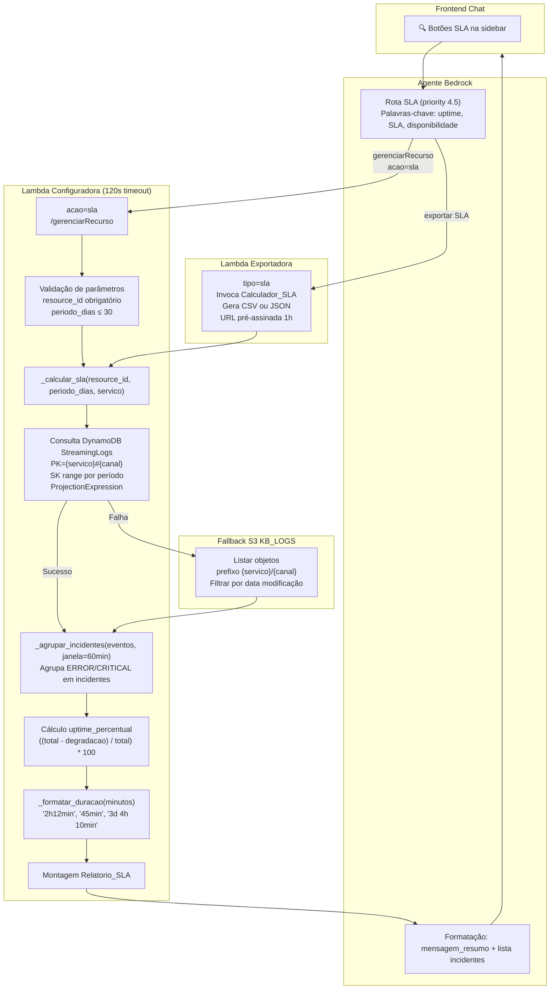

# Documento de Design — SLA Tracking

## Visão Geral

Esta funcionalidade adiciona ao Streaming Chatbot a capacidade de calcular e consultar o uptime/disponibilidade de canais de streaming com base nos eventos já armazenados no DynamoDB StreamingLogs e no bucket S3 KB_LOGS. Nenhuma nova coleta de métricas é necessária — o sistema reutiliza integralmente os dados existentes.

A implementação é adicionada à Lambda_Configuradora como nova ação `sla` no path `/gerenciarRecurso` existente, evitando a criação de um novo path e respeitando o limite de paths do Action_Group_Config. O módulo Calculador_SLA consulta o DynamoDB, agrupa eventos em incidentes usando a Janela_Consolidacao de 60 minutos, calcula o uptime percentual e retorna um Relatorio_SLA estruturado.

A resposta padrão segue o formato: `"99.70% — 2h12min de degradação em 3 incidentes"`. O sistema suporta busca por substring (múltiplos canais), fallback para S3 KB_LOGS em caso de falha do DynamoDB, e exportação via Lambda_Exportadora com `tipo="sla"`.

### Decisões de Design

1. **Reutilização do path `/gerenciarRecurso`**: Adiciona `acao=sla` ao enum existente em vez de criar um novo path OpenAPI, mantendo o schema dentro do limite de 9 paths do Action Group.
2. **Calculador_SLA como módulo interno**: Todo o código novo fica em `lambdas/configuradora/handler.py` — sem novos arquivos ou Lambdas. Três funções principais: `_calcular_sla()`, `_agrupar_incidentes()` e `_formatar_duracao()`.
3. **DynamoDB como fonte primária**: Consulta por PK `{servico}#{canal}` com SK range para o período, usando ProjectionExpression para minimizar RCU. Fallback automático para S3 KB_LOGS em caso de falha.
4. **Janela_Consolidacao de 60 minutos**: Eventos ERROR/CRITICAL separados por menos de 60 minutos são agrupados no mesmo incidente. Configurável via parâmetro interno.
5. **Busca por substring**: `resource_id` é tratado como substring case-insensitive, permitindo consultas como "WARNER" ou "Globo" que retornam múltiplos canais.
6. **Exportação via Lambda_Exportadora existente**: Adiciona suporte a `tipo="sla"` na Lambda_Exportadora, que invoca internamente a lógica do Calculador_SLA antes de gerar o arquivo CSV/JSON.

## Arquitetura



### Fluxo de Execução

1. Usuário pergunta "Qual o uptime do canal WARNER no último mês?" no chat
2. Agente Bedrock identifica palavras-chave SLA e roteia para `/gerenciarRecurso` com `acao=sla`, `resource_id="WARNER"`, `periodo_dias=30`
3. Lambda valida parâmetros (resource_id obrigatório, periodo_dias ≤ 30)
4. `_calcular_sla()` itera sobre serviços relevantes, construindo PK `{servico}#WARNER`
5. Consulta DynamoDB com SK range entre `{timestamp_inicio}` e `{timestamp_fim}`, paginando com LastEvaluatedKey
6. Se DynamoDB falhar, aciona fallback S3 KB_LOGS
7. `_agrupar_incidentes()` filtra eventos ERROR/CRITICAL e agrupa por Janela_Consolidacao de 60 minutos
8. Calcula `uptime_percentual` e `tempo_total_degradacao_formatado` via `_formatar_duracao()`
9. Monta Relatorio_SLA com todos os campos obrigatórios
10. Agente formata resposta em português com `mensagem_resumo` em destaque

### Estimativa de Volume

| Cenário | Eventos esperados | Tempo estimado |
|---------|-------------------|----------------|
| Canal único, 30 dias | ~500-2000 eventos | < 5s |
| Busca "WARNER" (1 canal), 30 dias | ~500-2000 eventos | < 5s |
| Busca "Globo" (10 canais), 30 dias | ~5000-20000 eventos | 10-30s |
| Busca "todos" (20 canais), 30 dias | ~10000-40000 eventos | 30-90s |


## Componentes e Interfaces

### 1. Função `_calcular_sla()` (nova)

Orquestra o cálculo de SLA para um canal ou grupo de canais.

```python
def _calcular_sla(
    resource_id: str,
    periodo_dias: int = 30,
    servico: str | None = None,
) -> dict[str, Any]:
    """Calcula SLA para o canal identificado por resource_id.

    Consulta DynamoDB StreamingLogs como fonte primária.
    Em caso de falha, aciona fallback para S3 KB_LOGS.
    Suporta busca por substring (múltiplos canais).
    Retorna Relatorio_SLA ou dict com campo 'relatorios' para múltiplos canais.
    """
```

| Parâmetro | Tipo | Descrição |
|-----------|------|-----------|
| `resource_id` | `str` | Nome parcial ou completo do canal (busca por substring) |
| `periodo_dias` | `int` | Período de consulta em dias (padrão 30, máximo 30) |
| `servico` | `str \| None` | Serviço específico ou None para todos |
| **Retorno** | `dict` | Relatorio_SLA (canal único) ou `{"relatorios": [...], "resumo_grupo": {...}}` |

### 2. Função `_agrupar_incidentes()` (nova)

Agrupa eventos ERROR/CRITICAL em incidentes usando a Janela_Consolidacao.

```python
def _agrupar_incidentes(
    eventos: list[dict],
    janela_consolidacao_minutos: int = 60,
) -> list[dict]:
    """Agrupa eventos ERROR/CRITICAL em Incidente_SLA.

    Eventos separados por menos de janela_consolidacao_minutos
    são agrupados no mesmo incidente.
    Retorna lista de incidentes ordenada por inicio ASC.
    """
```

| Parâmetro | Tipo | Descrição |
|-----------|------|-----------|
| `eventos` | `list[dict]` | Lista de eventos com campos timestamp, severidade, metrica_nome |
| `janela_consolidacao_minutos` | `int` | Janela de consolidação em minutos (padrão 60) |
| **Retorno** | `list[dict]` | Lista de Incidente_SLA com inicio, fim, duracao_minutos, severidade_maxima, eventos_count |

**Algoritmo de agrupamento:**
1. Filtrar apenas eventos com severidade ERROR ou CRITICAL
2. Ordenar por timestamp ASC
3. Iniciar incidente com o primeiro evento
4. Para cada evento subsequente: se gap desde o último evento do incidente atual < janela → adicionar ao incidente; senão → fechar incidente atual e iniciar novo
5. Calcular duração de cada incidente: `(fim - inicio).total_seconds() / 60 + 5` (granularidade mínima de 5 minutos)
6. Determinar `severidade_maxima` usando hierarquia `INFO < WARNING < ERROR < CRITICAL`
7. Contar `eventos_count` como número de `metrica_nome` distintos no incidente

### 3. Função `_formatar_duracao()` (nova)

Converte minutos em string legível em português.

```python
def _formatar_duracao(minutos: int) -> str:
    """Converte minutos em string legível.

    Exemplos:
        45 → "45min"
        132 → "2h12min"
        4570 → "3d 4h 10min"
        0 → "0min"
    """
```

| Entrada | Saída |
|---------|-------|
| 0 | "0min" |
| 45 | "45min" |
| 60 | "1h" |
| 132 | "2h12min" |
| 1440 | "1d" |
| 4570 | "3d 4h 10min" |

### 4. Função `_consultar_ddb_sla()` (nova)

Consulta o DynamoDB StreamingLogs para um canal e período específicos.

```python
def _consultar_ddb_sla(
    canal: str,
    servico: str,
    timestamp_inicio: str,
    timestamp_fim: str,
    ddb_table,
) -> list[dict]:
    """Consulta DynamoDB com PK={servico}#{canal}, SK range.

    Usa ProjectionExpression para reduzir RCU.
    Pagina automaticamente com LastEvaluatedKey.
    Aplica backoff exponencial (1s, 2s, 4s) para ProvisionedThroughputExceededException.
    Lança exceção em caso de falha para acionar fallback.
    """
```

### 5. Função `_consultar_s3_sla_fallback()` (nova)

Consulta o S3 KB_LOGS como fallback quando o DynamoDB falha.

```python
def _consultar_s3_sla_fallback(
    canal: str,
    servico: str | None,
    timestamp_inicio: datetime,
    timestamp_fim: datetime,
) -> list[dict]:
    """Consulta S3 KB_LOGS como fallback.

    Lista objetos com prefixo {servico}/{canal} (ou apenas {canal} se servico=None).
    Filtra por data de modificação dentro do período.
    Desserializa cada JSON e extrai campos necessários.
    """
```

### 6. Roteamento no Handler Existente

No bloco `if api_path in ("/gerenciarRecurso", ...)`, adicionar tratamento para `acao == "sla"`:

```python
# --- SLA ---
if acao == "sla":
    if not resource_id:
        return _bedrock_response(event, 400, {
            "erro": "Para acao=sla, parâmetro obrigatório: resource_id",
        })
    periodo_dias = int(parameters.get("periodo_dias", 30))
    if periodo_dias > 30:
        return _bedrock_response(event, 400, {
            "erro": "periodo_dias máximo é 30 (limitado pelo TTL do DynamoDB)",
        })
    servico = parameters.get("servico") or None
    try:
        resultado = _calcular_sla(resource_id, periodo_dias, servico)
        return _bedrock_response(event, 200, resultado)
    except Exception as exc:
        logger.error("SLA calculation error: %s", exc)
        return _bedrock_response(event, 500, {
            "erro": f"Erro no cálculo de SLA: {exc}",
        })
```

### 7. Atualização da Lambda_Exportadora

Adicionar suporte a `tipo="sla"` em `lambdas/exportadora/handler.py`:

```python
# Em handle_export() ou equivalente, adicionar branch para tipo="sla"
if tipo == "sla":
    # Invocar Calculador_SLA internamente
    relatorio = _calcular_sla_para_export(resource_id, periodo_dias, servico)
    if formato == "CSV":
        conteudo = _formatar_sla_csv(relatorio)
        extensao = "csv"
    else:
        conteudo = json.dumps(relatorio, ensure_ascii=False, default=str)
        extensao = "json"
    nome_arquivo = f"sla-{resource_id}-{periodo_dias}d-{timestamp}.{extensao}"
    # Upload para S3_Exports e retornar URL pré-assinada
```

Colunas CSV para exportação SLA:
`canal`, `servico`, `periodo_dias`, `data_inicio`, `data_fim`, `uptime_percentual`, `total_incidentes`, `tempo_total_degradacao_minutos`, `incidente_inicio`, `incidente_fim`, `incidente_duracao_minutos`, `incidente_severidade_maxima`

### 8. Atualização do Schema OpenAPI

Adicionar `"sla"` ao enum de `acao` e documentar parâmetros específicos em `Help/openapi-config-v2.json`:

```json
{
  "acao": {
    "enum": ["deletar", "start", "stop", "listar", "healthcheck", "historico", "comparar", "analytics", "sla"],
    "description": "... sla (calcula uptime e lista incidentes de um canal no período especificado)"
  },
  "periodo_dias": {
    "type": "integer",
    "default": 30,
    "description": "Periodo em dias para sla (máximo 30, limitado pelo TTL do DynamoDB). Padrao 30"
  }
}
```

### 9. Atualização do Prompt do Agente Bedrock

Adicionar rota SLA entre HEALTH_CHECK_MASSA (priority 4) e LOGS_HISTÓRICOS (priority 5):

```
<route priority="4.5" name="SLA" action_group="Action_Group_Config" operation="gerenciarRecurso">
Palavras-chave: "uptime", "SLA", "disponibilidade", "tempo fora do ar", "incidentes",
"degradação", "indisponibilidade", "ficou fora", "caiu por quanto tempo"
Use gerenciarRecurso com acao="sla" e resource_id com nome parcial do canal.
DIFERENCIAÇÃO: "uptime", "percentual", "disponibilidade" → rota SLA.
"por que caiu", "o que aconteceu" → rota LOGS_HISTÓRICOS.
Mapeamento de período: "último mês" → periodo_dias=30, "última semana" → periodo_dias=7,
"hoje"/"últimas 24h" → periodo_dias=1.
Ao apresentar resultado: exiba mensagem_resumo em destaque, depois liste incidentes
com data de início, duração e severidade máxima.
</route>
```

### 10. Atualização do Frontend (`chat.html`)

Adicionar botões de sugestão na seção "🔍 Logs & Métricas" da sidebar:

```javascript
"Qual o uptime do canal WARNER no último mês?"
"SLA de todos os canais Globo nos últimos 7 dias"
"Exportar relatório SLA do canal ESPN em CSV"
```


## Modelos de Dados

### Relatorio_SLA (resposta do cálculo)

```python
{
    "canal": "WARNER_HD",                          # nome do canal consultado
    "servico": "MediaLive",                        # serviço ou lista de serviços
    "periodo_dias": 30,                            # período consultado
    "data_inicio": "2024-12-16T00:00:00Z",         # ISO 8601 UTC
    "data_fim": "2025-01-15T23:59:59Z",            # ISO 8601 UTC
    "uptime_percentual": 99.70,                    # float, 2 casas decimais
    "total_incidentes": 3,                         # inteiro
    "tempo_total_degradacao_minutos": 132,         # inteiro
    "tempo_total_degradacao_formatado": "2h12min", # string legível
    "lista_incidentes": [                          # ordenada por inicio DESC
        {
            "inicio": "2025-01-10T14:30:00Z",
            "fim": "2025-01-10T16:42:00Z",
            "duracao_minutos": 132,
            "duracao_formatada": "2h12min",
            "severidade_maxima": "CRITICAL",
            "eventos_count": 5,
        },
    ],
    "fonte_dados": "dynamodb",                     # "dynamodb" ou "s3_fallback"
    "mensagem_resumo": "99.70% — 2h12min de degradação em 3 incidentes",
    "erros": [],                                   # lista de erros parciais
}
```

### Resposta de Múltiplos Canais

```python
{
    "relatorios": [
        { "...Relatorio_SLA do canal 1..." },
        { "...Relatorio_SLA do canal 2..." },
    ],
    "resumo_grupo": {
        "total_canais": 5,
        "uptime_medio": 99.12,
        "canal_pior_sla": "GLOBO_NEWS",
        "canal_melhor_sla": "GLOBO_HD",
    },
    "aviso": "Exibindo os 20 primeiros canais de 25 encontrados. Use resource_id mais específico para refinar a busca.",  # opcional
}
```

### Incidente_SLA (estrutura interna)

```python
{
    "inicio": datetime,                # timestamp do primeiro evento
    "fim": datetime,                   # timestamp do último evento
    "duracao_minutos": int,            # (fim - inicio).seconds/60 + 5
    "severidade_maxima": str,          # INFO | WARNING | ERROR | CRITICAL
    "eventos": list[dict],             # eventos que compõem o incidente
    "eventos_count": int,              # len(set(e["metrica_nome"] for e in eventos))
}
```

### Hierarquia de Severidade

```python
_SEVERITY_ORDER = {"INFO": 0, "WARNING": 1, "ERROR": 2, "CRITICAL": 3}
```

### Serviços Suportados para SLA

```python
_SLA_SERVICOS = ["MediaLive", "MediaPackage", "MediaTailor", "CloudFront"]
```

### Variável de Ambiente Necessária

```
LOGS_TABLE_NAME  # Nome da tabela DynamoDB StreamingLogs (já existente)
KB_LOGS_BUCKET   # Nome do bucket S3 KB_LOGS (já existente)
KB_LOGS_PREFIX   # Prefixo no S3 KB_LOGS (já existente)
```


## Propriedades de Corretude

*Uma propriedade é uma característica ou comportamento que deve ser verdadeiro em todas as execuções válidas de um sistema — essencialmente, uma declaração formal sobre o que o sistema deve fazer. Propriedades servem como ponte entre especificações legíveis por humanos e garantias de corretude verificáveis por máquina.*

### Reflexão sobre Redundância

Antes de listar as propriedades, analisamos redundâncias:

- **Req 4.2 e 4.3** (agrupamento por janela): São complementares — gap < 60min agrupa, gap >= 60min separa. Podem ser combinados em uma única propriedade que testa ambos os lados da fronteira com inputs variados.
- **Req 5.1, 5.2, 5.3** (cálculo de uptime): São partes da mesma fórmula. Combinamos em uma propriedade de cálculo de uptime que verifica a fórmula completa.
- **Req 6.1 e 6.2** (campos obrigatórios): São sobre completude do Relatorio_SLA. Combinamos em uma propriedade de estrutura completa.
- **Req 14.1, 14.2, 14.3, 14.4** (serialização): São aspectos do mesmo round-trip JSON. Combinamos em uma propriedade de round-trip que verifica todos os aspectos.

### Propriedade 1: Agrupamento de incidentes pela Janela_Consolidacao

*Para qualquer* lista de eventos ERROR/CRITICAL com timestamps aleatórios, dois eventos consecutivos separados por menos de 60 minutos SHALL ser agrupados no mesmo Incidente_SLA, e dois eventos separados por 60 minutos ou mais SHALL ser tratados como incidentes distintos.

**Valida: Requisitos 4.2, 4.3**

### Propriedade 2: Apenas eventos ERROR/CRITICAL formam incidentes

*Para qualquer* lista de eventos com severidades mistas (INFO, WARNING, ERROR, CRITICAL), a função `_agrupar_incidentes` SHALL retornar apenas incidentes compostos exclusivamente por eventos com severidade ERROR ou CRITICAL. Nenhum evento INFO ou WARNING SHALL aparecer como início ou fim de um incidente.

**Valida: Requisito 4.1**

### Propriedade 3: Severidade máxima segue a hierarquia

*Para qualquer* incidente com um conjunto de eventos de severidades variadas, o campo `severidade_maxima` SHALL ser igual à severidade mais alta segundo a hierarquia `INFO(0) < WARNING(1) < ERROR(2) < CRITICAL(3)`.

**Valida: Requisito 4.5**

### Propriedade 4: Cálculo de uptime percentual

*Para qualquer* valor de `periodo_dias` (1-30) e qualquer `tempo_total_degradacao_minutos` (0 até `periodo_total_minutos`), o `uptime_percentual` SHALL ser igual a `round(((periodo_dias * 1440 - tempo_total_degradacao_minutos) / (periodo_dias * 1440)) * 100, 2)`, limitado ao intervalo [0.00, 100.00].

**Valida: Requisitos 5.1, 5.2, 5.4**

### Propriedade 5: Formatação de duração é legível e correta

*Para qualquer* valor inteiro não-negativo de minutos, a função `_formatar_duracao` SHALL retornar uma string não-vazia que, quando interpretada, representa o mesmo número de minutos. Especificamente: minutos < 60 → apenas "Xmin"; 60 ≤ minutos < 1440 → "Xh" ou "XhYmin"; minutos ≥ 1440 → inclui "Xd".

**Valida: Requisito 5.5**

### Propriedade 6: Relatorio_SLA contém todos os campos obrigatórios

*Para qualquer* conjunto de eventos e parâmetros de entrada válidos, o Relatorio_SLA retornado por `_calcular_sla` SHALL conter todos os campos obrigatórios: `canal`, `servico`, `periodo_dias`, `data_inicio`, `data_fim`, `uptime_percentual`, `total_incidentes`, `tempo_total_degradacao_minutos`, `tempo_total_degradacao_formatado`, `lista_incidentes`, `fonte_dados`, `mensagem_resumo` e `erros`. Cada item de `lista_incidentes` SHALL conter: `inicio`, `fim`, `duracao_minutos`, `duracao_formatada`, `severidade_maxima` e `eventos_count`.

**Valida: Requisitos 6.1, 6.2**

### Propriedade 7: Lista de incidentes ordenada por inicio DESC

*Para qualquer* lista de incidentes gerada pelo Calculador_SLA, a `lista_incidentes` no Relatorio_SLA SHALL estar ordenada pelo campo `inicio` em ordem decrescente — para todo par consecutivo (i, i+1), `inicio[i] >= inicio[i+1]`.

**Valida: Requisito 6.3**

### Propriedade 8: Resumo de grupo contém campos corretos

*Para qualquer* lista de Relatorio_SLA de múltiplos canais, o `resumo_grupo` SHALL conter `total_canais` igual ao número de relatórios, `uptime_medio` igual à média aritmética dos `uptime_percentual` (arredondada para 2 casas), `canal_pior_sla` igual ao canal com menor `uptime_percentual` e `canal_melhor_sla` igual ao canal com maior `uptime_percentual`.

**Valida: Requisito 7.2**

### Propriedade 9: Round-trip JSON preserva o Relatorio_SLA

*Para qualquer* Relatorio_SLA válido gerado pelo Calculador_SLA, serializar com `json.dumps(ensure_ascii=False)` e desserializar com `json.loads` SHALL produzir um dicionário equivalente ao original. Campos numéricos (`uptime_percentual`, `total_incidentes`, `tempo_total_degradacao_minutos`, `duracao_minutos`) SHALL ser números JSON. Campos de data SHALL ser strings ISO 8601 com sufixo Z. Caracteres Unicode em português SHALL ser preservados.

**Valida: Requisitos 14.1, 14.2, 14.3, 14.4**


## Tratamento de Erros

### Erros de Validação de Parâmetros

| Cenário | HTTP Status | Resposta |
|---------|-------------|----------|
| `resource_id` ausente | 400 | `{"erro": "Para acao=sla, parâmetro obrigatório: resource_id"}` |
| `periodo_dias` > 30 | 400 | `{"erro": "periodo_dias máximo é 30 (limitado pelo TTL do DynamoDB)"}` |
| `periodo_dias` ≤ 0 | 400 | `{"erro": "periodo_dias deve ser um inteiro positivo"}` |

### Erros de Fonte de Dados

| Cenário | Comportamento | Log |
|---------|---------------|-----|
| DynamoDB falha (qualquer exceção) | Aciona fallback S3 KB_LOGS | WARNING |
| `ProvisionedThroughputExceededException` | Backoff exponencial (1s, 2s, 4s), 3 tentativas, depois fallback | WARNING → ERROR |
| S3 KB_LOGS falha após DynamoDB falhou | Retorna 503 | ERROR |
| Ambas as fontes indisponíveis | HTTP 503: "Fontes de dados indisponíveis. Tente novamente em instantes." | ERROR |

### Erros de Dados

| Cenário | Comportamento | Log |
|---------|---------------|-----|
| Nenhum evento encontrado para o canal | Retorna Relatorio_SLA com `uptime_percentual=100.00`, `total_incidentes=0`, mensagem específica | INFO |
| Canal não encontrado em nenhuma fonte | HTTP 404: "Canal '{resource_id}' não encontrado no período especificado." | INFO |
| JSON corrompido no S3 KB_LOGS | Ignora o arquivo, registra warning, continua | WARNING |
| `tempo_degradacao > periodo_total` | Limita `uptime_percentual` a 0.00, registra aviso | WARNING |

### Erros de Timeout

| Cenário | Comportamento | Log |
|---------|---------------|-----|
| Execução atinge ~100s | Interrompe canais pendentes, retorna relatórios já calculados com campo `aviso` | WARNING |
| Resultado parcial | `aviso`: "Resultado parcial: processados X de Y canais antes do timeout" | WARNING |

### Erros de Múltiplos Canais

| Cenário | Comportamento | Log |
|---------|---------------|-----|
| Canal individual falha no grupo | Inclui no campo `erros` do relatório, continua com demais | ERROR |
| Mais de 20 canais encontrados | Processa apenas os 20 primeiros, inclui campo `aviso` | INFO |


## Estratégia de Testes

### Abordagem Dual: Testes Unitários + Testes de Propriedade

A estratégia combina testes unitários para cenários específicos e edge cases com testes de propriedade (PBT) para verificar propriedades universais com cobertura ampla de inputs.

### Testes de Propriedade (Hypothesis)

Biblioteca: **Hypothesis** (Python) — já presente no projeto (diretório `.hypothesis/` existente).

Cada propriedade do design será implementada como um teste de propriedade com mínimo de 100 iterações:

| Propriedade | Tag | Gerador Principal |
|-------------|-----|-------------------|
| P1: Agrupamento por janela | `Feature: sla-tracking, Property 1: incident grouping by consolidation window` | `st.lists(evento_strategy)` com timestamps e gaps variados |
| P2: Apenas ERROR/CRITICAL formam incidentes | `Feature: sla-tracking, Property 2: only ERROR/CRITICAL form incidents` | `st.lists(st.sampled_from(["INFO","WARNING","ERROR","CRITICAL"]))` |
| P3: Severidade máxima | `Feature: sla-tracking, Property 3: max severity follows hierarchy` | `st.lists(st.sampled_from(["INFO","WARNING","ERROR","CRITICAL"]), min_size=1)` |
| P4: Cálculo de uptime | `Feature: sla-tracking, Property 4: uptime percentage calculation` | `st.integers(1, 30)` × `st.integers(0, 43200)` |
| P5: Formatação de duração | `Feature: sla-tracking, Property 5: duration formatting is readable and correct` | `st.integers(0, 100000)` |
| P6: Estrutura do Relatorio_SLA | `Feature: sla-tracking, Property 6: relatorio_sla structure completeness` | Gerador de eventos e parâmetros variados |
| P7: Ordenação lista_incidentes | `Feature: sla-tracking, Property 7: incidents ordered by inicio DESC` | `st.lists(incidente_strategy, min_size=1)` |
| P8: Resumo de grupo | `Feature: sla-tracking, Property 8: group summary correctness` | `st.lists(relatorio_strategy, min_size=2, max_size=20)` |
| P9: Round-trip JSON | `Feature: sla-tracking, Property 9: JSON round-trip preserves relatorio_sla` | Gerador de Relatorio_SLA completo com texto em português |

Configuração: `@settings(max_examples=100)` em cada teste.

### Testes Unitários (pytest)

| Área | Testes | Tipo |
|------|--------|------|
| Roteamento `acao=sla` | Mock event com acao=sla, verificar invocação de `_calcular_sla()` | EXAMPLE |
| Validação `resource_id` ausente | Verificar HTTP 400 com mensagem correta | EDGE_CASE |
| Validação `periodo_dias > 30` | Verificar HTTP 400 com mensagem correta | EDGE_CASE |
| Default `periodo_dias=30` | Sem periodo_dias → usa 30 | EXAMPLE |
| Fallback DynamoDB → S3 | Mock DynamoDB falhando, verificar chamada ao S3 | EXAMPLE |
| Dupla falha DynamoDB + S3 | Verificar HTTP 503 | EDGE_CASE |
| Nenhum evento encontrado | Verificar uptime=100.00 e mensagem específica | EDGE_CASE |
| Canal não encontrado | Verificar HTTP 404 | EDGE_CASE |
| Paginação DynamoDB | Mock com LastEvaluatedKey, verificar todas as páginas | EXAMPLE |
| Backoff exponencial | Mock throttling, verificar 3 retries com backoff | EXAMPLE |
| Timeout safety | Mock de time para simular execução lenta, verificar resultado parcial | EXAMPLE |
| Limite de 20 canais | Mock com 25 canais, verificar campo aviso | EDGE_CASE |
| Canal único sem wrapper | Mock com 1 canal, verificar ausência de campo relatorios | EXAMPLE |
| Exportação CSV | Verificar colunas e formato do CSV gerado | EXAMPLE |
| Exportação JSON | Verificar estrutura do JSON gerado | EXAMPLE |
| Nome do arquivo exportado | Verificar formato `sla-{resource_id}-{periodo_dias}d-{timestamp}.{ext}` | EXAMPLE |
| Schema OpenAPI | Verificar `sla` no enum de `acao` | EXAMPLE |
| Botões frontend | Verificar botões de sugestão no `chat.html` | EXAMPLE |

### Configuração dos Testes de Propriedade

```python
from hypothesis import given, settings, strategies as st

@settings(max_examples=100)
@given(...)
def test_property_N(...):
    # Feature: sla-tracking, Property N: <título>
    ...
```

### Testes de Integração

- Verificar que `LOGS_TABLE_NAME` está configurado na Lambda_Configuradora
- Verificar que `KB_LOGS_BUCKET` está acessível pela Lambda_Configuradora
- Teste end-to-end com DynamoDB mockado (moto) para o fluxo completo de cálculo
- Verificar que a Lambda_Exportadora aceita `tipo="sla"` e gera arquivo correto
