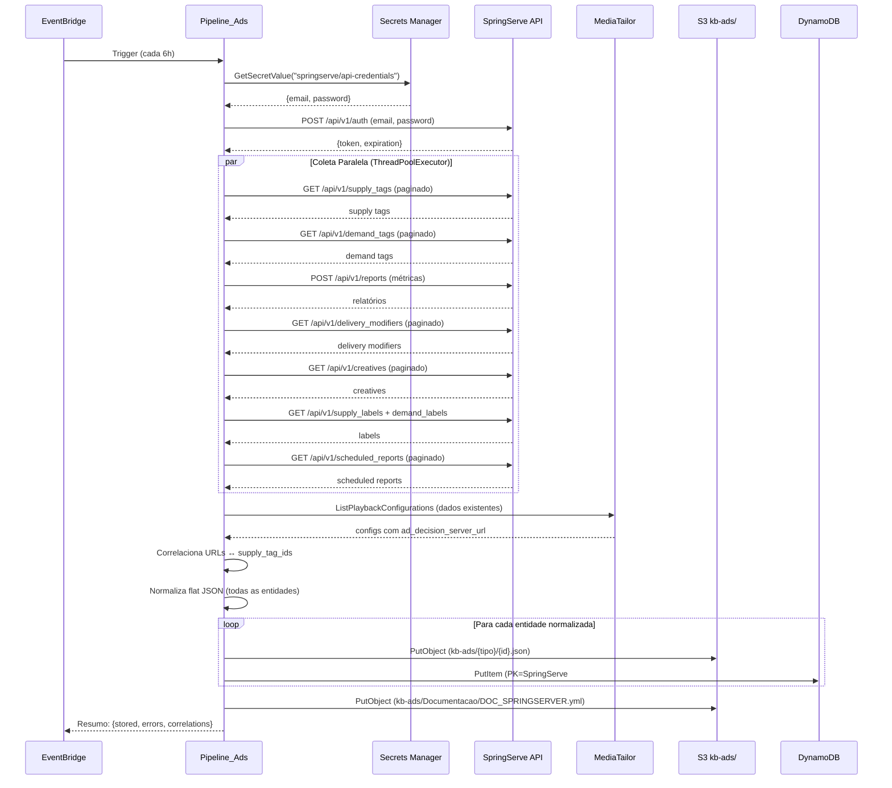

# Documento de Design — Integração SpringServe Ad Server

## Visão Geral

Este design descreve a integração de dados do ad server SpringServe e dados de ad delivery do MediaTailor na plataforma de chatbot de streaming existente. O sistema adiciona um novo pipeline de ingestão (`Pipeline_Ads`) que coleta dados da API REST do SpringServe (supply tags, demand tags, relatórios, delivery modifiers, creatives, labels), correlaciona com playback configurations do MediaTailor, normaliza em formato flat JSON e armazena via dual-write (S3 + DynamoDB). Uma terceira Knowledge Base (`KB_ADS`) é criada para indexar esses dados e permitir consultas em linguagem natural sobre ad delivery.

### Decisões de Design

1. **Terceira KB separada (KB_ADS)**: Dados de anúncios ficam isolados das KBs existentes (KB_CONFIG e KB_LOGS) para evitar contaminação cruzada e maximizar precisão do RAG.
2. **Reutilização do padrão Pipeline_Config**: O Pipeline_Ads segue exatamente o mesmo padrão do `pipeline_config/handler.py` — ThreadPoolExecutor com 5 workers, retry adaptativo (`mode="adaptive"`), dual-write S3+DynamoDB, validação e normalização flat JSON.
3. **Cliente HTTP com Session reutilizável**: Um `requests.Session` é criado com o token SpringServe no header `Authorization` e reutilizado para todas as chamadas da mesma execução, evitando re-autenticação desnecessária.
4. **Paginação genérica SpringServe**: Uma função `_paginate_springserve(session, url, params)` encapsula o padrão de paginação da API (page/per, iterando enquanto `current_page < total_pages`), reutilizável para todos os endpoints.
5. **Correlação via URL matching**: A correlação MediaTailor↔SpringServe é feita comparando o `ad_decision_server_url` das playback configurations com as URLs/IDs das supply tags. Parsing de URL extrai o supply_tag_id.
6. **Credenciais no Secrets Manager**: Email e password do SpringServe ficam no AWS Secrets Manager (`springserve/api-credentials`), nunca no código ou variáveis de ambiente.
7. **Re-autenticação automática**: Se uma chamada retornar HTTP 401, o pipeline re-autentica uma vez e repete a chamada. Se falhar novamente, registra erro e continua.
8. **KB_ADS criada via console Bedrock**: Seguindo o padrão das KBs existentes, a KB_ADS é criada manualmente no console com S3 Vectors (quick-create). O CDK provisiona apenas a infraestrutura de suporte (bucket, Lambda, EventBridge, Secrets Manager).
9. **DOC_SPRINGSERVER.yml indexado na KB_ADS**: O arquivo OpenAPI de 13.500+ linhas é copiado para o prefixo `kb-ads/Documentacao/` e indexado pela KB para responder perguntas conceituais sobre a API.
10. **Partição na tabela StreamingConfigs existente**: Dados de anúncios usam a mesma tabela DynamoDB com PK prefixado (`SpringServe#supply_tag`, `SpringServe#demand_tag`, etc.), evitando criar uma nova tabela.

## Arquitetura

### Diagrama de Arquitetura

```mermaid
graph TB
    subgraph SpringServe ["SpringServe API (externo)"]
        SS_Auth["POST /api/v1/auth<br/>Token Auth"]
        SS_Supply["GET /api/v1/supply_tags"]
        SS_Demand["GET /api/v1/demand_tags"]
        SS_Reports["POST /api/v1/reports"]
        SS_DM["GET /api/v1/delivery_modifiers"]
        SS_Creative["GET /api/v1/creatives"]
        SS_Labels["GET /api/v1/supply_labels<br/>GET /api/v1/demand_labels"]
        SS_Scheduled["GET /api/v1/scheduled_reports"]
    end

    subgraph Pipeline ["Pipeline_Ads (us-east-1)"]
        P_ADS["Lambda Pipeline_Ads<br/>Python 3.12<br/>ThreadPoolExecutor 5w<br/>Retry Adaptativo"]
        SM["Secrets Manager<br/>springserve/api-credentials"]
    end

    subgraph Bedrock ["Amazon Bedrock (us-east-1)"]
        Agent["Agente_Bedrock<br/>+ KB_ADS (3ª KB)"]
        KB_ADS["KB_ADS<br/>S3 Vectors quick-create"]
        KB_C["KB_CONFIG (existente)"]
    end

    subgraph Storage ["Armazenamento (us-east-1)"]
        S3_ADS["S3 kb-ads/<br/>Flat JSONs +<br/>DOC_SPRINGSERVER.yml"]
        DDB["DynamoDB StreamingConfigs<br/>PK: SpringServe#tipo"]
    end

    subgraph Existing ["Infraestrutura Existente"]
        MT["MediaTailor<br/>ad_decision_server_url"]
        EB["EventBridge<br/>Schedule 6h"]
        EXP["Lambda Exportadora"]
    end

    EB -->|"Trigger cada 6h"| P_ADS
    P_ADS --> SM
    SM -->|"email + password"| P_ADS
    P_ADS -->|"POST /api/v1/auth"| SS_Auth
    SS_Auth -->|"token"| P_ADS

    P_ADS --> SS_Supply & SS_Demand & SS_Reports & SS_DM & SS_Creative & SS_Labels & SS_Scheduled

    P_ADS -->|"Correlação via<br/>ad_decision_server_url"| MT

    P_ADS -->|"Flat JSON"| S3_ADS
    P_ADS -->|"Dual-write"| DDB

    KB_ADS --> S3_ADS
    Agent --> KB_ADS
    Agent --> KB_C

    EXP -->|"Lê kb-ads/"| S3_ADS
```



### Fluxo de Execução do Pipeline



## Componentes e Interfaces

### 1. Pipeline_Ads (`lambdas/pipeline_ads/handler.py`)

Nova Lambda que segue o padrão do `pipeline_config/handler.py`.

#### Funções Públicas

| Função | Entrada | Saída | Descrição |
|--------|---------|-------|-----------|
| `handler(event, context)` | EventBridge event | `dict` resumo de execução | Entry point |
| `_authenticate(session, email, password)` | Session + credenciais | `str` token | Autentica via POST /api/v1/auth |
| `_paginate_springserve(session, url, params)` | Session + URL + params | `list[dict]` | Paginação genérica SpringServe |
| `_process_supply_tags(session, s3, results)` | Session + S3 client + results | — | Coleta e armazena supply tags |
| `_process_demand_tags(session, s3, results)` | Session + S3 client + results | — | Coleta e armazena demand tags |
| `_process_reports(session, s3, results)` | Session + S3 client + results | — | Gera e armazena relatórios |
| `_process_delivery_modifiers(session, s3, results)` | Session + S3 client + results | — | Coleta e armazena delivery modifiers |
| `_process_creatives(session, s3, results)` | Session + S3 client + results | — | Coleta e armazena creatives |
| `_process_labels(session, s3, results)` | Session + S3 client + results | — | Coleta e armazena labels |
| `_process_correlations(session, s3, mt, results, supply_tags)` | Session + S3 + MT client + results + supply tags | — | Gera correlações canal↔SpringServe |
| `_build_correlation(mt_config, supply_tag, report_data)` | Config MT + supply tag + métricas | `dict` flat JSON | Monta documento de correlação |

#### Variáveis de Ambiente

```python
SPRINGSERVE_SECRET_NAME = os.environ.get("SPRINGSERVE_SECRET_NAME", "springserve/api-credentials")
SPRINGSERVE_BASE_URL = os.environ.get("SPRINGSERVE_BASE_URL", "https://video.springserve.com")
KB_ADS_BUCKET = os.environ.get("KB_ADS_BUCKET", "")
KB_ADS_PREFIX = os.environ.get("KB_ADS_PREFIX", "kb-ads/")
CONFIGS_TABLE_NAME = os.environ.get("CONFIGS_TABLE_NAME", "")
MEDIATAILOR_REGION = os.environ.get("MEDIATAILOR_REGION", "us-east-1")
WORKERS = int(os.environ.get("WORKERS", "5"))
```

#### Constantes

```python
BOTO_CONFIG = BotoConfig(
    max_pool_connections=10,
    retries={"max_attempts": 5, "mode": "adaptive"},
)

SPRINGSERVE_ENDPOINTS = {
    "supply_tags": "/api/v1/supply_tags",
    "demand_tags": "/api/v1/demand_tags",
    "delivery_modifiers": "/api/v1/delivery_modifiers",
    "creatives": "/api/v1/creatives",
    "supply_labels": "/api/v1/supply_labels",
    "demand_labels": "/api/v1/demand_labels",
    "scheduled_reports": "/api/v1/scheduled_reports",
    "reports": "/api/v1/reports",
    "auth": "/api/v1/auth",
}

MAX_PER_PAGE = 1000
```

### 2. Normalizers (`lambdas/pipeline_ads/shared/normalizers.py`)

Novas funções de normalização seguindo o padrão de `pipeline_config/shared/normalizers.py`.

#### Funções

| Função | Entrada | Saída |
|--------|---------|-------|
| `normalize_supply_tag(raw, demand_priorities)` | dict raw API + lista de priorities | `dict` flat JSON |
| `normalize_demand_tag(raw)` | dict raw API | `dict` flat JSON |
| `normalize_report(raw)` | dict raw API report row | `dict` flat JSON |
| `normalize_delivery_modifier(raw)` | dict raw API | `dict` flat JSON |
| `normalize_creative(raw)` | dict raw API | `dict` flat JSON |
| `normalize_label(raw, label_type)` | dict raw API + "supply"/"demand" | `dict` flat JSON |
| `normalize_scheduled_report(raw)` | dict raw API | `dict` flat JSON |
| `normalize_correlation(mt_config, supply_tag, report_data)` | MT config + supply tag + métricas | `dict` flat JSON |

#### Exemplo de Saída — Supply Tag Normalizada

```python
{
    "channel_id": "supply_tag_123",
    "servico": "SpringServe",
    "tipo": "supply_tag",
    "supply_tag_id": 123,
    "nome": "live_1097_preroll",
    "status": "active",
    "account_id": 456,
    "demand_tag_count": 5,
    "demand_tags": "Advertiser_X, Advertiser_Y, Advertiser_Z",
    "demand_tag_ids": "789, 790, 791",
    "created_at": "2024-01-15T10:00:00Z",
    "updated_at": "2024-06-20T14:30:00Z",
}
```

#### Exemplo de Saída — Correlação Canal Normalizada

```python
{
    "channel_id": "correlacao_live_1097",
    "servico": "Correlacao",
    "tipo": "canal_springserve",
    "mediatailor_name": "live_1097",
    "mediatailor_ad_server_url": "https://video.springserve.com/vast/...",
    "supply_tag_id": 123,
    "supply_tag_name": "live_1097_preroll",
    "demand_tags_associadas": "Advertiser_X, Advertiser_Y",
    "fill_rate_atual": 0.85,
    "total_impressions_24h": 45000,
}
```

### 3. Autenticação SpringServe (`lambdas/pipeline_ads/shared/auth.py`)

Módulo dedicado à autenticação com a API SpringServe.

```python
class SpringServeAuth:
    """Gerencia autenticação com a API SpringServe."""

    def __init__(self, base_url: str, email: str, password: str):
        self.base_url = base_url
        self.email = email
        self.password = password
        self.session = requests.Session()
        self.token = None

    def authenticate(self) -> str:
        """POST /api/v1/auth → token."""
        resp = self.session.post(
            f"{self.base_url}/api/v1/auth",
            data={"email": self.email, "password": self.password},
            headers={"Content-Type": "application/x-www-form-urlencoded"},
        )
        resp.raise_for_status()
        self.token = resp.json()["token"]
        self.session.headers["Authorization"] = self.token
        return self.token

    def request(self, method, path, **kwargs):
        """Faz request com re-auth automática em caso de 401."""
        resp = self.session.request(method, f"{self.base_url}{path}", **kwargs)
        if resp.status_code == 401 and self.token:
            self.authenticate()
            resp = self.session.request(method, f"{self.base_url}{path}", **kwargs)
        resp.raise_for_status()
        return resp
```

### 4. Paginação SpringServe

```python
def _paginate_springserve(auth: SpringServeAuth, path: str, params: dict = None) -> list:
    """Paginação genérica para endpoints SpringServe.

    Itera enquanto current_page < total_pages.
    Usa page/per como parâmetros de paginação (per max 1000).
    """
    all_results = []
    page = 1
    params = params or {}
    params["per"] = MAX_PER_PAGE

    while True:
        params["page"] = page
        resp = auth.request("GET", path, params=params)
        data = resp.json()
        all_results.extend(data.get("results", []))

        current_page = data.get("current_page", page)
        total_pages = data.get("total_pages", 1)

        if current_page >= total_pages:
            break
        page += 1

    return all_results
```

### 5. CDK Stack — Alterações em `stacks/main_stack.py`

Nova seção adicionada ao MainStack:

```python
# ---------------------------------------------------------------
# N. Pipeline Ads Lambda + EventBridge + Secrets Manager
# ---------------------------------------------------------------

# Secret para credenciais SpringServe
springserve_secret = secretsmanager.Secret(
    self, "SpringServeCredentials",
    secret_name="springserve/api-credentials",
    description="Credenciais da API SpringServe (email + password)",
    generate_secret_string=secretsmanager.SecretStringGenerator(
        secret_string_template='{"email":"placeholder@empresa.com"}',
        generate_string_key="password",
    ),
)

# S3 prefix kb-ads/ no bucket existente (ou novo bucket)
# Reutiliza kb_config_bucket com prefixo kb-ads/

pipeline_ads_fn = _lambda.Function(
    self, "PipelineAdsFunction",
    runtime=_lambda.Runtime.PYTHON_3_12,
    handler="handler.handler",
    code=_lambda.Code.from_asset("lambdas/pipeline_ads"),
    timeout=Duration.minutes(5),
    environment={
        "KB_ADS_BUCKET": kb_config_bucket.bucket_name,
        "KB_ADS_PREFIX": "kb-ads/",
        "SPRINGSERVE_SECRET_NAME": springserve_secret.secret_name,
        "SPRINGSERVE_BASE_URL": "https://video.springserve.com",
        "CONFIGS_TABLE_NAME": configs_table.table_name,
        "MEDIATAILOR_REGION": "us-east-1",
        "WORKERS": "5",
    },
)

# Permissões
springserve_secret.grant_read(pipeline_ads_fn)
kb_config_bucket.grant_put(pipeline_ads_fn)
configs_table.grant_write_data(pipeline_ads_fn)
pipeline_ads_fn.add_to_role_policy(iam.PolicyStatement(
    actions=["mediatailor:ListPlaybackConfigurations",
             "mediatailor:GetPlaybackConfiguration"],
    resources=["*"],
))

# Requests layer (para biblioteca requests)
# Ou usar urllib3 embutido no Lambda runtime

ads_schedule = events.Rule(
    self, "PipelineAdsSchedule",
    schedule=events.Schedule.rate(Duration.hours(6)),
)
ads_schedule.add_target(targets.LambdaFunction(pipeline_ads_fn))
```

### 6. Atualização do Agente Bedrock (manual via console)

Nova KB associada ao agente:

| KB | Descrição para o Agente |
|----|------------------------|
| KB_ADS | "Use esta base para responder perguntas sobre anúncios, ad delivery, SpringServe, supply tags, demand tags, fill rate, impressões, receita, delivery modifiers, creatives e correlação entre canais MediaTailor e SpringServe. Também contém documentação da API SpringServe (DOC_SPRINGSERVER.yml) para perguntas conceituais." |

Nova regra de roteamento no prompt do agente:

```
<route priority="2.5" name="ANUNCIOS" knowledge_base="KB_ADS">
Palavras-chave: "anúncio", "ad", "SpringServe", "supply tag", "demand tag",
"fill rate", "impressões", "receita", "delivery modifier", "creative",
"correlação canal", "ad server"
Use para consultas sobre entrega de anúncios, métricas de ad delivery,
configurações do SpringServe e correlação canal-SpringServe.
Para perguntas que envolvam canal + anúncios, consulte KB_ADS E KB_CONFIG.
</route>
```

### 7. Atualização da Lambda Exportadora

A Exportadora existente ganha suporte ao prefixo `kb-ads/`:

- Novo filtro `base_dados="KB_ADS"` ou `servico="SpringServe"` ou `servico="Correlacao"`
- Leitura de arquivos do prefixo `kb-ads/` no S3
- Filtros específicos: `tipo`, `supply_tag_name`, `fill_rate_min`, `fill_rate_max`

### 8. Atualização do Frontend (`frontend/chat.html`)

Nova categoria na sidebar:

```html
<span class="sidebar-title" style="margin-top: 8px;">📢 Anúncios / SpringServe</span>
<button class="suggestion-btn" onclick="useSuggestion(this)">Quais supply tags existem no SpringServe?</button>
<button class="suggestion-btn" onclick="useSuggestion(this)">Qual o fill rate do canal live_1097?</button>
<button class="suggestion-btn" onclick="useSuggestion(this)">Quais demand tags estão associadas ao canal Warner?</button>
<button class="suggestion-btn" onclick="useSuggestion(this)">Quais canais têm fill rate abaixo de 80%?</button>
<button class="suggestion-btn" onclick="useSuggestion(this)">Qual a receita total de impressões ontem?</button>
<button class="suggestion-btn" onclick="useSuggestion(this)">Quais delivery modifiers estão ativos?</button>
<button class="suggestion-btn" onclick="useSuggestion(this)">Quais creatives estão associados ao demand tag X?</button>
<button class="suggestion-btn" onclick="useSuggestion(this)">Qual a correlação entre canais MediaTailor e SpringServe?</button>
<button class="suggestion-btn" onclick="useSuggestion(this)">O que é uma supply tag no SpringServe?</button>
<button class="suggestion-btn" onclick="useSuggestion(this)">Como funciona a autenticação da API SpringServe?</button>
<button class="suggestion-btn" onclick="useSuggestion(this)">Exportar supply tags em CSV</button>
<button class="suggestion-btn" onclick="useSuggestion(this)">Exportar relatório de fill rate em JSON</button>
```

## Modelos de Dados

### Config_Ad — Supply Tag (flat JSON)

```python
{
    "channel_id": "supply_tag_123",       # ID único para RAG
    "servico": "SpringServe",             # sempre "SpringServe"
    "tipo": "supply_tag",                 # tipo da entidade
    "supply_tag_id": 123,                 # ID numérico SpringServe
    "nome": "live_1097_preroll",          # nome da supply tag
    "status": "active",                   # active/inactive
    "account_id": 456,                    # conta SpringServe
    "demand_tag_count": 5,                # qtd demand tags associadas
    "demand_tags": "Adv_X, Adv_Y",       # nomes das demand tags (string)
    "demand_tag_ids": "789, 790",         # IDs das demand tags (string)
    "created_at": "2024-01-15T10:00:00Z",
    "updated_at": "2024-06-20T14:30:00Z",
}
```

### Config_Ad — Demand Tag (flat JSON)

```python
{
    "channel_id": "demand_tag_789",
    "servico": "SpringServe",
    "tipo": "demand_tag",
    "demand_tag_id": 789,
    "nome": "Advertiser_X_Preroll",
    "status": "active",
    "demand_type": "vast_url",
    "supply_tag_ids": "123, 124, 125",
    "created_at": "2024-01-15T10:00:00Z",
    "updated_at": "2024-06-20T14:30:00Z",
}
```

### Config_Ad — Report (flat JSON)

```python
{
    "channel_id": "report_supply_123_2024-06-20",
    "servico": "SpringServe",
    "tipo": "report",
    "supply_tag_id": 123,
    "supply_tag_name": "live_1097_preroll",
    "fill_rate": 0.85,
    "total_impressions": 45000,
    "total_revenue": 125.50,
    "total_cost": 80.00,
    "cpm": 2.79,
    "data_inicio": "2024-06-19",
    "data_fim": "2024-06-20",
}
```

### Config_Ad — Delivery Modifier (flat JSON)

```python
{
    "channel_id": "delivery_modifier_42",
    "servico": "SpringServe",
    "tipo": "delivery_modifier",
    "modifier_id": 42,
    "nome": "Geo_BR_Only",
    "descricao": "Targeting geográfico Brasil",
    "ativo": True,
    "demand_tag_ids": "789, 790",
    "multiplier_interaction": "multiply",
}
```

### Config_Ad — Creative (flat JSON)

```python
{
    "channel_id": "creative_555",
    "servico": "SpringServe",
    "tipo": "creative",
    "creative_id": 555,
    "nome": "Video_30s_Advertiser_X",
    "creative_type": "video",
    "status": "active",
    "demand_tag_id": 789,
    "format": "VAST",
    "duration": 30,
}
```

### Config_Ad — Label (flat JSON)

```python
{
    "channel_id": "supply_label_10",
    "servico": "SpringServe",
    "tipo": "supply_label",
    "label_id": 10,
    "nome": "Premium_Inventory",
}
```

### Config_Ad — Scheduled Report (flat JSON)

```python
{
    "channel_id": "scheduled_report_77",
    "servico": "SpringServe",
    "tipo": "scheduled_report",
    "report_id": 77,
    "nome": "Daily_Fill_Rate_Report",
    "frequency": "daily",
    "status": "active",
    "dimensions": "supply_tag_id",
    "metrics": "impressions, revenue, fill_rate",
}
```

### Correlacao_Canal (flat JSON)

```python
{
    "channel_id": "correlacao_live_1097",
    "servico": "Correlacao",
    "tipo": "canal_springserve",
    "mediatailor_name": "live_1097",
    "mediatailor_ad_server_url": "https://video.springserve.com/vast/...",
    "supply_tag_id": 123,
    "supply_tag_name": "live_1097_preroll",
    "demand_tags_associadas": "Advertiser_X, Advertiser_Y",
    "fill_rate_atual": 0.85,
    "total_impressions_24h": 45000,
}
```

### Chaves S3

| Tipo | Padrão de Chave |
|------|----------------|
| Supply Tag | `kb-ads/SpringServe/supply_tag_{id}.json` |
| Demand Tag | `kb-ads/SpringServe/demand_tag_{id}.json` |
| Report | `kb-ads/SpringServe/report_supply_{id}_{data}.json` |
| Delivery Modifier | `kb-ads/SpringServe/delivery_modifier_{id}.json` |
| Creative | `kb-ads/SpringServe/creative_{id}.json` |
| Supply Label | `kb-ads/SpringServe/supply_label_{id}.json` |
| Demand Label | `kb-ads/SpringServe/demand_label_{id}.json` |
| Scheduled Report | `kb-ads/SpringServe/scheduled_report_{id}.json` |
| Correlação | `kb-ads/Correlacao/correlacao_{mediatailor_name}.json` |
| Documentação | `kb-ads/Documentacao/DOC_SPRINGSERVER.yml` |

### Chaves DynamoDB

| Tipo | PK | SK |
|------|----|----|
| Supply Tag | `SpringServe#supply_tag` | `{nome}` |
| Demand Tag | `SpringServe#demand_tag` | `{nome}` |
| Report | `SpringServe#report` | `{supply_tag_name}#{data}` |
| Delivery Modifier | `SpringServe#delivery_modifier` | `{nome}` |
| Creative | `SpringServe#creative` | `{nome}` |
| Supply Label | `SpringServe#supply_label` | `{nome}` |
| Demand Label | `SpringServe#demand_label` | `{nome}` |
| Scheduled Report | `SpringServe#scheduled_report` | `{nome}` |
| Correlação | `Correlacao#canal` | `{mediatailor_name}` |


## Propriedades de Corretude

*Uma propriedade é uma característica ou comportamento que deve ser verdadeiro em todas as execuções válidas de um sistema — essencialmente, uma declaração formal sobre o que o sistema deve fazer. Propriedades servem como ponte entre especificações legíveis por humanos e garantias de corretude verificáveis por máquina.*

### Propriedade 1: Paginação coleta todos os itens

*Para qualquer* resposta paginada da API SpringServe com N páginas e M itens por página, a função `_paginate_springserve` SHALL coletar exatamente a soma de todos os itens de todas as páginas, iterando de page=1 até current_page >= total_pages, e o número total de itens retornados SHALL ser igual ao total_count reportado pela API.

**Validates: Requirements 2.1, 3.1, 4.5**

### Propriedade 2: Normalização produz flat JSON com campos obrigatórios

*Para qualquer* entidade raw da API SpringServe (supply tag, demand tag, report, delivery modifier, creative, label, scheduled report) ou dados de correlação, a função de normalização correspondente SHALL produzir um dicionário flat (sem nesting — nenhum valor é dict ou lista de dicts) contendo os campos obrigatórios `channel_id` (não-vazio), `servico` (valor correto: "SpringServe" para entidades SpringServe, "Correlacao" para correlações) e `tipo` (valor descritivo correspondente ao tipo da entidade).

**Validates: Requirements 2.2, 3.2, 4.2, 5.1, 5.2, 5.3, 6.3, 9.1, 9.2, 9.3, 9.4**

### Propriedade 3: Formato da chave S3 segue o padrão correto

*Para qualquer* combinação de (tipo_entidade, id_entidade), a chave S3 gerada SHALL seguir o padrão `kb-ads/{categoria}/{tipo}_{id}.json`, onde categoria é "SpringServe" para entidades SpringServe, "Correlacao" para correlações e "Documentacao" para documentação. O tipo e id SHALL ser extraídos corretamente do documento normalizado.

**Validates: Requirements 2.4, 3.3, 4.3, 5.4, 6.4**

### Propriedade 4: Round-trip de serialização JSON preserva dados

*Para qualquer* documento Config_Ad ou Correlacao_Canal normalizado, serializar para JSON (com `json.dumps(ensure_ascii=False)`) e desserializar de volta (com `json.loads`) SHALL produzir um dicionário equivalente ao original. Campos numéricos (IDs, fill_rate, impressions) SHALL ser preservados como números, e caracteres Unicode em português SHALL ser mantidos.

**Validates: Requirements 9.5**

### Propriedade 5: Re-autenticação automática em caso de token expirado

*Para qualquer* chamada à API SpringServe que retorne HTTP 401, o método `request` da classe `SpringServeAuth` SHALL re-autenticar automaticamente via POST /api/v1/auth exatamente uma vez e repetir a chamada original. Se a re-autenticação falhar, SHALL propagar o erro sem loop infinito.

**Validates: Requirements 1.5**

### Propriedade 6: Pipeline é resiliente a falhas parciais e o resumo é preciso

*Para qualquer* subconjunto de recursos que falhem durante a coleta (erro de API, timeout, dados inválidos), o pipeline SHALL continuar processando os recursos restantes, e o resumo final SHALL refletir corretamente: total_armazenados + total_erros + total_rejeitados = total_tentados. Nenhum erro individual SHALL interromper o processamento dos demais.

**Validates: Requirements 10.3, 10.5**

### Propriedade 7: Correlação URL identifica corretamente supply tags

*Para qualquer* ad_decision_server_url de uma playback configuration do MediaTailor que contenha uma referência a um supply_tag_id existente, a função de correlação SHALL identificar corretamente o supply_tag_id e gerar um documento de Correlacao_Canal vinculando o canal MediaTailor à supply tag correspondente. URLs que não contenham referência a supply tags conhecidas SHALL resultar em correlação vazia (sem documento gerado) e um warning registrado.

**Validates: Requirements 6.2, 6.6**

## Tratamento de Erros

### Erros de Autenticação SpringServe

| Cenário | Comportamento | Severidade |
|---------|---------------|------------|
| Secrets Manager indisponível | Registra erro, encerra execução | CRITICAL |
| POST /api/v1/auth retorna 400 (credenciais inválidas) | Registra erro com timestamp e código HTTP, encerra execução | CRITICAL |
| POST /api/v1/auth retorna 500 (erro servidor) | Retry com backoff, após 3 tentativas encerra execução | ERROR |
| Token expira durante execução (401 em chamada) | Re-autentica uma vez, repete chamada. Se falhar novamente, registra erro e continua | WARNING → ERROR |

### Erros de API SpringServe (Coleta de Dados)

| Cenário | Comportamento | Severidade |
|---------|---------------|------------|
| GET endpoint retorna 429 (rate limit) | Backoff exponencial (1s, 2s, 4s), até 5 tentativas | WARNING |
| GET endpoint retorna 500 (erro servidor) | Retry com backoff, após tentativas registra erro e continua | ERROR |
| GET endpoint retorna 404 (recurso não encontrado) | Registra warning, continua com próximo recurso | WARNING |
| Timeout na chamada HTTP | Retry com backoff, após tentativas registra erro e continua | ERROR |
| Resposta com JSON inválido | Registra erro com endpoint e body parcial, continua | ERROR |
| Paginação retorna dados inconsistentes (total_pages muda) | Usa dados coletados até o momento, registra warning | WARNING |

### Erros de Correlação

| Cenário | Comportamento | Severidade |
|---------|---------------|------------|
| ad_decision_server_url não corresponde a nenhuma supply tag | Registra warning com nome da playback config e URL | WARNING |
| MediaTailor API indisponível | Registra erro, pula etapa de correlação, continua com demais | ERROR |
| Supply tag referenciada não existe mais no SpringServe | Registra warning, gera correlação parcial (sem métricas) | WARNING |

### Erros de Armazenamento

| Cenário | Comportamento | Severidade |
|---------|---------------|------------|
| S3 PutObject falha para um documento | Registra erro, continua com próximo documento | ERROR |
| S3 bucket não existe | Registra erro, todos os documentos falham | CRITICAL |
| DynamoDB PutItem falha (fail-open) | Registra erro, S3 write já foi feito, continua | WARNING |
| DynamoDB throttling | Backoff automático (adaptive mode), continua | WARNING |

### Erros de Validação

| Cenário | Comportamento | Severidade |
|---------|---------------|------------|
| Documento normalizado falha na validação (campos obrigatórios ausentes) | Incrementa contador `skipped_validation`, não armazena | WARNING |
| Documento detectado como contaminação cruzada | Incrementa contador `skipped_contamination`, não armazena | WARNING |

## Estratégia de Testes

### Abordagem Dual: Testes Unitários + Testes de Propriedade

A estratégia combina testes unitários para cenários específicos e edge cases com testes de propriedade (PBT) para verificar propriedades universais com cobertura ampla de inputs.

### Testes de Propriedade (Hypothesis)

Biblioteca: **Hypothesis** (Python) — já presente no projeto (diretório `.hypothesis/` existente).

Cada propriedade do design será implementada como um teste de propriedade com mínimo de 100 iterações:

| Propriedade | Tag | Gerador |
|-------------|-----|---------|
| P1: Paginação coleta todos os itens | `Feature: springserve-ad-integration, Property 1: pagination collects all items` | `st.integers(1, 20)` para total_pages × `st.integers(1, 100)` para items_per_page |
| P2: Normalização produz flat JSON | `Feature: springserve-ad-integration, Property 2: normalization produces flat JSON` | Geradores de raw data por tipo de entidade (supply_tag, demand_tag, etc.) |
| P3: Formato chave S3 | `Feature: springserve-ad-integration, Property 3: S3 key format` | `st.sampled_from(entity_types)` × `st.integers(1, 99999)` para IDs |
| P4: Round-trip JSON | `Feature: springserve-ad-integration, Property 4: JSON round-trip` | Gerador de Config_Ad completo com campos variados |
| P5: Re-auth em 401 | `Feature: springserve-ad-integration, Property 5: re-auth on 401` | `st.sampled_from(endpoints)` para endpoint que retorna 401 |
| P6: Resiliência + resumo | `Feature: springserve-ad-integration, Property 6: resilience and summary accuracy` | `st.lists(st.booleans())` para sucesso/falha de cada recurso |
| P7: Correlação URL | `Feature: springserve-ad-integration, Property 7: URL correlation` | Gerador de URLs com/sem supply_tag_id embutido |

Configuração: `@settings(max_examples=100)` em cada teste.

### Testes Unitários (pytest)

| Área | Testes | Tipo |
|------|--------|------|
| Autenticação | Mock de Secrets Manager + POST /api/v1/auth, verificar token no header | INTEGRATION (mocked) |
| Auth falha 400 | Mock retornando 400, verificar que pipeline encerra | EDGE_CASE |
| Paginação vazia | API retorna 0 resultados, verificar lista vazia | EDGE_CASE |
| Paginação 1 página | API retorna 1 página, verificar todos os itens | EXAMPLE |
| Normalização supply tag | Raw data específico, verificar campos de saída | EXAMPLE |
| Normalização demand tag | Raw data específico, verificar campos de saída | EXAMPLE |
| Normalização report | Raw data específico, verificar campos de saída | EXAMPLE |
| Correlação com match | URL que contém supply_tag_id, verificar correlação | EXAMPLE |
| Correlação sem match | URL que não contém supply_tag_id, verificar warning | EDGE_CASE |
| Dual-write DynamoDB | Mock DynamoDB, verificar PK/SK corretos | EXAMPLE |
| Cópia DOC_SPRINGSERVER.yml | Mock S3, verificar chave correta | EXAMPLE |
| Resumo de execução | Cenário com mix de sucesso/falha, verificar contadores | EXAMPLE |

### Testes de Infraestrutura (CDK)

- **Snapshot test**: `cdk synth` para verificar que a stack gera o template esperado
- **Assertion tests**:
  - Lambda Pipeline_Ads tem runtime Python 3.12 e timeout 5min
  - EventBridge rule com schedule rate(6 hours)
  - Secret no Secrets Manager com nome correto
  - Permissões IAM: secretsmanager:GetSecretValue, s3:PutObject, dynamodb:PutItem, mediatailor:List/Get
  - Variáveis de ambiente da Lambda contêm bucket, prefixo, secret name
