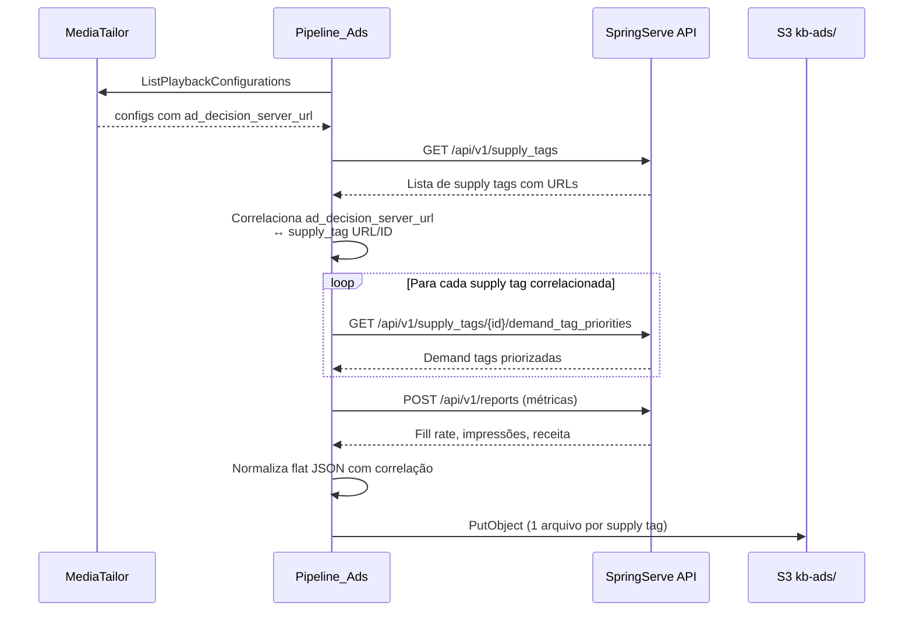

# Documento de Requisitos — Integração SpringServe Ad Server e Dados de Ad Delivery do MediaTailor

## Introdução

Este documento descreve os requisitos para a integração de dados do ad server SpringServe e dados de ad delivery do MediaTailor na plataforma de chatbot de streaming existente. O sistema adicionará uma terceira Knowledge Base (KB_ADS) dedicada a dados de entrega de anúncios, permitindo que operadores consultem em linguagem natural sobre supply tags, demand tags, métricas de fill rate, impressões, receita, delivery modifiers, creatives e a correlação entre canais MediaTailor e SpringServe.

A integração utiliza a API REST do SpringServe (documentada no DOC_SPRINGSERVER.yml, spec OpenAPI com 13.500+ linhas) com autenticação baseada em token (POST /api/v1/auth). A correlação entre MediaTailor e SpringServe é feita via campo `ad_decision_server_url` das playback configurations do MediaTailor, que aponta para supply tags do SpringServe, permitindo rastrear: canal → playback config → supply tag → demand tags → métricas.

A arquitetura segue o padrão existente: Lambda Python 3.12, normalização flat JSON, ThreadPoolExecutor com retry adaptativo, dual-write S3 + DynamoDB, e EventBridge para agendamento. O DOC_SPRINGSERVER.yml também será indexado na KB_ADS para responder perguntas conceituais sobre a API.

## Glossário

- **KB_ADS**: Terceira base de conhecimento RAG dedicada a dados de entrega de anúncios do SpringServe e métricas de ad delivery do MediaTailor
- **SpringServe**: Plataforma de ad serving da Magnite utilizada para gerenciar supply tags, demand tags, delivery modifiers, creatives e relatórios de métricas de anúncios
- **SpringServe_API**: API REST v1 do SpringServe (base URL: /api/v1) com autenticação por token, paginação (page/per), filtros por atributos e inclusão de associações via parâmetro `includes`
- **SpringServe_Token**: Token de autenticação obtido via POST /api/v1/auth com email e password, utilizado no header Authorization para chamadas subsequentes
- **Supply_Tag**: Entidade do SpringServe que representa um ponto de veiculação de anúncios (onde os anúncios são servidos). Cada supply tag possui um ID numérico e está vinculada a um ad server URL utilizado pelo MediaTailor
- **Demand_Tag**: Entidade do SpringServe que representa uma fonte de demanda de anúncios (de onde os anúncios vêm). Demand tags são priorizadas dentro de supply tags
- **Delivery_Modifier**: Regra de entrega do SpringServe que modifica o comportamento de veiculação de anúncios (ex: targeting geográfico, frequency capping)
- **Creative**: Peça criativa (vídeo, áudio, display) registrada no SpringServe e associada a demand tags
- **Supply_Label**: Rótulo de categorização aplicado a supply tags no SpringServe para organização e filtragem
- **Demand_Label**: Rótulo de categorização aplicado a demand tags no SpringServe para organização e filtragem
- **Scheduled_Report**: Relatório automatizado configurado no SpringServe que gera métricas periodicamente (fill rate, impressões, receita)
- **Pipeline_Ads**: Pipeline automatizado que coleta dados do SpringServe e métricas de ad delivery do MediaTailor, normaliza em formato flat JSON e armazena no S3 e DynamoDB
- **Config_Ad**: Configuração de ad delivery em formato JSON flat (sem nesting) contendo dados normalizados de supply tags, demand tags, delivery modifiers, creatives e métricas do SpringServe
- **Correlacao_Canal**: Mapeamento entre canal MediaTailor (via ad_decision_server_url) e supply tag do SpringServe, permitindo rastrear a cadeia completa: canal → playback config → supply tag → demand tags → métricas
- **Secrets_Manager**: Serviço AWS Secrets Manager utilizado para armazenar credenciais do SpringServe (email e password) de forma segura
- **S3_KB_ADS**: Prefixo no bucket S3 dedicado ao armazenamento de dados normalizados de anúncios para indexação pela KB_ADS
- **DynamoDB_Ads**: Tabela DynamoDB (ou partição na tabela StreamingConfigs existente) para armazenamento estruturado de dados de anúncios, permitindo consultas filtradas

## Diagrama da Solução

```mermaid
graph TB
    subgraph SpringServe ["SpringServe API (externo)"]
        SS_Auth["POST /api/v1/auth<br/>Token Authentication"]
        SS_Supply["GET /api/v1/supply_tags"]
        SS_Demand["GET /api/v1/demand_tags"]
        SS_Reports["POST /api/v1/reports"]
        SS_DM["GET /api/v1/delivery_modifiers"]
        SS_Creative["GET /api/v1/creatives"]
        SS_Labels["GET /api/v1/supply_labels<br/>GET /api/v1/demand_labels"]
        SS_Scheduled["GET /api/v1/scheduled_reports"]
    end

    subgraph Pipeline ["Pipeline_Ads (us-east-1)"]
        P_ADS["⚡ Lambda Pipeline_Ads<br/>Python 3.12<br/>ThreadPoolExecutor<br/>Retry Adaptativo"]
        SM["🔐 Secrets Manager<br/>SpringServe Credentials"]
    end

    subgraph Bedrock ["Amazon Bedrock (us-east-1)"]
        Agent["🤖 Agente_Bedrock<br/>+ KB_ADS"]
        KB_ADS["📚 KB_ADS<br/>S3 Vectors (quick-create)"]
    end

    subgraph Storage ["Armazenamento (us-east-1)"]
        S3_ADS["📦 S3 kb-ads/<br/>Flat JSONs + DOC_SPRINGSERVER.yml"]
        DDB["📊 DynamoDB StreamingConfigs<br/>PK: SpringServe#supply_tag, etc."]
    end

    subgraph Existing ["Infraestrutura Existente"]
        MT["📢 MediaTailor<br/>ad_decision_server_url"]
        KB_C["📚 KB_CONFIG<br/>MediaTailor configs"]
        EB["⏰ EventBridge<br/>Schedule"]
    end

    EB -->|"Trigger (cada 6h)"| P_ADS
    P_ADS --> SM
    SM -->|"email + password"| P_ADS
    P_ADS -->|"Token Auth"| SS_Auth
    SS_Auth -->|"token"| P_ADS

    P_ADS --> SS_Supply
    P_ADS --> SS_Demand
    P_ADS --> SS_Reports
    P_ADS --> SS_DM
    P_ADS --> SS_Creative
    P_ADS --> SS_Labels
    P_ADS --> SS_Scheduled

    P_ADS -->|"Correlação via ad_decision_server_url"| MT

    P_ADS -->|"Normaliza flat JSON"| S3_ADS
    P_ADS -->|"Dual-write"| DDB

    KB_ADS --> S3_ADS
    Agent --> KB_ADS
```



### Fluxo de Correlação Canal ↔ SpringServe



## Requisitos

### Requisito 1: Autenticação Segura com SpringServe API

**User Story:** Como engenheiro de plataforma, eu quero que as credenciais do SpringServe sejam armazenadas de forma segura e que a autenticação seja gerenciada automaticamente, para que o pipeline acesse a API sem expor credenciais no código.

#### Detalhes da API de Autenticação

A autenticação do SpringServe funciona assim:

```
POST https://video.springserve.com/api/v1/auth
Content-Type: application/x-www-form-urlencoded

email=user@empresa.com&password=senha_secreta

Resposta 200:
{
  "token": "abc123xyz...",
  "expiration": "2025-01-15T12:00:00Z"
}
```

O token retornado é usado em todas as chamadas subsequentes:
```
GET https://video.springserve.com/api/v1/supply_tags?page=1&per=1000
Authorization: abc123xyz...
```

Ou via Bearer:
```
Authorization: Bearer abc123xyz...
```

#### Critérios de Aceitação

1. THE Pipeline_Ads SHALL armazenar as credenciais do SpringServe (email e password) no AWS Secrets Manager com chave "springserve/api-credentials"
2. WHEN o Pipeline_Ads iniciar uma execução, THE Pipeline_Ads SHALL obter as credenciais do Secrets Manager e autenticar via POST /api/v1/auth (Content-Type: application/x-www-form-urlencoded, body: email + password) para obter um SpringServe_Token
3. THE Pipeline_Ads SHALL utilizar o SpringServe_Token no header `Authorization: {token}` para todas as chamadas subsequentes à SpringServe_API durante a mesma execução
4. IF a chamada POST /api/v1/auth retornar erro HTTP 400 (bad request / invalid credentials), THEN THE Pipeline_Ads SHALL registrar o erro com timestamp e código HTTP e encerrar a execução sem processar dados
5. IF o SpringServe_Token expirar durante a execução (HTTP 401 em chamada subsequente), THEN THE Pipeline_Ads SHALL re-autenticar automaticamente uma vez via POST /api/v1/auth e repetir a chamada que falhou
6. THE Pipeline_Ads SHALL criar um cliente HTTP (requests.Session) reutilizável com o token no header Authorization para todas as chamadas da mesma execução

### Requisito 2: Ingestão de Supply Tags do SpringServe

**User Story:** Como operador de NOC, eu quero que os dados de supply tags do SpringServe sejam coletados e normalizados automaticamente, para que eu possa consultar onde os anúncios estão sendo veiculados.

#### Detalhes da Chamada API

```
GET https://video.springserve.com/api/v1/supply_tags?page=1&per=1000
Authorization: {token}

Resposta 200:
{
  "count": 50,
  "total_count": 120,
  "current_page": 1,
  "total_pages": 3,
  "includable_fields": ["demand_tag_priorities", ...],
  "results": [
    { "id": 123, "name": "live_1097_preroll", "is_active": true, "account_id": 456, ... }
  ]
}
```

Para demand tag priorities de cada supply tag:
```
GET https://video.springserve.com/api/v1/supply_tags/{id}/demand_tag_priorities
Authorization: {token}

Resposta 200: [
  { "demand_tag_id": 789, "demand_tag_name": "Advertiser_X", "priority": 1, ... }
]
```

Paginação: parâmetros `page` (começa em 1) e `per` (max 1000). Iterar enquanto `current_page < total_pages`.

#### Critérios de Aceitação

1. THE Pipeline_Ads SHALL coletar todas as supply tags via GET /api/v1/supply_tags com paginação (page=1,2,3..., per=1000), iterando enquanto current_page for menor que total_pages
2. THE Pipeline_Ads SHALL normalizar cada supply tag em formato Config_Ad flat JSON contendo: supply_tag_id, nome, status, account_id, demand_tag_count e campos relevantes retornados pela API
3. WHEN uma supply tag for coletada, THE Pipeline_Ads SHALL consultar GET /api/v1/supply_tags/{id}/demand_tag_priorities para obter as demand tags priorizadas associadas e incluir no JSON normalizado
4. THE Pipeline_Ads SHALL armazenar cada supply tag normalizada como arquivo JSON individual no S3_KB_ADS com chave: kb-ads/SpringServe/supply_tag_{id}.json
5. THE Pipeline_Ads SHALL fazer dual-write de cada supply tag normalizada no DynamoDB com PK=SpringServe#supply_tag e SK=nome da supply tag

### Requisito 3: Ingestão de Demand Tags do SpringServe

**User Story:** Como operador de NOC, eu quero que os dados de demand tags do SpringServe sejam coletados e normalizados automaticamente, para que eu possa consultar de onde os anúncios estão vindo.

#### Detalhes da Chamada API

```
GET https://video.springserve.com/api/v1/demand_tags?page=1&per=1000
Authorization: {token}

Resposta 200:
{
  "count": 100,
  "total_count": 250,
  "current_page": 1,
  "total_pages": 3,
  "results": [
    { "id": 789, "name": "Advertiser_X_Preroll", "is_active": true, "type": "...", ... }
  ]
}
```

Mesma paginação das supply tags. Suporta filtros via query params (ex: `is_active=true`).

#### Critérios de Aceitação

1. THE Pipeline_Ads SHALL coletar todas as demand tags via GET /api/v1/demand_tags com paginação (page=1,2,3..., per=1000), iterando enquanto current_page for menor que total_pages
2. THE Pipeline_Ads SHALL normalizar cada demand tag em formato Config_Ad flat JSON contendo: demand_tag_id, nome, status, tipo, supply_tag_ids associados e campos relevantes retornados pela API
3. THE Pipeline_Ads SHALL armazenar cada demand tag normalizada como arquivo JSON individual no S3_KB_ADS com chave: kb-ads/SpringServe/demand_tag_{id}.json
4. THE Pipeline_Ads SHALL fazer dual-write de cada demand tag normalizada no DynamoDB com PK=SpringServe#demand_tag e SK=nome da demand tag

### Requisito 4: Ingestão de Métricas e Relatórios do SpringServe

**User Story:** Como operador de NOC, eu quero que métricas de fill rate, impressões e receita do SpringServe sejam coletadas periodicamente, para que eu possa monitorar a performance de entrega de anúncios.

#### Detalhes da Chamada API

Relatórios são gerados via POST (não GET):
```
POST https://video.springserve.com/api/v1/reports
Authorization: {token}
Content-Type: application/json

{
  "async": false,
  "date_range": "yesterday",
  "dimensions": ["supply_tag_id"],
  "metrics": ["impressions", "revenue", "total_cost", "cpm", "fill_rate"],
  "interval": "Cumulative",
  "timezone": "Etc/UTC",
  "csv": false,
  "sort": ["impressions desc"]
}

Resposta 200:
{
  "results": [
    {
      "supply_tag_id": 123,
      "supply_tag_name": "live_1097_preroll",
      "impressions": 45000,
      "revenue": 125.50,
      "total_cost": 80.00,
      "cpm": 2.79,
      "fill_rate": 0.85
    }
  ]
}
```

Para scheduled reports:
```
GET https://video.springserve.com/api/v1/scheduled_reports?page=1&per=100
Authorization: {token}
```

#### Critérios de Aceitação

1. THE Pipeline_Ads SHALL gerar relatórios de métricas via POST /api/v1/reports com body JSON contendo: async=false, date_range="yesterday", dimensions=["supply_tag_id"], metrics=["impressions", "revenue", "total_cost", "cpm", "fill_rate"], interval="Cumulative", timezone="Etc/UTC"
2. THE Pipeline_Ads SHALL normalizar os dados de relatório em formato Config_Ad flat JSON contendo: supply_tag_id, supply_tag_name, fill_rate, total_impressions, total_revenue, total_requests, data_inicio, data_fim
3. THE Pipeline_Ads SHALL armazenar os relatórios normalizados no S3_KB_ADS com chave: kb-ads/SpringServe/report_supply_{id}_{data}.json
4. THE Pipeline_Ads SHALL fazer dual-write dos relatórios normalizados no DynamoDB com PK=SpringServe#report e SK=supply_tag_name#{data}
5. THE Pipeline_Ads SHALL coletar a lista de scheduled_reports via GET /api/v1/scheduled_reports com paginação e armazenar seus metadados normalizados no S3_KB_ADS

### Requisito 5: Ingestão de Delivery Modifiers, Creatives e Labels

**User Story:** Como operador de NOC, eu quero que dados complementares do SpringServe (delivery modifiers, creatives, labels) sejam coletados, para que eu possa ter uma visão completa do ecossistema de anúncios.

#### Detalhes das Chamadas API

Todas seguem o mesmo padrão de paginação:
```
GET https://video.springserve.com/api/v1/delivery_modifiers?page=1&per=1000
GET https://video.springserve.com/api/v1/creatives?page=1&per=1000
GET https://video.springserve.com/api/v1/supply_labels?page=1&per=1000
GET https://video.springserve.com/api/v1/demand_labels?page=1&per=1000
Authorization: {token}

Resposta padrão:
{
  "count": N,
  "total_count": M,
  "current_page": 1,
  "total_pages": P,
  "results": [ ... ]
}
```

Delivery Modifier schema: id, account_id, name, description, active, demand_tag_ids, modifier_rules (com multiplier, source_type, geo targeting).

#### Critérios de Aceitação

1. THE Pipeline_Ads SHALL coletar todos os delivery modifiers via GET /api/v1/delivery_modifiers com paginação (page/per, max 1000) e normalizar em formato Config_Ad flat JSON contendo: modifier_id, nome, descricao, ativo, demand_tag_ids, multiplier_interaction
2. THE Pipeline_Ads SHALL coletar todos os creatives via GET /api/v1/creatives com paginação (page/per, max 1000) e normalizar em formato Config_Ad flat JSON contendo: creative_id, nome, tipo, status, demand_tag_id associado, formato, duração
3. THE Pipeline_Ads SHALL coletar todos os supply labels via GET /api/v1/supply_labels e demand labels via GET /api/v1/demand_labels com paginação e normalizar em formato Config_Ad flat JSON
4. THE Pipeline_Ads SHALL armazenar cada entidade normalizada como arquivo JSON individual no S3_KB_ADS com chave: kb-ads/SpringServe/{tipo}_{id}.json
5. THE Pipeline_Ads SHALL fazer dual-write de cada entidade normalizada no DynamoDB com PK=SpringServe#{tipo} e SK=nome da entidade

### Requisito 6: Correlação MediaTailor ↔ SpringServe

**User Story:** Como operador de NOC, eu quero que o sistema correlacione automaticamente os canais MediaTailor com as supply tags do SpringServe, para que eu possa rastrear a cadeia completa de entrega de anúncios por canal.

#### Critérios de Aceitação

1. THE Pipeline_Ads SHALL extrair o campo ad_decision_server_url de cada playback configuration do MediaTailor (dados já disponíveis na KB_CONFIG)
2. THE Pipeline_Ads SHALL correlacionar cada ad_decision_server_url com a supply tag correspondente do SpringServe, identificando o supply_tag_id a partir da URL ou parâmetros da URL
3. WHEN uma correlação for estabelecida, THE Pipeline_Ads SHALL gerar um documento de Correlacao_Canal em formato flat JSON contendo: mediatailor_name, mediatailor_ad_server_url, supply_tag_id, supply_tag_name, demand_tags_associadas (lista de nomes), fill_rate_atual, total_impressions_24h
4. THE Pipeline_Ads SHALL armazenar cada Correlacao_Canal no S3_KB_ADS com chave: kb-ads/Correlacao/correlacao_{mediatailor_name}.json
5. THE Pipeline_Ads SHALL fazer dual-write de cada Correlacao_Canal no DynamoDB com PK=Correlacao#canal e SK=mediatailor_name
6. IF o ad_decision_server_url de uma playback configuration não corresponder a nenhuma supply tag conhecida, THEN THE Pipeline_Ads SHALL registrar um warning com o nome da playback configuration e a URL não correlacionada

### Requisito 7: Terceira Knowledge Base (KB_ADS)

**User Story:** Como engenheiro de plataforma, eu quero uma terceira Knowledge Base dedicada a dados de anúncios, para que o chatbot possa responder perguntas sobre ad delivery sem contaminar as bases existentes.

#### Critérios de Aceitação

1. THE KB_ADS SHALL ser criada manualmente no console Bedrock com S3 Vectors (quick-create), seguindo o mesmo padrão das KB_CONFIG e KB_LOGS existentes
2. THE KB_ADS SHALL utilizar como data source o prefixo S3: s3://{bucket}/kb-ads/
3. THE KB_ADS SHALL indexar os documentos normalizados de supply tags, demand tags, relatórios, delivery modifiers, creatives, labels e correlações canal-SpringServe
4. THE KB_ADS SHALL indexar o arquivo DOC_SPRINGSERVER.yml para responder perguntas conceituais sobre a API e entidades do SpringServe
5. THE Agente_Bedrock SHALL ser atualizado para incluir a KB_ADS como terceira Knowledge Base associada, com descrição orientando o uso para perguntas sobre anúncios, ad delivery, SpringServe, fill rate, impressões e receita

### Requisito 8: Atualização do Roteamento do Agente Bedrock

**User Story:** Como operador de NOC, eu quero que o chatbot identifique automaticamente perguntas sobre anúncios e as direcione para a base correta, para que eu receba respostas precisas sobre ad delivery.

#### Critérios de Aceitação

1. THE Agente_Bedrock SHALL classificar perguntas sobre anúncios, ad delivery, SpringServe, supply tags, demand tags, fill rate, impressões e receita como intenção "anuncios" e rotear para a KB_ADS
2. WHEN a pergunta envolver correlação entre canal e anúncios (ex: "qual o fill rate do canal X"), THE Agente_Bedrock SHALL consultar tanto a KB_ADS quanto a KB_CONFIG para consolidar a resposta
3. THE Agente_Bedrock SHALL manter o roteamento existente para KB_CONFIG e KB_LOGS inalterado para perguntas que não envolvam anúncios
4. WHEN a pergunta envolver exportação de dados de anúncios, THE Agente_Bedrock SHALL rotear para o Action_Group_Export com base de dados KB_ADS

### Requisito 9: Normalização Flat JSON para Dados de Anúncios

**User Story:** Como engenheiro de dados, eu quero que os dados do SpringServe sejam normalizados no mesmo padrão flat JSON utilizado pelos demais serviços, para que o RAG e a Exportadora funcionem com máxima precisão.

#### Critérios de Aceitação

1. ALL Config_Ad JSONs SHALL ser flat (sem nesting) com todos os campos no nível raiz, seguindo o mesmo padrão das Config_Enriquecida existentes
2. THE Pipeline_Ads SHALL incluir o campo "servico" com valor "SpringServe" em todos os documentos normalizados de entidades do SpringServe
3. THE Pipeline_Ads SHALL incluir o campo "tipo" com valor descritivo (ex: "supply_tag", "demand_tag", "report", "delivery_modifier", "creative", "supply_label", "demand_label") em todos os documentos normalizados
4. THE Pipeline_Ads SHALL incluir o campo "servico" com valor "Correlacao" e "tipo" com valor "canal_springserve" nos documentos de Correlacao_Canal
5. FOR ALL documentos normalizados, parsing do JSON e re-serialização SHALL produzir um documento equivalente ao original (propriedade round-trip)

### Requisito 10: Execução Paralela e Resiliência do Pipeline

**User Story:** Como engenheiro de plataforma, eu quero que o pipeline de anúncios execute chamadas em paralelo com retry adaptativo, para que a ingestão seja eficiente e resiliente a falhas temporárias da API SpringServe.

#### Critérios de Aceitação

1. THE Pipeline_Ads SHALL utilizar ThreadPoolExecutor com número configurável de workers (padrão: 5) para chamadas paralelas à SpringServe_API
2. THE Pipeline_Ads SHALL implementar retry adaptativo com backoff exponencial para chamadas à SpringServe_API, respeitando rate limits (HTTP 429)
3. IF uma chamada individual à SpringServe_API falhar após todos os retries, THEN THE Pipeline_Ads SHALL registrar o erro com endpoint, ID do recurso e código HTTP, e continuar processando os demais recursos
4. THE Pipeline_Ads SHALL ser agendada via EventBridge com frequência configurável (padrão: a cada 6 horas), no mesmo padrão do Pipeline_Config existente
5. THE Pipeline_Ads SHALL registrar ao final da execução um resumo contendo: total de recursos processados, total armazenados, total de erros e total de correlações estabelecidas

### Requisito 11: Infraestrutura CDK para KB_ADS

**User Story:** Como engenheiro de plataforma, eu quero que a infraestrutura necessária para a KB_ADS seja provisionada via CDK, para que o deploy seja automatizado e reprodutível.

#### Critérios de Aceitação

1. THE MainStack SHALL criar um bucket S3 (ou prefixo dedicado no bucket existente) para armazenar dados da KB_ADS com Block Public Access habilitado e encryption S3_MANAGED
2. THE MainStack SHALL criar a Lambda Pipeline_Ads com runtime Python 3.12, timeout de 5 minutos e variáveis de ambiente para bucket, prefixo, região e nome do secret do Secrets Manager
3. THE MainStack SHALL criar uma regra EventBridge para agendar a Pipeline_Ads a cada 6 horas
4. THE MainStack SHALL conceder à Pipeline_Ads permissões IAM para: secretsmanager:GetSecretValue (no secret do SpringServe), s3:PutObject (no bucket KB_ADS), dynamodb:PutItem (na tabela StreamingConfigs), mediatailor:ListPlaybackConfigurations e mediatailor:GetPlaybackConfiguration
5. THE MainStack SHALL criar o secret no Secrets Manager com placeholder para credenciais do SpringServe (email e password)

### Requisito 12: Suporte a Exportação de Dados de Anúncios

**User Story:** Como operador de NOC, eu quero exportar dados de anúncios em CSV ou JSON, para que eu possa analisar métricas de ad delivery offline.

#### Critérios de Aceitação

1. THE Lambda_Exportadora SHALL suportar exportação de dados da KB_ADS quando o filtro de base de dados incluir "KB_ADS" ou "anuncios"
2. THE Lambda_Exportadora SHALL suportar filtros específicos para dados de anúncios: servico="SpringServe", tipo (supply_tag, demand_tag, report, etc.), supply_tag_name, fill_rate_min, fill_rate_max
3. WHEN o usuário solicitar exportação de dados de anúncios, THE Lambda_Exportadora SHALL ler os arquivos do prefixo kb-ads/ no S3, aplicar filtros e gerar o arquivo no formato solicitado (CSV ou JSON)
4. THE Lambda_Exportadora SHALL incluir dados de correlação canal-SpringServe nas exportações quando o filtro incluir tipo="correlacao" ou servico="Correlacao"

### Requisito 13: Sugestões de Perguntas sobre Anúncios no Frontend

**User Story:** Como operador de NOC, eu quero ver sugestões de perguntas sobre anúncios na sidebar do chat, para que eu saiba quais consultas posso fazer sobre ad delivery.

#### Critérios de Aceitação

1. THE Frontend_Chat SHALL incluir uma nova categoria "📢 Anúncios / SpringServe" na sidebar de sugestões
2. THE Frontend_Chat SHALL incluir sugestões de perguntas sobre: supply tags, demand tags, fill rate, impressões, correlação canal-SpringServe, delivery modifiers e creatives
3. THE Frontend_Chat SHALL incluir sugestões de exportação de dados de anúncios (ex: "Exportar supply tags em CSV", "Exportar relatório de fill rate em JSON")

### Requisito 14: Indexação do DOC_SPRINGSERVER.yml na KB_ADS

**User Story:** Como operador de NOC, eu quero poder fazer perguntas conceituais sobre a API e entidades do SpringServe, para que eu entenda como o sistema de anúncios funciona.

#### Critérios de Aceitação

1. THE Pipeline_Ads SHALL copiar o arquivo DOC_SPRINGSERVER.yml para o S3_KB_ADS com chave: kb-ads/Documentacao/DOC_SPRINGSERVER.yml
2. THE KB_ADS SHALL indexar o DOC_SPRINGSERVER.yml para responder perguntas conceituais sobre endpoints, entidades, autenticação e funcionalidades da API SpringServe
3. WHEN o usuário fizer perguntas conceituais sobre SpringServe (ex: "o que é uma supply tag", "como funciona a autenticação do SpringServe"), THE Agente_Bedrock SHALL consultar a KB_ADS e utilizar o conteúdo do DOC_SPRINGSERVER.yml para gerar a resposta
