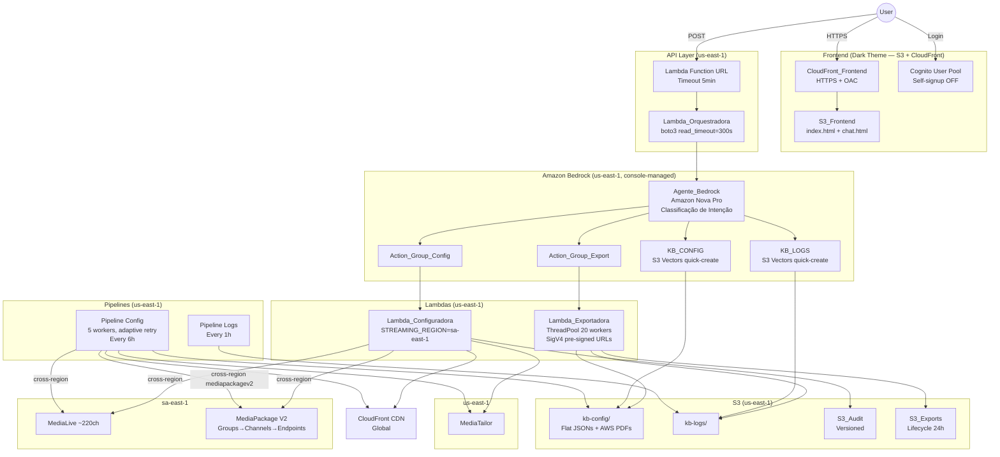
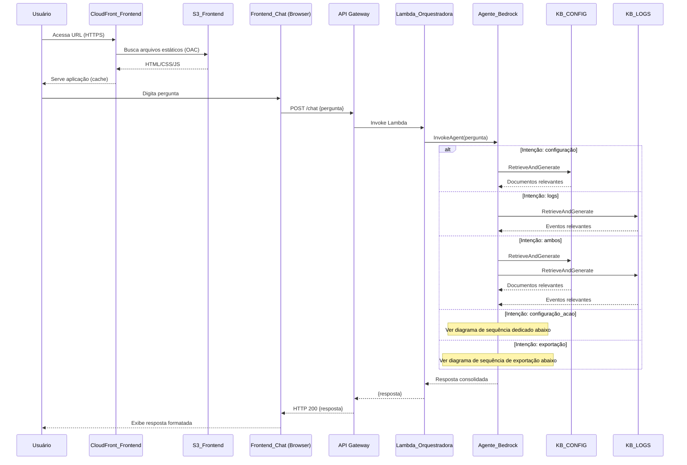
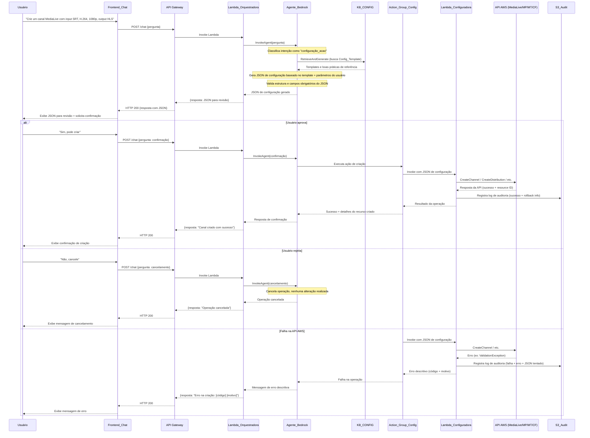
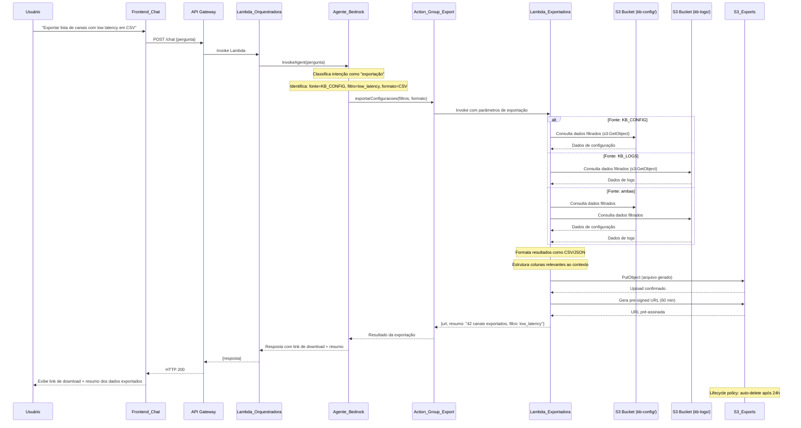

# Documento de Design — Chatbot Inteligente para Gestão de Canais de Streaming

## Visão Geral

Este documento descreve o design técnico do chatbot inteligente para gestão de canais de streaming, baseado em Amazon Bedrock. O sistema permite que operadores de NOC e engenheiros de streaming façam perguntas em linguagem natural sobre configurações de canais MediaLive, MediaPackage, MediaTailor e CloudFront, diagnóstico de erros, inserção de anúncios, distribuição via CDN e relatórios operacionais.

A arquitetura segue um padrão serverless com duas bases de conhecimento RAG independentes (KB_CONFIG e KB_LOGS), orquestradas por um Agente Bedrock que classifica a intenção da pergunta e roteia para a base correta. O pipeline de streaming completo abrange processamento de vídeo (MediaLive), empacotamento (MediaPackage), inserção de anúncios (MediaTailor) e distribuição CDN (CloudFront). Além de consultas de leitura, o sistema suporta operações de escrita (criação e modificação de canais e recursos) via Action Groups do Bedrock, com confirmação obrigatória do usuário e auditoria completa de todas as operações.

### Decisões de Design Principais

1. **Duas Knowledge Bases separadas**: Mantém dados estáticos (configurações) isolados de dados dinâmicos (logs), maximizando a precisão das respostas e evitando contaminação cruzada.
2. **Agente Bedrock criado via console (não CloudFormation)**: O suporte CloudFormation para S3 Vectors e Bedrock KBs é instável. O agente, KBs e Action Groups são criados manualmente via console Bedrock com quick-create vector store.
3. **Modelo Amazon Nova Pro**: Utilizado ao invés de Claude 3 Sonnet devido a restrições de SCP da organização AWS que bloqueiam modelos Anthropic.
4. **Arquitetura cross-region**: Infraestrutura principal em us-east-1 (Bedrock, Lambdas, S3, Cognito). Serviços de streaming: MediaLive e MediaPackage V2 em sa-east-1, MediaTailor em us-east-1, CloudFront global. Pipelines fazem chamadas cross-region via variável STREAMING_REGION.
5. **Lambda Function URL ao invés de API Gateway**: O API Gateway tem limite fixo de 29s. A Function URL suporta até 15 minutos, necessário quando o agente chama Action Groups (Exportadora lê centenas de arquivos S3).
6. **Cognito User Pool com self-signup desabilitado**: Apenas administradores criam usuários via CLI. Frontend com tela de login separada (index.html) e chat (chat.html) com redirect.
7. **JSON flat (sem nesting)**: Os normalizers produzem JSONs com todos os campos no nível raiz (sem chave "dados" aninhada). Otimizado para RAG e filtros da Exportadora.
8. **Normalização rica**: Extrai todas as resoluções, bitrates, áudios (PIDs, idiomas, codecs), legendas (DVB_SUB, WebVTT), failover, inputs, program IDs, etc. Cada endpoint MediaPackage V2 é salvo como arquivo separado.
9. **Pipeline paralelo com rate limiting**: ThreadPoolExecutor com 5 workers e retry adaptativo (mode="adaptive") para respeitar rate limits das APIs AWS.
10. **Frontend dark theme profissional**: Tema escuro com sidebar de ~50 sugestões categorizadas (MediaLive, MediaPackage, MediaTailor, CloudFront, Exportações, Criar/Modificar, Conceitos). Links de download clicáveis no chat.
11. **Documentação AWS indexada**: PDFs de User Guides e API References dos 4 serviços são armazenados no bucket KB_CONFIG e indexados pela KB para responder perguntas conceituais.

## Arquitetura

### Diagrama de Arquitetura


    end

    subgraph Ingestion
        P_Config[Pipeline Config<br/>Extração + Normalização]
        P_Logs[Pipeline Logs<br/>Coleta + Normalização]
    end

    subgraph AWS Services
        ML[MediaLive<br/>~220 canais]
        MP[MediaPackage]
        MT[MediaTailor<br/>Ad Insertion]
        CF[CloudFront<br/>CDN Distribution<br/>Streaming]
        CW[CloudWatch Logs]
    end

    User((Usuário)) -->|HTTPS| CF_FE
    CF_FE -->|Origin: S3| S3_FE
    S3_FE -.->|Serve| UI
    UI -->|POST /chat| APIGW
    APIGW -->|Invoke| Lambda
    Lambda -->|InvokeAgent| Agent
    Agent -->|Consulta config| KB_C
    Agent -->|Consulta logs| KB_L
    Agent -->|Operações de escrita| AG_Config
    AG_Config -->|Invoke| Lambda_Config
    Agent -->|Operações de exportação| AG_Export
    AG_Export -->|Invoke| Lambda_Export
    Lambda_Export -->|Consulta configs| S3_C
    Lambda_Export -->|Consulta logs| S3_L
    Lambda_Export -->|Armazena arquivo| S3_Exp
    Lambda_Export -->|Gera pre-signed URL| S3_Exp
    Lambda_Config -->|CreateChannel / UpdateChannel| ML
    Lambda_Config -->|CreateChannel / CreateOriginEndpoint| MP
    Lambda_Config -->|PutPlaybackConfiguration| MT
    Lambda_Config -->|CreateDistribution / UpdateDistribution| CF
    Lambda_Config -->|Registra auditoria| S3_Audit
    KB_C -->|Retrieve| S3_C
    KB_L -->|Retrieve| S3_L

    P_Config -->|Normaliza + Armazena| S3_C
    P_Logs -->|Normaliza + Armazena| S3_L

    ML -->|DescribeChannel API| P_Config
    MP -->|DescribeChannel API| P_Config
    MT -->|GetPlaybackConfiguration API| P_Config
    CF -->|GetDistribution API| P_Config
    CW -->|FilterLogEvents| P_Logs
    ML -->|CloudWatch Logs| CW
    MP -->|CloudWatch Logs| CW
    MT -->|CloudWatch Logs| CW
    CF -->|Access Logs / Real-time Logs| CW
```

### Fluxo de Dados Principal



### Fluxo de Criação/Modificação de Canal (configuração_acao)



### Fluxo de Exportação de Dados (exportação)




## Componentes e Interfaces

### 1. Frontend_Chat (Interface Web — S3 + CloudFront)

**Responsabilidade**: Interface conversacional para interação do usuário com o chatbot.

**Tecnologia**: Aplicação web estática (HTML, CSS, JavaScript) ou framework SPA (React, Vue, etc.) — sem dependência de servidor ou EC2.

**Hospedagem (Infraestrutura Serverless)**:

| Componente | Descrição |
|-----------|-----------|
| **S3_Frontend** | Bucket Amazon S3 com Static Website Hosting habilitado. Armazena os arquivos estáticos da aplicação (HTML, CSS, JS, assets). O acesso público direto ao bucket é bloqueado — apenas o CloudFront_Frontend pode acessar via OAC. |
| **CloudFront_Frontend** | Distribuição Amazon CloudFront **dedicada exclusivamente** ao Frontend_Chat. Serve os arquivos do S3_Frontend com HTTPS habilitado. Utiliza Origin Access Control (OAC) para restringir o acesso direto ao S3. **Distinta das distribuições CloudFront usadas para entrega de conteúdo de streaming.** |

**Configuração do CloudFront_Frontend**:
- Origin: S3_Frontend bucket (via OAC, não via website endpoint)
- Viewer Protocol Policy: `redirect-to-https`
- Default Root Object: `index.html`
- Custom Error Response: redirecionar 403/404 para `index.html` (para SPA routing)
- Cache Policy: Managed-CachingOptimized para assets estáticos
- CORS: Configurado para permitir chamadas à API Gateway

**Configuração do S3_Frontend**:
- Static Website Hosting: habilitado
- Block Public Access: habilitado (acesso apenas via CloudFront OAC)
- Bucket Policy: permite `s3:GetObject` apenas para o CloudFront_Frontend via OAC

**Interface**:
- Campo de entrada de texto para perguntas
- Área de exibição de mensagens em formato conversacional (chat bubbles)
- Indicador de carregamento durante processamento
- Exibição de mensagens de erro
- Histórico de mensagens da sessão atual

**Comunicação**:
```
POST /chat
Content-Type: application/json

Request:  { "pergunta": "string" }
Response: { "resposta": "string" }
```

**Nota sobre CloudFront**: O projeto utiliza duas distribuições CloudFront com propósitos distintos:
- **CloudFront (streaming)**: Distribuições existentes para entrega de conteúdo de vídeo (CDN de streaming) — gerenciadas como parte do pipeline MediaLive/MediaPackage/MediaTailor.
- **CloudFront_Frontend**: Distribuição nova e dedicada exclusivamente para servir a aplicação web do chatbot. Não tem relação com as distribuições de streaming.

### 2. API Gateway (REST API)

**Responsabilidade**: Expor endpoint REST seguro para comunicação frontend-backend.

**Configuração**:
- Método: `POST /chat`
- Integração: Lambda Proxy Integration
- CORS habilitado para o domínio do CloudFront_Frontend
- Timeout: 29 segundos (limite do API Gateway)

**Validação de Request**:
- Campo `pergunta` obrigatório (string, não vazio)
- Content-Type: `application/json`

**Respostas**:
| Código | Cenário |
|--------|---------|
| 200 | Resposta bem-sucedida |
| 400 | Campo `pergunta` ausente ou inválido |
| 504 | Timeout da Lambda_Orquestradora |
| 500 | Erro interno |

### 3. Lambda_Orquestradora

**Responsabilidade**: Receber requisições da API Gateway e invocar o Agente Bedrock.

**Runtime**: Python 3.12 ou Node.js 20.x

**Fluxo**:
1. Recebe evento do API Gateway (proxy integration)
2. Extrai campo `pergunta` do body
3. Valida entrada
4. Invoca `bedrock-agent-runtime:InvokeAgent` com a pergunta
5. Coleta resposta do agente (streaming chunks)
6. Retorna resposta formatada

**Variáveis de Ambiente**:
- `AGENT_ID`: ID do Agente Bedrock
- `AGENT_ALIAS_ID`: Alias do agente

**Permissões IAM**:
- `bedrock:InvokeAgent` no recurso do agente

**Interface (pseudocódigo)**:
```python
def handler(event, context):
    body = json.loads(event["body"])
    pergunta = body.get("pergunta")
    
    if not pergunta or not pergunta.strip():
        return {"statusCode": 400, "body": json.dumps({"erro": "Campo 'pergunta' é obrigatório"})}
    
    response = bedrock_agent_runtime.invoke_agent(
        agentId=AGENT_ID,
        agentAliasId=AGENT_ALIAS_ID,
        sessionId=generate_session_id(),
        inputText=pergunta
    )
    
    resposta = collect_agent_response(response)
    return {"statusCode": 200, "body": json.dumps({"resposta": resposta})}
```

### 4. Agente_Bedrock (Orquestração Inteligente)

**Responsabilidade**: Classificar intenção da pergunta, rotear para a(s) base(s) de conhecimento correta(s) e gerar resposta consolidada em português brasileiro.

**Configuração**:
- Modelo base: Amazon Nova ou Claude (Anthropic) via Bedrock
- Duas Knowledge Bases associadas: KB_CONFIG e KB_LOGS
- Dois Action Groups associados: Action_Group_Config (operações de escrita) e Action_Group_Export (operações de exportação)
- Instruções do agente configuradas para:
  - Classificar intenção como "configuração", "configuração_acao", "logs", "ambos" ou "exportação"
  - Responder sempre em português brasileiro
  - Informar quando não houver dados suficientes
  - Exigir confirmação explícita antes de operações de escrita
  - Identificar filtros, base de dados e formato de saída para exportações

**Instruções do Agente (Agent Instructions)**:
```
Você é um assistente especializado em gestão de canais de streaming MediaLive, MediaPackage, MediaTailor e CloudFront.

Regras:
1. Sempre responda em português brasileiro.
2. Classifique cada pergunta como:
   - "configuração": perguntas sobre parâmetros de canais, configurações de ad insertion, distribuições CDN, boas práticas, documentação técnica → consulte KB_CONFIG
   - "configuração_acao": solicitações de criação, modificação ou exclusão de canais e recursos (ex: "Crie um canal", "Altere o bitrate", "Configure um novo input") → consulte KB_CONFIG para templates, gere o JSON de configuração e encaminhe para Action_Group_Config após confirmação do usuário
   - "logs": perguntas sobre erros, falhas, incidentes, eventos (incluindo falhas de inserção de anúncios e erros de distribuição CDN) → consulte KB_LOGS
   - "ambos": perguntas que envolvem configuração E logs (ex: relatórios de canal) → consulte ambas as bases
   - "exportação": solicitações de exportação de listas filtradas, relatórios em arquivo ou download de dados (ex: "Exportar lista de canais", "Gerar CSV dos erros", "Lista de canais com low latency em JSON") → identifique a base de dados (KB_CONFIG, KB_LOGS ou ambas), os filtros aplicáveis e o formato de saída (CSV padrão ou JSON se solicitado), e encaminhe para Action_Group_Export
3. Se não encontrar informações relevantes, informe ao usuário que não possui dados suficientes.
4. Ao gerar relatórios, consolide informações de ambas as bases, incluindo dados de MediaLive, MediaPackage, MediaTailor e CloudFront.
5. Para intenções "configuração_acao":
   a. Consulte a KB_CONFIG para obter configurações existentes como template de referência e boas práticas aplicáveis.
   b. Gere o JSON de configuração completo e válido para a API AWS de destino.
   c. Valide a estrutura e campos obrigatórios do JSON antes de apresentar ao usuário.
   d. SEMPRE apresente o JSON completo ao usuário para revisão e solicite confirmação explícita antes de executar.
   e. NUNCA execute operações de criação, modificação ou exclusão sem confirmação explícita do usuário.
   f. Se o usuário não confirmar ou responder negativamente, cancele a operação e informe que nenhuma alteração foi realizada.
   g. Após confirmação, encaminhe para o Action_Group_Config para execução via Lambda_Configuradora.
6. Para intenções "exportação":
   a. Identifique a base de dados relevante: KB_CONFIG (configurações), KB_LOGS (logs/erros) ou ambas.
   b. Identifique os filtros aplicáveis a partir da consulta do usuário (ex: serviço, canal, período, severidade, tipo de erro, parâmetros técnicos).
   c. Identifique o formato de saída solicitado (CSV ou JSON). Se não especificado, use CSV como padrão.
   d. Encaminhe a solicitação para o Action_Group_Export com os filtros, base de dados e formato identificados.
   e. Ao receber o resultado, apresente o link de download (URL pré-assinada) e um resumo dos dados exportados (quantidade de registros, filtros aplicados).
   f. Se nenhum dado corresponder aos filtros, informe ao usuário que nenhum resultado foi encontrado sem gerar arquivo.
```

**Knowledge Bases Associadas**:

| KB | Descrição para o Agente |
|----|------------------------|
| KB_CONFIG | "Use esta base para responder perguntas sobre configurações de canais, parâmetros técnicos (GOP, bitrate, codecs), configurações de inserção de anúncios (MediaTailor), distribuições CDN (CloudFront), boas práticas de streaming e documentação AWS de MediaLive/MediaPackage/MediaTailor/CloudFront. Para intenções 'configuração_acao', use esta base para buscar configurações existentes como template de referência." |
| KB_LOGS | "Use esta base para responder perguntas sobre erros, falhas, incidentes, logs de operação, diagnósticos e histórico de eventos dos canais, incluindo falhas de inserção de anúncios (MediaTailor) e erros de distribuição CDN (CloudFront)." |

**Action Group Associado**:

| Action Group | Descrição para o Agente |
|-------------|------------------------|
| Action_Group_Config | "Use este grupo de ações para executar operações de criação, modificação ou exclusão de canais e recursos de streaming. SOMENTE após o usuário confirmar explicitamente a configuração JSON apresentada. Nunca execute sem confirmação." |
| Action_Group_Export | "Use este grupo de ações para executar operações de exportação de dados filtrados das bases de conhecimento. Quando o usuário solicitar exportação de listas, relatórios ou downloads de dados, identifique os filtros, a base de dados (KB_CONFIG, KB_LOGS ou ambas) e o formato (CSV ou JSON) e encaminhe para este grupo." |

### 5. KB_CONFIG (Knowledge Base de Configurações)

**Responsabilidade**: Armazenar e indexar configurações de canais, documentação técnica e boas práticas.

**Data Source**: Amazon S3 (bucket ou prefixo dedicado)
- Prefixo: `s3://<bucket>/kb-config/`
- Formato: JSON (Config_Enriquecida) e documentos técnicos (PDF, MD, TXT)

**Embeddings Model**: Amazon Titan Embeddings V2

**Vector Store**: Amazon OpenSearch Serverless (ou padrão Bedrock)

**Metadata Filtering**: Suporte a filtros por `channel_id`, `serviço`, `tipo`

**Conteúdo Indexado**:
- ~220 configurações de canais MediaLive (Config_Enriquecida)
- ~220 configurações de canais MediaPackage (Config_Enriquecida)
- Configurações de MediaTailor — playback configurations, ad insertion policies (Config_Enriquecida)
- Distribuições CloudFront — origins, behaviors, cache policies (Config_Enriquecida)
- Documentação oficial AWS (MediaLive, MediaPackage, MediaTailor, CloudFront)
- Boas práticas de streaming (HLS, DASH, GOP, bitrate, codecs, low latency, SRT, inserção de anúncios, distribuição CDN)

### 6. KB_LOGS (Knowledge Base de Logs)

**Responsabilidade**: Armazenar e indexar logs normalizados e histórico de incidentes.

**Data Source**: Amazon S3 (bucket ou prefixo dedicado)
- Prefixo: `s3://<bucket>/kb-logs/`
- Formato: JSON (Evento_Estruturado)

**Embeddings Model**: Amazon Titan Embeddings V2

**Vector Store**: Amazon OpenSearch Serverless (ou padrão Bedrock)

**Metadata Filtering**: Suporte a filtros por `timestamp`, `canal`, `severidade`, `tipo_erro`

**Conteúdo Indexado**:
- Eventos estruturados de MediaLive, MediaPackage, MediaTailor, CloudFront e CloudWatch
- Histórico de incidentes classificados (INPUT_LOSS, queda de bitrate, pico de latência, falha de inserção de anúncio, erro de distribuição CDN, etc.)

### 7. Pipeline de Ingestão de Configurações

**Responsabilidade**: Extrair, normalizar e armazenar configurações de canais.

**Tecnologia**: AWS Lambda (agendada via EventBridge) ou AWS Step Functions

**Fluxo**:
1. Listar canais MediaLive (`medialive:ListChannels`)
2. Para cada canal, obter configuração detalhada (`medialive:DescribeChannel`)
3. Listar canais MediaPackage (`mediapackage:ListChannels`, `mediapackage:ListOriginEndpoints`)
4. Para cada canal, obter configuração detalhada
5. Listar configurações MediaTailor (`mediatailor:ListPlaybackConfigurations`)
6. Para cada configuração, obter detalhes (`mediatailor:GetPlaybackConfiguration`)
7. Listar distribuições CloudFront (`cloudfront:ListDistributions`)
8. Para cada distribuição, obter configuração detalhada (`cloudfront:GetDistribution`)
9. Normalizar cada configuração em Config_Enriquecida
10. Validar campos obrigatórios (channel_id, serviço, tipo)
11. Armazenar no S3 (`s3://<bucket>/kb-config/`)
12. Disparar sync da KB_CONFIG

**Tratamento de Erros**:
- Se extração falhar para um canal ou recurso: registrar erro com channel_id/distribution_id/configuration_name e motivo, continuar com próximo recurso
- Se validação falhar: rejeitar registro, registrar motivo

### 8. Pipeline de Ingestão de Logs

**Responsabilidade**: Coletar, normalizar, enriquecer e armazenar logs.

**Tecnologia**: AWS Lambda (agendada via EventBridge) ou AWS Step Functions

**Fluxo**:
1. Coletar logs do CloudWatch (`logs:FilterLogEvents`) para grupos de log de MediaLive, MediaPackage, MediaTailor e CloudFront
2. Normalizar cada log em Evento_Estruturado (timestamp, canal, severidade, tipo_erro, descrição)
3. Enriquecer com: causa provável, impacto estimado, recomendação de correção (via LLM ou regras)
4. Validar campos obrigatórios (timestamp, canal, severidade, tipo_erro, descrição)
5. Validar que dados não são de configuração (cross-contamination check)
6. Armazenar no S3 (`s3://<bucket>/kb-logs/`)
7. Disparar sync da KB_LOGS

**Tratamento de Erros**:
- Se coleta falhar para um serviço: registrar erro com nome do serviço e motivo, continuar com próximos
- Se validação falhar: rejeitar registro, registrar motivo
- Se dados de configuração forem detectados: rejeitar e registrar alerta

### 9. Action_Group_Config (Grupo de Ações de Configuração)

**Responsabilidade**: Grupo de ações do Agente Bedrock responsável por operações de escrita (criação, modificação e exclusão) em canais e recursos de streaming. Atua como intermediário entre o Agente Bedrock e a Lambda_Configuradora.

**Tipo**: Bedrock Agent Action Group

**Ações Definidas**:

| Ação | Descrição | Parâmetros |
|------|-----------|------------|
| `criarRecurso` | Cria um novo recurso de streaming | `servico` (string), `tipo_recurso` (string), `configuracao_json` (object) |
| `modificarRecurso` | Modifica um recurso existente | `servico` (string), `tipo_recurso` (string), `resource_id` (string), `configuracao_json` (object) |

**Schema OpenAPI (simplificado)**:
```yaml
openapi: 3.0.0
info:
  title: Action Group Config API
  version: 1.0.0
paths:
  /criarRecurso:
    post:
      summary: Cria um novo recurso de streaming
      operationId: criarRecurso
      requestBody:
        content:
          application/json:
            schema:
              type: object
              required: [servico, tipo_recurso, configuracao_json]
              properties:
                servico:
                  type: string
                  enum: [MediaLive, MediaPackage, MediaTailor, CloudFront]
                tipo_recurso:
                  type: string
                  enum: [channel, input, origin_endpoint, playback_configuration, distribution]
                configuracao_json:
                  type: object
      responses:
        '200':
          description: Recurso criado com sucesso
  /modificarRecurso:
    post:
      summary: Modifica um recurso existente
      operationId: modificarRecurso
      requestBody:
        content:
          application/json:
            schema:
              type: object
              required: [servico, tipo_recurso, resource_id, configuracao_json]
              properties:
                servico:
                  type: string
                  enum: [MediaLive, MediaPackage, MediaTailor, CloudFront]
                tipo_recurso:
                  type: string
                resource_id:
                  type: string
                configuracao_json:
                  type: object
      responses:
        '200':
          description: Recurso modificado com sucesso
```

**Lambda de Execução**: Lambda_Configuradora

**Pré-condição**: O Agente Bedrock só invoca este Action Group após confirmação explícita do usuário.

### 10. Lambda_Configuradora

**Responsabilidade**: Executar chamadas de criação e modificação de recursos nas APIs AWS MediaLive, MediaPackage, MediaTailor e CloudFront. Registrar todas as operações em log de auditoria.

**Runtime**: Python 3.12

**Operações Suportadas**:

| Serviço | Operação | API AWS |
|---------|----------|---------|
| MediaLive | Criar canal | `medialive:CreateChannel` |
| MediaLive | Modificar canal | `medialive:UpdateChannel` |
| MediaLive | Criar input | `medialive:CreateInput` |
| MediaLive | Modificar input | `medialive:UpdateInput` |
| MediaPackage | Criar canal | `mediapackage:CreateChannel` |
| MediaPackage | Criar origin endpoint | `mediapackage:CreateOriginEndpoint` |
| MediaPackage | Modificar origin endpoint | `mediapackage:UpdateOriginEndpoint` |
| MediaTailor | Criar/atualizar playback config | `mediatailor:PutPlaybackConfiguration` |
| CloudFront | Criar distribuição | `cloudfront:CreateDistribution` |
| CloudFront | Modificar distribuição | `cloudfront:UpdateDistribution` |

**Fluxo de Execução**:
1. Recebe evento do Action_Group_Config (serviço, tipo_recurso, resource_id, configuracao_json)
2. Valida estrutura e campos obrigatórios do JSON para a API de destino
3. Para modificações: obtém configuração atual do recurso (para rollback info)
4. Executa chamada à API AWS correspondente
5. Em caso de sucesso: registra log de auditoria com informações de rollback
6. Em caso de falha: registra log de auditoria com código de erro e JSON tentado
7. Retorna resultado ao Action_Group_Config

**Variáveis de Ambiente**:
- `AUDIT_BUCKET`: Nome do bucket S3_Audit para logs de auditoria
- `AUDIT_PREFIX`: Prefixo S3 para logs de auditoria (ex: `audit/`)

**Permissões IAM**:
```json
{
  "Version": "2012-10-17",
  "Statement": [
    {
      "Sid": "MediaLiveOperations",
      "Effect": "Allow",
      "Action": [
        "medialive:CreateChannel",
        "medialive:UpdateChannel",
        "medialive:CreateInput",
        "medialive:UpdateInput",
        "medialive:DescribeChannel",
        "medialive:DescribeInput"
      ],
      "Resource": "*"
    },
    {
      "Sid": "MediaPackageOperations",
      "Effect": "Allow",
      "Action": [
        "mediapackage:CreateChannel",
        "mediapackage:CreateOriginEndpoint",
        "mediapackage:UpdateOriginEndpoint",
        "mediapackage:DescribeChannel",
        "mediapackage:DescribeOriginEndpoint"
      ],
      "Resource": "*"
    },
    {
      "Sid": "MediaTailorOperations",
      "Effect": "Allow",
      "Action": [
        "mediatailor:PutPlaybackConfiguration",
        "mediatailor:GetPlaybackConfiguration"
      ],
      "Resource": "*"
    },
    {
      "Sid": "CloudFrontOperations",
      "Effect": "Allow",
      "Action": [
        "cloudfront:CreateDistribution",
        "cloudfront:UpdateDistribution",
        "cloudfront:GetDistribution",
        "cloudfront:GetDistributionConfig"
      ],
      "Resource": "*"
    },
    {
      "Sid": "AuditLogStorage",
      "Effect": "Allow",
      "Action": [
        "s3:PutObject"
      ],
      "Resource": "arn:aws:s3:::${AUDIT_BUCKET}/${AUDIT_PREFIX}*"
    }
  ]
}
```

**Validação de JSON antes da chamada API**:
- Verifica presença de todos os campos obrigatórios para o serviço/operação de destino
- Valida tipos de dados dos campos (string, number, boolean, array, object)
- Valida valores de enums (ex: codec, protocolo, resolução)
- Rejeita JSON com campos desconhecidos ou inválidos para a API de destino

**Interface (pseudocódigo)**:
```python
def handler(event, context):
    action = event.get("actionGroup")
    api_path = event.get("apiPath")
    parameters = parse_parameters(event)
    
    servico = parameters["servico"]
    tipo_recurso = parameters["tipo_recurso"]
    config_json = parameters["configuracao_json"]
    
    # Validar JSON antes de executar
    validation_result = validate_config_json(servico, tipo_recurso, config_json)
    if not validation_result.is_valid:
        return error_response(f"JSON inválido: {validation_result.errors}")
    
    try:
        if api_path == "/criarRecurso":
            result = create_resource(servico, tipo_recurso, config_json)
            audit_entry = build_audit_log(
                operacao="criacao",
                servico=servico,
                resource_id=result["resource_id"],
                config_aplicada=config_json,
                resultado="sucesso",
                rollback_info={"resource_id": result["resource_id"], "acao_reversao": "delete"}
            )
        elif api_path == "/modificarRecurso":
            resource_id = parameters["resource_id"]
            config_anterior = get_current_config(servico, tipo_recurso, resource_id)
            result = update_resource(servico, tipo_recurso, resource_id, config_json)
            audit_entry = build_audit_log(
                operacao="modificacao",
                servico=servico,
                resource_id=resource_id,
                config_aplicada=config_json,
                resultado="sucesso",
                rollback_info={"config_anterior": config_anterior}
            )
        
        store_audit_log(audit_entry)
        return success_response(result)
    
    except AWSAPIError as e:
        audit_entry = build_audit_log(
            operacao=api_path,
            servico=servico,
            resource_id=parameters.get("resource_id"),
            config_aplicada=config_json,
            resultado="falha",
            erro={"codigo": e.error_code, "mensagem": e.message}
        )
        store_audit_log(audit_entry)
        return error_response(f"Erro na API AWS: [{e.error_code}] {e.message}")
```

### 11. S3_Audit (Bucket de Auditoria)

**Responsabilidade**: Armazenar logs de auditoria de todas as operações de criação e modificação de recursos executadas pela Lambda_Configuradora.

**Configuração**:
- Bucket dedicado, separado dos buckets da KB_CONFIG e KB_LOGS
- Versionamento habilitado (para preservar histórico completo de alterações)
- Lifecycle policy: retenção mínima de 365 dias (configurável)
- Block Public Access: habilitado
- Server-Side Encryption: AES-256 ou AWS KMS

**Estrutura de Armazenamento**:
```
s3://<audit-bucket>/audit/
  ├── YYYY/MM/DD/
  │   ├── <timestamp>-<operation-id>.json
  │   ├── <timestamp>-<operation-id>.json
  │   └── ...
```

**Acesso**:
- Escrita: apenas Lambda_Configuradora (via IAM role)
- Leitura: equipe de operações e auditoria (via IAM policies dedicadas)

### 12. Action_Group_Export (Grupo de Ações de Exportação)

**Responsabilidade**: Grupo de ações do Agente Bedrock responsável por operações de exportação de dados filtrados das bases de conhecimento KB_CONFIG e KB_LOGS. Atua como intermediário entre o Agente Bedrock e a Lambda_Exportadora.

**Tipo**: Bedrock Agent Action Group

**Ações Definidas**:

| Ação | Descrição | Parâmetros |
|------|-----------|------------|
| `exportarConfiguracoes` | Exporta dados filtrados da KB_CONFIG | `filtros` (object), `formato` (string: CSV\|JSON), `colunas` (array de strings, opcional) |
| `exportarLogs` | Exporta dados filtrados da KB_LOGS | `filtros` (object), `formato` (string: CSV\|JSON), `colunas` (array de strings, opcional) |
| `exportarCombinado` | Exporta dados combinados de KB_CONFIG e KB_LOGS | `filtros_config` (object), `filtros_logs` (object), `formato` (string: CSV\|JSON) |

**Schema OpenAPI (simplificado)**:
```yaml
openapi: 3.0.0
info:
  title: Action Group Export API
  version: 1.0.0
paths:
  /exportarConfiguracoes:
    post:
      summary: Exporta dados filtrados de configurações
      operationId: exportarConfiguracoes
      requestBody:
        content:
          application/json:
            schema:
              type: object
              required: [filtros, formato]
              properties:
                filtros:
                  type: object
                  properties:
                    servico:
                      type: string
                      enum: [MediaLive, MediaPackage, MediaTailor, CloudFront]
                    channel_id:
                      type: string
                    tipo:
                      type: string
                    parametros:
                      type: object
                      description: "Filtros técnicos (ex: low_latency=true, codec_video=H.265)"
                formato:
                  type: string
                  enum: [CSV, JSON]
                  default: CSV
                colunas:
                  type: array
                  items:
                    type: string
                  description: "Colunas específicas a incluir no arquivo (opcional)"
      responses:
        '200':
          description: Exportação realizada com sucesso
          content:
            application/json:
              schema:
                type: object
                properties:
                  download_url:
                    type: string
                  resumo:
                    type: object
                    properties:
                      total_registros:
                        type: integer
                      filtros_aplicados:
                        type: object
                      formato:
                        type: string
  /exportarLogs:
    post:
      summary: Exporta dados filtrados de logs
      operationId: exportarLogs
      requestBody:
        content:
          application/json:
            schema:
              type: object
              required: [filtros, formato]
              properties:
                filtros:
                  type: object
                  properties:
                    canal:
                      type: string
                    severidade:
                      type: string
                      enum: [INFO, WARNING, ERROR, CRITICAL]
                    tipo_erro:
                      type: string
                    periodo:
                      type: object
                      properties:
                        inicio:
                          type: string
                          format: date-time
                        fim:
                          type: string
                          format: date-time
                    servico_origem:
                      type: string
                      enum: [MediaLive, MediaPackage, MediaTailor, CloudFront, CloudWatch]
                formato:
                  type: string
                  enum: [CSV, JSON]
                  default: CSV
                colunas:
                  type: array
                  items:
                    type: string
      responses:
        '200':
          description: Exportação realizada com sucesso
  /exportarCombinado:
    post:
      summary: Exporta dados combinados de configurações e logs
      operationId: exportarCombinado
      requestBody:
        content:
          application/json:
            schema:
              type: object
              required: [filtros_config, filtros_logs, formato]
              properties:
                filtros_config:
                  type: object
                filtros_logs:
                  type: object
                formato:
                  type: string
                  enum: [CSV, JSON]
                  default: CSV
      responses:
        '200':
          description: Exportação combinada realizada com sucesso
```

**Lambda de Execução**: Lambda_Exportadora

### 13. Lambda_Exportadora

**Responsabilidade**: Consultar dados filtrados nos buckets S3 das bases de conhecimento (kb-config/ e kb-logs/), formatar os resultados no formato solicitado (CSV ou JSON) e armazenar o arquivo gerado no S3_Exports com geração de URL pré-assinada para download.

**Runtime**: Python 3.12

**Fluxo de Execução**:
1. Recebe evento do Action_Group_Export (ação, filtros, formato, colunas)
2. Identifica o(s) bucket(s) S3 de origem com base na ação (kb-config/, kb-logs/ ou ambos)
3. Lista e filtra objetos S3 com base nos filtros recebidos (prefixo, metadados)
4. Para cada objeto relevante: faz download (s3:GetObject) e extrai dados JSON
5. Aplica filtros adicionais nos dados (ex: low_latency=true, severidade=ERROR, período)
6. Estrutura as colunas/campos relevantes ao contexto da consulta
7. Formata os resultados no formato solicitado (CSV ou JSON)
8. Gera nome de arquivo único: `export-{acao}-{timestamp}-{uuid}.{formato}`
9. Armazena o arquivo no S3_Exports (s3:PutObject)
10. Gera URL pré-assinada com validade de 60 minutos (s3:GetObject no S3_Exports)
11. Retorna URL + resumo (total de registros, filtros aplicados, formato)

**Variáveis de Ambiente**:
- `KB_CONFIG_BUCKET`: Nome do bucket S3 da KB_CONFIG
- `KB_CONFIG_PREFIX`: Prefixo S3 dos dados de configuração (ex: `kb-config/`)
- `KB_LOGS_BUCKET`: Nome do bucket S3 da KB_LOGS
- `KB_LOGS_PREFIX`: Prefixo S3 dos dados de logs (ex: `kb-logs/`)
- `EXPORTS_BUCKET`: Nome do bucket S3_Exports
- `EXPORTS_PREFIX`: Prefixo S3 para arquivos exportados (ex: `exports/`)
- `PRESIGNED_URL_EXPIRY`: Validade da URL pré-assinada em segundos (padrão: 3600)

**Permissões IAM**:
```json
{
  "Version": "2012-10-17",
  "Statement": [
    {
      "Sid": "ReadKBConfigData",
      "Effect": "Allow",
      "Action": [
        "s3:GetObject",
        "s3:ListBucket"
      ],
      "Resource": [
        "arn:aws:s3:::${KB_CONFIG_BUCKET}",
        "arn:aws:s3:::${KB_CONFIG_BUCKET}/${KB_CONFIG_PREFIX}*"
      ]
    },
    {
      "Sid": "ReadKBLogsData",
      "Effect": "Allow",
      "Action": [
        "s3:GetObject",
        "s3:ListBucket"
      ],
      "Resource": [
        "arn:aws:s3:::${KB_LOGS_BUCKET}",
        "arn:aws:s3:::${KB_LOGS_BUCKET}/${KB_LOGS_PREFIX}*"
      ]
    },
    {
      "Sid": "WriteExportsData",
      "Effect": "Allow",
      "Action": [
        "s3:PutObject"
      ],
      "Resource": "arn:aws:s3:::${EXPORTS_BUCKET}/${EXPORTS_PREFIX}*"
    },
    {
      "Sid": "GeneratePresignedURL",
      "Effect": "Allow",
      "Action": [
        "s3:GetObject"
      ],
      "Resource": "arn:aws:s3:::${EXPORTS_BUCKET}/${EXPORTS_PREFIX}*"
    }
  ]
}
```

**Estruturação de Colunas por Contexto**:

| Tipo de Exportação | Colunas Padrão |
|-------------------|----------------|
| Lista de canais (configurações) | channel_id, nome_canal, servico, estado, regiao, codec_video, resolucao, bitrate_video, low_latency, protocolo_ingest |
| Lista de canais com filtro técnico | channel_id, nome_canal, servico + campos do filtro aplicado |
| Relatório de erros (logs) | timestamp, canal, severidade, tipo_erro, descricao, causa_provavel, recomendacao_correcao, servico_origem |
| Exportação combinada | Seção de configuração + seção de logs, separadas por contexto |

**Interface (pseudocódigo)**:
```python
def handler(event, context):
    action = event.get("actionGroup")
    api_path = event.get("apiPath")
    parameters = parse_parameters(event)
    
    filtros = parameters.get("filtros", {})
    formato = parameters.get("formato", "CSV")
    colunas = parameters.get("colunas", None)
    
    try:
        if api_path == "/exportarConfiguracoes":
            dados = query_s3_data(KB_CONFIG_BUCKET, KB_CONFIG_PREFIX, filtros)
        elif api_path == "/exportarLogs":
            dados = query_s3_data(KB_LOGS_BUCKET, KB_LOGS_PREFIX, filtros)
        elif api_path == "/exportarCombinado":
            dados_config = query_s3_data(KB_CONFIG_BUCKET, KB_CONFIG_PREFIX, parameters.get("filtros_config", {}))
            dados_logs = query_s3_data(KB_LOGS_BUCKET, KB_LOGS_PREFIX, parameters.get("filtros_logs", {}))
            dados = merge_data(dados_config, dados_logs)
        
        if not dados:
            return response_no_data(filtros)
        
        # Estruturar colunas relevantes ao contexto
        colunas_finais = colunas or determine_columns(api_path, filtros, dados)
        
        # Formatar arquivo
        if formato == "CSV":
            conteudo = format_as_csv(dados, colunas_finais)
            content_type = "text/csv"
        else:
            conteudo = format_as_json(dados, colunas_finais)
            content_type = "application/json"
        
        # Gerar nome de arquivo único
        filename = f"export-{api_path.strip('/')}-{timestamp()}-{uuid4()}.{formato.lower()}"
        s3_key = f"{EXPORTS_PREFIX}{filename}"
        
        # Upload para S3_Exports
        s3.put_object(
            Bucket=EXPORTS_BUCKET,
            Key=s3_key,
            Body=conteudo,
            ContentType=content_type
        )
        
        # Gerar URL pré-assinada (60 minutos)
        download_url = s3.generate_presigned_url(
            'get_object',
            Params={'Bucket': EXPORTS_BUCKET, 'Key': s3_key},
            ExpiresIn=PRESIGNED_URL_EXPIRY
        )
        
        resumo = {
            "total_registros": len(dados),
            "filtros_aplicados": filtros,
            "formato": formato,
            "arquivo": filename
        }
        
        return success_response({"download_url": download_url, "resumo": resumo})
    
    except Exception as e:
        return error_response(f"Erro na exportação: {str(e)}")
```

### 14. S3_Exports (Bucket de Exportações Temporárias)

**Responsabilidade**: Armazenar temporariamente os arquivos exportados pela Lambda_Exportadora, permitindo download via URLs pré-assinadas.

**Configuração**:
- Bucket dedicado, separado dos buckets da KB_CONFIG, KB_LOGS e S3_Audit
- Block Public Access: habilitado (acesso apenas via pre-signed URLs)
- Server-Side Encryption: AES-256 ou AWS KMS
- Lifecycle Policy: exclusão automática de objetos após 24 horas
- Versionamento: desabilitado (arquivos temporários, sem necessidade de histórico)

**Lifecycle Policy**:
```json
{
  "Rules": [
    {
      "ID": "AutoDeleteExports",
      "Status": "Enabled",
      "Filter": {
        "Prefix": "exports/"
      },
      "Expiration": {
        "Days": 1
      }
    }
  ]
}
```

**Estrutura de Armazenamento**:
```
s3://<exports-bucket>/exports/
  ├── export-exportarConfiguracoes-2024-01-15T10-30-00Z-<uuid>.csv
  ├── export-exportarLogs-2024-01-15T11-00-00Z-<uuid>.json
  ├── export-exportarCombinado-2024-01-15T12-00-00Z-<uuid>.csv
  └── ...
```

**Acesso**:
- Escrita: apenas Lambda_Exportadora (via IAM role — s3:PutObject)
- Leitura: Lambda_Exportadora para geração de pre-signed URLs (s3:GetObject)
- Download: usuários finais via pre-signed URLs (validade de 60 minutos)

## Modelos de Dados

### Config_Enriquecida (KB_CONFIG)

```json
{
  "channel_id": "string",
  "servico": "MediaLive | MediaPackage | MediaTailor | CloudFront",
  "tipo": "configuracao | documentacao | pratica",
  "dados": {
    "nome_canal": "string",
    "estado": "string",
    "regiao": "string",
    "input_type": "string",
    "codec_video": "string",
    "codec_audio": "string",
    "resolucao": "string",
    "bitrate_video": "number",
    "gop_size": "number",
    "gop_unit": "FRAMES | MILLISECONDS",
    "framerate": "number",
    "low_latency": "boolean",
    "protocolo_ingest": "RTMP | SRT | HLS | RTP",
    "outputs": [
      {
        "tipo": "HLS | DASH | CMAF",
        "destino": "string",
        "segment_length": "number"
      }
    ],
    "ad_insertion": {
      "playback_configuration_name": "string",
      "ad_decision_server_url": "string",
      "cdn_content_segment_url_prefix": "string",
      "slate_ad_url": "string",
      "personalization_threshold_seconds": "number",
      "avail_suppression_mode": "string"
    },
    "cdn_distribution": {
      "distribution_id": "string",
      "domain_name": "string",
      "origins": [
        {
          "id": "string",
          "domain_name": "string",
          "origin_path": "string"
        }
      ],
      "default_cache_behavior": {
        "viewer_protocol_policy": "string",
        "allowed_methods": ["string"],
        "cache_policy_id": "string"
      },
      "price_class": "string",
      "enabled": "boolean"
    },
    "configuracao_completa": {}
  }
}
```

**Arquivo de Metadados S3** (para filtragem na KB):
```json
{
  "metadataAttributes": {
    "channel_id": {
      "value": { "type": "STRING", "stringValue": "1057" },
      "includeForEmbedding": true
    },
    "servico": {
      "value": { "type": "STRING", "stringValue": "MediaLive" },
      "includeForEmbedding": true
    },
    "tipo": {
      "value": { "type": "STRING", "stringValue": "configuracao" },
      "includeForEmbedding": true
    }
  }
}
```

**Exemplo de Metadados S3 para MediaTailor**:
```json
{
  "metadataAttributes": {
    "channel_id": {
      "value": { "type": "STRING", "stringValue": "config-canal-1057" },
      "includeForEmbedding": true
    },
    "servico": {
      "value": { "type": "STRING", "stringValue": "MediaTailor" },
      "includeForEmbedding": true
    },
    "tipo": {
      "value": { "type": "STRING", "stringValue": "configuracao" },
      "includeForEmbedding": true
    }
  }
}
```

**Exemplo de Metadados S3 para CloudFront**:
```json
{
  "metadataAttributes": {
    "channel_id": {
      "value": { "type": "STRING", "stringValue": "E1A2B3C4D5E6F7" },
      "includeForEmbedding": true
    },
    "servico": {
      "value": { "type": "STRING", "stringValue": "CloudFront" },
      "includeForEmbedding": true
    },
    "tipo": {
      "value": { "type": "STRING", "stringValue": "configuracao" },
      "includeForEmbedding": true
    }
  }
}
```

### Evento_Estruturado (KB_LOGS)

```json
{
  "timestamp": "ISO 8601 string",
  "canal": "string (channel_id)",
  "severidade": "INFO | WARNING | ERROR | CRITICAL",
  "tipo_erro": "INPUT_LOSS | BITRATE_DROP | LATENCY_SPIKE | OUTPUT_FAILURE | ENCODER_ERROR | AD_INSERTION_FAILURE | CDN_DISTRIBUTION_ERROR | CDN_ORIGIN_ERROR | CDN_CACHE_ERROR | OTHER",
  "descricao": "string",
  "causa_provavel": "string",
  "impacto_estimado": "string",
  "recomendacao_correcao": "string",
  "servico_origem": "MediaLive | MediaPackage | MediaTailor | CloudFront | CloudWatch",
  "log_group": "string",
  "log_stream": "string"
}
```

**Arquivo de Metadados S3** (para filtragem na KB):
```json
{
  "metadataAttributes": {
    "canal": {
      "value": { "type": "STRING", "stringValue": "1057" },
      "includeForEmbedding": true
    },
    "severidade": {
      "value": { "type": "STRING", "stringValue": "ERROR" },
      "includeForEmbedding": true
    },
    "tipo_erro": {
      "value": { "type": "STRING", "stringValue": "INPUT_LOSS" },
      "includeForEmbedding": true
    },
    "servico_origem": {
      "value": { "type": "STRING", "stringValue": "MediaLive" },
      "includeForEmbedding": true
    },
    "timestamp": {
      "value": { "type": "STRING", "stringValue": "2024-01-15T10:30:00Z" },
      "includeForEmbedding": false
    }
  }
}
```

**Exemplo de Metadados S3 para evento MediaTailor**:
```json
{
  "metadataAttributes": {
    "canal": {
      "value": { "type": "STRING", "stringValue": "1057" },
      "includeForEmbedding": true
    },
    "severidade": {
      "value": { "type": "STRING", "stringValue": "ERROR" },
      "includeForEmbedding": true
    },
    "tipo_erro": {
      "value": { "type": "STRING", "stringValue": "AD_INSERTION_FAILURE" },
      "includeForEmbedding": true
    },
    "servico_origem": {
      "value": { "type": "STRING", "stringValue": "MediaTailor" },
      "includeForEmbedding": true
    },
    "timestamp": {
      "value": { "type": "STRING", "stringValue": "2024-01-15T11:45:00Z" },
      "includeForEmbedding": false
    }
  }
}
```

### Request/Response da API

**Request (POST /chat)**:
```json
{
  "pergunta": "string"
}
```

**Response (200 OK)**:
```json
{
  "resposta": "string"
}
```

**Response (400 Bad Request)**:
```json
{
  "erro": "Campo 'pergunta' é obrigatório"
}
```

**Response (504 Gateway Timeout)**:
```json
{
  "erro": "Tempo limite de execução excedido. Tente novamente."
}
```

### Audit_Log (Log de Auditoria)

```json
{
  "audit_id": "string (UUID)",
  "timestamp": "ISO 8601 string",
  "usuario_id": "string",
  "tipo_operacao": "criacao | modificacao",
  "servico_aws": "MediaLive | MediaPackage | MediaTailor | CloudFront",
  "tipo_recurso": "channel | input | origin_endpoint | playback_configuration | distribution",
  "resource_id": "string (ID do recurso criado ou modificado)",
  "configuracao_json_aplicada": {},
  "resultado": "sucesso | falha",
  "erro": {
    "codigo": "string (código de erro da API AWS, presente apenas em caso de falha)",
    "mensagem": "string (mensagem de erro, presente apenas em caso de falha)"
  },
  "rollback_info": {
    "config_anterior": "(object, presente apenas em modificações bem-sucedidas — configuração antes da alteração)",
    "acao_reversao": "string (ex: 'delete' para criações, 'update' para modificações)",
    "resource_id_para_exclusao": "string (presente apenas em criações bem-sucedidas)"
  },
  "pergunta_original": "string (pergunta do usuário que originou a operação)"
}
```

### Config_Request (Requisição de Configuração)

```json
{
  "request_id": "string (UUID)",
  "timestamp": "ISO 8601 string",
  "usuario_id": "string",
  "intencao": "configuração_acao",
  "operacao": "criacao | modificacao",
  "servico_destino": "MediaLive | MediaPackage | MediaTailor | CloudFront",
  "tipo_recurso": "channel | input | origin_endpoint | playback_configuration | distribution",
  "resource_id": "string (presente apenas para modificações)",
  "pergunta_original": "string",
  "config_template_utilizado": "string (ID da Config_Template de referência da KB_CONFIG)",
  "configuracao_json_gerada": {},
  "status_confirmacao": "pendente | aprovado | rejeitado",
  "timestamp_confirmacao": "ISO 8601 string (preenchido após resposta do usuário)"
}
```

### Export_Request (Requisição de Exportação)

```json
{
  "request_id": "string (UUID)",
  "timestamp": "ISO 8601 string",
  "usuario_id": "string",
  "intencao": "exportação",
  "acao": "exportarConfiguracoes | exportarLogs | exportarCombinado",
  "pergunta_original": "string",
  "fonte_dados": "KB_CONFIG | KB_LOGS | ambas",
  "filtros": {
    "servico": "string (opcional — MediaLive | MediaPackage | MediaTailor | CloudFront)",
    "channel_id": "string (opcional)",
    "canal": "string (opcional — para filtros de logs)",
    "severidade": "string (opcional — INFO | WARNING | ERROR | CRITICAL)",
    "tipo_erro": "string (opcional)",
    "periodo": {
      "inicio": "ISO 8601 string (opcional)",
      "fim": "ISO 8601 string (opcional)"
    },
    "parametros": {
      "descricao": "object (opcional — filtros técnicos como low_latency, codec_video, etc.)"
    }
  },
  "formato_saida": "CSV | JSON",
  "colunas_solicitadas": ["string (opcional — lista de colunas específicas)"],
  "resultado": {
    "status": "sucesso | falha | sem_dados",
    "download_url": "string (URL pré-assinada, presente apenas em caso de sucesso)",
    "total_registros": "number (presente apenas em caso de sucesso)",
    "arquivo_nome": "string (nome do arquivo gerado)",
    "erro": "string (presente apenas em caso de falha)"
  }
}
```

### Classificação de Intenção (Agente Bedrock)

O agente classifica internamente a intenção em cinco categorias:

| Intenção | Exemplos de Perguntas | Base(s) / Ação | 
|----------|----------------------|----------------|
| configuração | "Qual a configuração do canal 1057?", "Qual GOP estamos usando?", "Quais canais têm low latency?", "Quais canais têm inserção de anúncios configurada?", "Qual a distribuição CloudFront do canal 1057?", "Qual a política de cache do CloudFront?" | KB_CONFIG (somente leitura) |
| configuração_acao | "Crie um canal MediaLive com input SRT e output HLS", "Altere o bitrate do canal 1057 para 8000 kbps", "Configure um novo input RTMP para o canal 1060", "Crie uma distribuição CloudFront para o canal 1057" | KB_CONFIG (template) → Gera JSON → Confirmação → Action_Group_Config |
| logs | "Por que o canal 1057 caiu ontem?", "Quais erros aconteceram hoje?", "Qual o problema mais recorrente?", "Houve falhas de ad insertion no canal 1057?", "A distribuição CloudFront do canal 1060 está com erros?", "Quais erros de CDN ocorreram hoje?" | KB_LOGS (somente leitura) |
| ambos | "Me gere um relatório do canal 1060", "Qual a situação completa do canal 1057?", "O canal 1057 tem problemas de ad insertion e qual a configuração do MediaTailor?" | KB_CONFIG + KB_LOGS (somente leitura) |
| exportação | "Exportar lista de todos os canais", "Lista de canais configurados com low latency em CSV", "Relatório de erros dos últimos 30 dias", "Lista de canais com falhas de ad insertion", "Exportar configuração completa e erros recentes do canal 1057 em JSON", "Gerar CSV dos canais com codec H.265" | Identifica filtros + base → Action_Group_Export → Lambda_Exportadora → S3_Exports → Pre-signed URL |

## Propriedades de Corretude

*Uma propriedade é uma característica ou comportamento que deve ser verdadeiro em todas as execuções válidas de um sistema — essencialmente, uma declaração formal sobre o que o sistema deve fazer. Propriedades servem como ponte entre especificações legíveis por humanos e garantias de corretude verificáveis por máquina.*

### Propriedade 1: Exibição de resposta no chat

*Para qualquer* string de resposta recebida da API, o Frontend_Chat deve renderizar essa string na área de conversação, preservando seu conteúdo completo.

**Valida: Requisitos 1.3**

### Propriedade 2: Preservação do histórico de mensagens

*Para qualquer* sequência de mensagens (perguntas e respostas) adicionadas à sessão de chat, todas as mensagens anteriores devem permanecer visíveis na área de conversação na ordem em que foram adicionadas.

**Valida: Requisitos 1.5**

### Propriedade 3: Rejeição de payloads inválidos

*Para qualquer* payload JSON que não contenha o campo "pergunta" como string não-vazia (incluindo campo ausente, null, string vazia, string composta apenas de espaços, ou tipo incorreto), a Lambda_Orquestradora deve retornar HTTP 400 com uma mensagem de erro descritiva.

**Valida: Requisitos 2.4**

### Propriedade 4: Normalização de configurações produz Config_Enriquecida válida

*Para qualquer* configuração bruta de canal ou recurso extraída das APIs MediaLive, MediaPackage, MediaTailor ou CloudFront, a função de normalização deve produzir uma Config_Enriquecida contendo todos os campos obrigatórios (channel_id, serviço, tipo) e dados de configuração completos.

**Valida: Requisitos 4.6, 5.2**

### Propriedade 5: Normalização de logs produz Evento_Estruturado válido

*Para qualquer* entrada de log bruta coletada do CloudWatch, MediaLive, MediaPackage, MediaTailor ou CloudFront, a função de normalização deve produzir um Evento_Estruturado contendo todos os campos obrigatórios (timestamp, canal, severidade, tipo_erro, descrição).

**Valida: Requisitos 7.2**

### Propriedade 6: Logs de erro contêm informações de identificação

*Para qualquer* falha de extração de configuração ou coleta de logs, o log de erro estruturado gerado deve conter o identificador da fonte (channel_id ou distribution_id para configurações, nome do serviço para logs) e o motivo da falha.

**Valida: Requisitos 5.4, 7.5**

### Propriedade 7: Prevenção de contaminação cruzada entre bases de conhecimento

*Para qualquer* registro de dados, se o registro tiver estrutura de Evento_Estruturado (log), ele deve ser rejeitado ao tentar ingestão no bucket da KB_CONFIG; e se tiver estrutura de Config_Enriquecida (configuração), deve ser rejeitado ao tentar ingestão no bucket da KB_LOGS. Em ambos os casos, um alerta deve ser registrado.

**Valida: Requisitos 6.4, 10.4, 10.5**

### Propriedade 8: Validação de campos obrigatórios com log de rejeição

*Para qualquer* Config_Enriquecida ou Evento_Estruturado gerado, se algum campo obrigatório estiver ausente, o registro deve ser rejeitado antes do armazenamento, e o log de rejeição deve identificar especificamente quais campos estão faltando.

**Valida: Requisitos 11.3, 11.4, 11.5**

### Propriedade 9: Validação de JSON de configuração gerado

*Para qualquer* solicitação válida de criação ou modificação de recurso (em qualquer serviço: MediaLive, MediaPackage, MediaTailor ou CloudFront), o JSON de configuração gerado pelo Agente_Bedrock deve conter todos os campos obrigatórios para a API AWS de destino e ser estruturalmente válido, antes de ser apresentado ao usuário.

**Valida: Requisitos 12.1, 12.7**

### Propriedade 10: Confirmação obrigatória antes de operações de escrita

*Para qualquer* operação classificada como "configuração_acao", o sistema não deve executar nenhuma chamada de criação, modificação ou exclusão na API AWS sem que o usuário tenha fornecido confirmação explícita. Se o usuário não confirmar ou responder negativamente, nenhuma alteração deve ser realizada nos recursos AWS.

**Valida: Requisitos 13.1, 13.2**

### Propriedade 11: Completude do log de auditoria

*Para qualquer* operação de criação ou modificação executada pela Lambda_Configuradora (seja com resultado de sucesso ou falha), o log de auditoria registrado deve conter todos os campos obrigatórios: timestamp, identificador do usuário, tipo de operação, serviço AWS afetado, identificador do recurso, configuração JSON aplicada/tentada e resultado da operação. Em caso de falha, deve conter adicionalmente o código de erro e a mensagem de falha.

**Valida: Requisitos 12.9, 13.3, 13.6**

### Propriedade 12: Informações de reversão no log de auditoria

*Para qualquer* operação de modificação bem-sucedida, o log de auditoria deve conter a configuração anterior do recurso (antes da alteração). *Para qualquer* operação de criação bem-sucedida, o log de auditoria deve conter o identificador do recurso criado, permitindo sua exclusão para reversão.

**Valida: Requisitos 13.4**

### Propriedade 13: Mensagem de erro descritiva da Lambda_Configuradora

*Para qualquer* falha em chamada à API AWS durante criação ou modificação de recurso, a Lambda_Configuradora deve retornar ao usuário uma mensagem contendo o código de erro da API e o motivo da falha, de forma que o usuário possa identificar a causa do problema.

**Valida: Requisitos 12.8**

### Propriedade 14: Filtragem correta na exportação de configurações

*Para qualquer* conjunto de dados de configuração na KB_CONFIG e qualquer combinação válida de filtros (serviço, channel_id, parâmetros técnicos), a Lambda_Exportadora deve produzir um arquivo contendo exclusivamente registros que satisfazem todos os filtros aplicados, sem omitir registros correspondentes, e com colunas estruturadas de forma relevante ao contexto da consulta.

**Valida: Requisitos 14.1, 14.7**

### Propriedade 15: Filtragem correta na exportação de logs

*Para qualquer* conjunto de dados de logs na KB_LOGS e qualquer combinação válida de filtros (canal, severidade, tipo_erro, período, serviço_origem), a Lambda_Exportadora deve produzir um arquivo contendo exclusivamente registros que satisfazem todos os filtros aplicados, sem omitir registros correspondentes, e com colunas estruturadas de forma relevante ao contexto da consulta.

**Valida: Requisitos 14.2, 14.7**

### Propriedade 16: Consolidação correta na exportação combinada

*Para qualquer* exportação combinada envolvendo dados de KB_CONFIG e KB_LOGS, o arquivo gerado deve conter dados de ambas as fontes, preservando todos os registros filtrados de cada base sem perda ou duplicação de dados.

**Valida: Requisitos 14.3**

### Propriedade 17: Round-trip de formatação CSV/JSON

*Para qualquer* conjunto de dados exportáveis, formatar como CSV e depois fazer parsing do CSV deve produzir dados equivalentes aos originais. O mesmo vale para formatação como JSON. Quando o formato não for especificado, o formato padrão utilizado deve ser CSV.

**Valida: Requisitos 14.4**

### Propriedade 18: Exportação sem resultados não gera arquivo

*Para qualquer* combinação de filtros que não corresponda a nenhum registro nas bases de dados consultadas, a Lambda_Exportadora não deve gerar arquivo no S3_Exports e deve retornar uma indicação de que nenhum resultado foi encontrado.

**Valida: Requisitos 14.8**

### Propriedade 19: Mensagem de erro descritiva na exportação

*Para qualquer* falha durante o processo de exportação (erro de leitura S3, erro de formatação, erro de upload), a Lambda_Exportadora deve retornar uma mensagem de erro contendo o motivo da falha, de forma que o usuário possa identificar a causa do problema.

**Valida: Requisitos 14.9**

## Tratamento de Erros

### Frontend_Chat

| Cenário | Comportamento |
|---------|--------------|
| API retorna HTTP 400 | Exibir mensagem: "Pergunta inválida. Por favor, digite uma pergunta." |
| API retorna HTTP 504 | Exibir mensagem: "O servidor demorou para responder. Tente novamente." |
| API retorna HTTP 500 | Exibir mensagem: "Erro interno. Tente novamente em alguns instantes." |
| Falha de rede | Exibir mensagem: "Sem conexão. Verifique sua internet e tente novamente." |
| Resposta vazia | Exibir mensagem: "Não foi possível obter uma resposta. Tente reformular sua pergunta." |

### S3_Frontend / CloudFront_Frontend (Hospedagem)

| Cenário | Comportamento |
|---------|--------------|
| CloudFront_Frontend retorna 403 (acesso direto ao S3 bloqueado) | CloudFront Custom Error Response redireciona para `index.html` (SPA fallback) |
| CloudFront_Frontend retorna 404 (rota SPA não encontrada) | CloudFront Custom Error Response redireciona para `index.html` com HTTP 200 |
| S3_Frontend indisponível (origin failure) | CloudFront_Frontend retorna 502/503; usuário vê página de erro padrão do CloudFront |
| Certificado HTTPS inválido ou expirado | CloudFront_Frontend rejeita conexão; usuário vê erro de certificado no navegador |
| Cache desatualizado após deploy | Executar invalidação de cache no CloudFront_Frontend (`/*`) após cada deploy de novos arquivos no S3_Frontend |
| CORS bloqueado nas chamadas à API Gateway | Verificar configuração de CORS no API Gateway e headers de resposta; CloudFront_Frontend não deve interferir nos headers CORS da API |

### Lambda_Orquestradora

| Cenário | Comportamento |
|---------|--------------|
| Campo "pergunta" ausente/vazio | Retornar HTTP 400 com mensagem descritiva |
| Erro ao invocar Agente Bedrock | Registrar erro em CloudWatch, retornar HTTP 500 |
| Timeout do Agente Bedrock | Retornar HTTP 504 com mensagem de timeout |
| Resposta vazia do Agente | Retornar HTTP 200 com mensagem informando que não há dados suficientes |
| Exceção não tratada | Registrar stack trace em CloudWatch, retornar HTTP 500 genérico |

### Pipeline de Ingestão de Configurações

| Cenário | Comportamento |
|---------|--------------|
| Falha na API MediaLive/MediaPackage | Registrar erro com channel_id e motivo, continuar com próximo canal |
| Falha na API MediaTailor | Registrar erro com configuration_name e motivo, continuar com próxima configuração |
| Falha na API CloudFront | Registrar erro com distribution_id e motivo, continuar com próxima distribuição |
| Validação de campos falha | Rejeitar registro, registrar campos faltantes em log estruturado |
| Dados de log detectados no bucket config | Rejeitar ingestão, registrar alerta |
| Falha no upload para S3 | Registrar erro, retry com backoff exponencial (máx. 3 tentativas) |
| Falha no sync da KB | Registrar erro, agendar retry |

### Pipeline de Ingestão de Logs

| Cenário | Comportamento |
|---------|--------------|
| Falha na coleta do CloudWatch (MediaLive/MediaPackage/MediaTailor/CloudFront) | Registrar erro com nome do serviço e motivo, continuar com próximos |
| Validação de campos falha | Rejeitar registro, registrar campos faltantes em log estruturado |
| Dados de configuração detectados no bucket logs | Rejeitar ingestão, registrar alerta |
| Falha no enriquecimento | Armazenar evento sem enriquecimento, marcar como "não enriquecido" |
| Falha no upload para S3 | Registrar erro, retry com backoff exponencial (máx. 3 tentativas) |

### Lambda_Configuradora

| Cenário | Comportamento |
|---------|--------------|
| JSON de configuração inválido (campos obrigatórios ausentes) | Rejeitar operação, retornar mensagem descritiva indicando campos faltantes |
| JSON de configuração com valores inválidos (enum, tipo) | Rejeitar operação, retornar mensagem indicando campos com valores inválidos |
| Falha na API MediaLive (CreateChannel/UpdateChannel) | Registrar log de auditoria com erro, retornar código de erro e mensagem da API ao usuário |
| Falha na API MediaPackage (CreateChannel/CreateOriginEndpoint) | Registrar log de auditoria com erro, retornar código de erro e mensagem da API ao usuário |
| Falha na API MediaTailor (PutPlaybackConfiguration) | Registrar log de auditoria com erro, retornar código de erro e mensagem da API ao usuário |
| Falha na API CloudFront (CreateDistribution/UpdateDistribution) | Registrar log de auditoria com erro, retornar código de erro e mensagem da API ao usuário |
| Timeout na chamada à API AWS | Registrar log de auditoria com erro de timeout, retornar mensagem de timeout ao usuário |
| Falha ao obter configuração atual (para rollback info em modificações) | Registrar warning, prosseguir com operação mas marcar rollback_info como indisponível |
| Falha ao registrar log de auditoria no S3_Audit | Registrar erro em CloudWatch Logs, retry com backoff exponencial (máx. 3 tentativas). Se persistir, a operação principal já foi executada — registrar alerta crítico |
| Permissão IAM insuficiente para a operação | Retornar mensagem descritiva indicando falta de permissão para o serviço/operação |
| Exceção não tratada | Registrar stack trace em CloudWatch, registrar log de auditoria com erro genérico, retornar mensagem de erro interno |

### Lambda_Exportadora

| Cenário | Comportamento |
|---------|--------------|
| Filtros inválidos ou não reconhecidos | Retornar mensagem descritiva indicando filtros inválidos |
| Nenhum dado encontrado para os filtros | Retornar indicação de "sem resultados" sem gerar arquivo no S3_Exports |
| Falha ao ler dados do S3 (kb-config/ ou kb-logs/) | Registrar erro em CloudWatch, retornar mensagem descritiva com bucket/prefixo e motivo da falha |
| Falha na formatação CSV/JSON (dados corrompidos ou incompatíveis) | Registrar erro em CloudWatch, retornar mensagem indicando falha na formatação com detalhes |
| Falha ao fazer upload do arquivo para S3_Exports | Registrar erro em CloudWatch, retry com backoff exponencial (máx. 3 tentativas). Se persistir, retornar mensagem de erro ao usuário |
| Falha ao gerar URL pré-assinada | Registrar erro em CloudWatch, retornar mensagem indicando que o arquivo foi gerado mas o link de download não pôde ser criado |
| Arquivo exportado excede limite de tamanho (ex: >100MB) | Retornar mensagem sugerindo ao usuário aplicar filtros mais restritivos para reduzir o volume de dados |
| Timeout na consulta de dados S3 (volume muito grande) | Registrar erro em CloudWatch, retornar mensagem de timeout sugerindo filtros mais específicos |
| Permissão IAM insuficiente para leitura dos buckets KB | Retornar mensagem descritiva indicando falta de permissão para acessar os dados |
| Exceção não tratada | Registrar stack trace em CloudWatch, retornar mensagem de erro genérica ao usuário |

## Estratégia de Testes

### Abordagem Dual: Testes Unitários + Testes de Propriedade

O sistema utiliza uma abordagem dual de testes para cobertura abrangente:

- **Testes unitários**: Verificam exemplos específicos, edge cases e condições de erro
- **Testes de propriedade (PBT)**: Verificam propriedades universais em todos os inputs válidos
- **Testes de integração**: Verificam a comunicação entre componentes e serviços AWS

### Testes de Propriedade (Property-Based Testing)

**Biblioteca**: Hypothesis (Python) ou fast-check (TypeScript), dependendo da linguagem escolhida para cada componente.

**Configuração**: Mínimo de 100 iterações por teste de propriedade.

**Tag de referência**: Cada teste deve conter um comentário no formato:
`Feature: streaming-chatbot, Property {número}: {texto da propriedade}`

**Propriedades a implementar**:

| Propriedade | Componente Testado | Tipo de Gerador |
|-------------|-------------------|-----------------|
| 1: Exibição de resposta | Frontend_Chat | Strings aleatórias (incluindo unicode, HTML, strings longas) |
| 2: Preservação do histórico | Frontend_Chat | Sequências aleatórias de mensagens (1-50 mensagens) |
| 3: Rejeição de payloads inválidos | Lambda_Orquestradora | Payloads JSON inválidos (campo ausente, null, vazio, tipo errado) |
| 4: Normalização de configurações | Pipeline Config | Configurações brutas de canal com variações de campos (MediaLive, MediaPackage, MediaTailor, CloudFront) |
| 5: Normalização de logs | Pipeline Logs | Entradas de log brutas com variações de formato (MediaLive, MediaPackage, MediaTailor, CloudFront, CloudWatch) |
| 6: Logs de erro com identificação | Ambos os Pipelines | Combinações de channel_id/distribution_id/configuration_name/serviço + tipos de erro |
| 7: Prevenção de contaminação cruzada | Validador de Ingestão | Registros de config e log misturados |
| 8: Validação de campos obrigatórios | Validador de Dados | Config_Enriquecida e Evento_Estruturado com campos faltantes |
| 9: Validação de JSON de configuração gerado | Agente_Bedrock / Validador JSON | Configurações JSON geradas para cada serviço (MediaLive, MediaPackage, MediaTailor, CloudFront) com variações de parâmetros |
| 10: Confirmação obrigatória antes de escrita | Agente_Bedrock / Action_Group_Config | Sequências de interação com e sem confirmação do usuário |
| 11: Completude do log de auditoria | Lambda_Configuradora | Operações aleatórias (criação/modificação) com resultados variados (sucesso/falha) para cada serviço |
| 12: Informações de reversão no log de auditoria | Lambda_Configuradora | Operações bem-sucedidas de criação e modificação com configurações variadas |
| 13: Mensagem de erro descritiva | Lambda_Configuradora | Erros de API AWS variados (códigos de erro, mensagens, serviços diferentes) |
| 14: Filtragem correta na exportação de configurações | Lambda_Exportadora | Conjuntos aleatórios de Config_Enriquecida + combinações de filtros (serviço, channel_id, parâmetros técnicos) |
| 15: Filtragem correta na exportação de logs | Lambda_Exportadora | Conjuntos aleatórios de Evento_Estruturado + combinações de filtros (canal, severidade, tipo_erro, período) |
| 16: Consolidação correta na exportação combinada | Lambda_Exportadora | Conjuntos aleatórios de dados de config e logs + filtros combinados |
| 17: Round-trip de formatação CSV/JSON | Lambda_Exportadora | Conjuntos aleatórios de dados exportáveis com variações de tipos, caracteres especiais, unicode |
| 18: Exportação sem resultados não gera arquivo | Lambda_Exportadora | Conjuntos de dados + filtros que intencionalmente não correspondem a nenhum registro |
| 19: Mensagem de erro descritiva na exportação | Lambda_Exportadora | Cenários de erro variados (falha S3, formatação, upload) com mensagens descritivas |

### Testes Unitários (Exemplos Específicos)

| Componente | Cenários |
|-----------|----------|
| Frontend_Chat | Renderização inicial (1.1), indicador de carregamento (1.2), exibição de erros HTTP (1.4) |
| API Gateway | Endpoint aceita POST (2.1), timeout retorna 504 (2.5) |
| Lambda_Orquestradora | Invocação do agente com pergunta válida, tratamento de timeout |
| Pipeline Config | Priorização de JSON sobre texto bruto (11.2), extração de configs MediaTailor e CloudFront |
| Action_Group_Config | Invocação correta da Lambda_Configuradora com parâmetros esperados |
| Lambda_Configuradora | Criação de canal MediaLive com JSON válido (12.4), modificação de recurso existente (12.6), cancelamento quando usuário não confirma (13.2) |
| Agente_Bedrock | Classificação de "Crie um canal" como "configuração_acao" (3.1), consulta KB_CONFIG para templates (12.2), apresentação de JSON antes de execução (12.3) |
| Action_Group_Export | Invocação correta da Lambda_Exportadora com parâmetros de filtro e formato esperados |
| Lambda_Exportadora | Exportação de lista de canais com filtro low_latency (14.1), exportação de erros dos últimos 7 dias (14.2), exportação combinada de canal específico (14.3), formato padrão CSV quando não especificado (14.4) |
| Agente_Bedrock (exportação) | Classificação de "Exportar lista de canais" como "exportação" (3.1), apresentação de link de download + resumo (14.6) |

### Testes de Integração

| Cenário | Componentes Envolvidos |
|---------|----------------------|
| Fluxo completo pergunta-resposta | Usuário → CloudFront_Frontend → S3_Frontend → Frontend_Chat → API Gateway → Lambda → Agente Bedrock → KB |
| Acesso ao frontend via CloudFront_Frontend | Usuário → CloudFront_Frontend → S3_Frontend (verificar HTTPS, OAC, cache) |
| Classificação de intenção | Lambda → Agente Bedrock (config, config_acao, logs, ambos, exportação) — incluindo perguntas sobre MediaTailor, CloudFront e exportação de dados |
| Consulta com filtro de metadados | Agente Bedrock → KB_CONFIG / KB_LOGS (filtros por serviço: MediaLive, MediaPackage, MediaTailor, CloudFront) |
| Pipeline config end-to-end | MediaLive API → MediaPackage API → MediaTailor API → CloudFront API → Normalização → S3 → KB sync |
| Pipeline logs end-to-end | CloudWatch (MediaLive/MediaPackage/MediaTailor/CloudFront) → Normalização → Enriquecimento → S3 → KB sync |
| Separação de bases | Verificar que KB_CONFIG e KB_LOGS usam prefixos S3 distintos |
| CORS entre CloudFront_Frontend e API Gateway | Verificar que chamadas do frontend servido pelo CloudFront_Frontend para a API Gateway não são bloqueadas por CORS |
| Fluxo completo de criação de canal | Usuário → Agente Bedrock (config_acao) → KB_CONFIG (template) → Gera JSON → Apresenta ao usuário → Confirmação → Action_Group_Config → Lambda_Configuradora → API AWS → Audit Log |
| Fluxo completo de modificação de recurso | Usuário → Agente Bedrock (config_acao) → KB_CONFIG (config atual) → Gera JSON de atualização → Confirmação → Action_Group_Config → Lambda_Configuradora → API AWS → Audit Log |
| Fluxo de cancelamento de operação | Usuário → Agente Bedrock (config_acao) → Gera JSON → Usuário rejeita → Nenhuma operação executada |
| Lambda_Configuradora → APIs AWS | Verificar que Lambda_Configuradora consegue invocar APIs de cada serviço (MediaLive, MediaPackage, MediaTailor, CloudFront) |
| Lambda_Configuradora → S3_Audit | Verificar que logs de auditoria são gravados corretamente no bucket S3_Audit |
| Fluxo completo de exportação de configurações | Usuário → Agente Bedrock (exportação) → Action_Group_Export → Lambda_Exportadora → S3 (kb-config/) → Formata CSV/JSON → S3_Exports → Pre-signed URL → Resposta com link |
| Fluxo completo de exportação de logs | Usuário → Agente Bedrock (exportação) → Action_Group_Export → Lambda_Exportadora → S3 (kb-logs/) → Formata CSV/JSON → S3_Exports → Pre-signed URL → Resposta com link |
| Fluxo de exportação combinada | Usuário → Agente Bedrock (exportação) → Action_Group_Export → Lambda_Exportadora → S3 (kb-config/ + kb-logs/) → Consolida → S3_Exports → Pre-signed URL |
| Lambda_Exportadora → S3 (leitura) | Verificar que Lambda_Exportadora consegue ler dados dos buckets kb-config/ e kb-logs/ |
| Lambda_Exportadora → S3_Exports (escrita + pre-signed URL) | Verificar que Lambda_Exportadora consegue armazenar arquivo no S3_Exports e gerar URL pré-assinada válida com validade de 60 minutos |
| Fluxo de exportação sem resultados | Usuário solicita exportação com filtros que não correspondem a nenhum dado → Agente retorna mensagem informativa sem gerar arquivo |

### Testes Smoke

| Cenário | Verificação |
|---------|------------|
| S3_Frontend acessível via CloudFront_Frontend (1.6, 1.7) | Verificar que a URL do CloudFront_Frontend retorna a aplicação com HTTPS |
| CloudFront_Frontend com OAC configurado (1.7) | Verificar que acesso direto ao S3_Frontend é bloqueado e apenas CloudFront_Frontend serve os arquivos |
| CloudFront_Frontend é distribuição dedicada (1.8) | Verificar que a distribuição CloudFront_Frontend é distinta das distribuições de streaming |
| KB_CONFIG contém ~220 canais + configs MediaTailor + distribuições CloudFront (4.1) | Contagem de documentos indexados por serviço |
| KB_CONFIG contém documentação AWS (4.2) | Presença de documentos de referência para MediaLive, MediaPackage, MediaTailor e CloudFront |
| KB_CONFIG contém conteúdo técnico (4.3) | Presença de conteúdo sobre HLS, DASH, ad insertion, CDN, etc. |
| KB_LOGS contém eventos de 5 fontes (6.1) | Presença de eventos de MediaLive, MediaPackage, MediaTailor, CloudFront e CloudWatch |
| Prefixos S3 dedicados (10.1, 10.2) | Verificação de configuração de buckets |
| Lambda_Configuradora suporta todos os serviços (12.5) | Verificar que Lambda_Configuradora aceita requisições para MediaLive, MediaPackage, MediaTailor e CloudFront |
| S3_Audit com versionamento habilitado (13.5) | Verificar que o bucket S3_Audit existe, tem versionamento habilitado e é separado dos buckets KB_CONFIG e KB_LOGS |
| Action_Group_Config associado ao Agente Bedrock | Verificar que o Action Group está corretamente configurado e associado ao agente |
| Action_Group_Export associado ao Agente Bedrock | Verificar que o Action Group de exportação está corretamente configurado e associado ao agente |
| S3_Exports com lifecycle policy de 24h | Verificar que o bucket S3_Exports existe, tem Block Public Access habilitado e lifecycle policy configurada para exclusão automática após 24 horas |
| Lambda_Exportadora com permissões corretas | Verificar que Lambda_Exportadora tem permissões s3:GetObject nos buckets KB, s3:PutObject e s3:GetObject no S3_Exports |
| Classificação de intenção "exportação" | Verificar que perguntas de exportação (ex: "Exportar lista de canais") são classificadas como "exportação" pelo Agente Bedrock |

## Estimativa de Custos

### Custo Mensal por Componente (uso moderado: ~1.000 consultas/dia, região us-east-1)

| Componente | Serviço AWS | Pricing Model | Custo Estimado/Mês |
|-----------|-------------|---------------|-------------------|
| **Agente Bedrock** (Claude 3 Sonnet) | Bedrock On-Demand | $3/1M input tokens, $15/1M output tokens | $50–150 |
| **Embeddings** (Titan V2) | Bedrock On-Demand | $0.00002/1K tokens | $1–5 |
| **Knowledge Bases** (S3 Vectors) | S3 Vectors | Storage $0.023/GB + queries $0.0025/1K requests | $1–5 |
| **S3** (5 buckets: KB Config, KB Logs, Audit, Exports, Frontend) | Amazon S3 Standard | $0.023/GB storage + $0.005/1K PUT + $0.0004/1K GET | $1–5 |
| **Lambda** (5 funções) | AWS Lambda | $0.20/1M requests + $0.0000166667/GB-s | $0–5 |
| **API Gateway** (REST API) | API Gateway | $3.50/1M requests | $3–10 |
| **CloudFront** (Frontend) | CloudFront | $0.085/GB transfer (primeiros 10TB) | $1–5 |
| **EventBridge** (2 regras agendadas) | EventBridge | $1/1M events | ~$0 |
| **CloudWatch Logs** | CloudWatch | $0.50/GB ingestão | $1–5 |
| **Total** | | | **~$60–190/mês** |

### Cenários de Uso

| Cenário | Consultas/Dia | Custo Bedrock (Claude) | Custo Total Estimado |
|---------|--------------|----------------------|---------------------|
| Baixo (piloto) | ~100 | ~$5–15 | ~$15–40/mês |
| Moderado (NOC) | ~1.000 | ~$50–150 | ~$60–190/mês |
| Alto (múltiplas equipes) | ~5.000 | ~$250–750 | ~$280–800/mês |

### Notas sobre Otimização de Custos

1. **Bedrock é o custo dominante** (~70-80% do total). O modelo Claude 3 Sonnet custa $3/1M input + $15/1M output tokens.
2. **Alternativa mais barata**: Claude 3 Haiku ($0.25/$1.25 por 1M tokens) reduz o custo do Bedrock em ~90% para consultas simples, com trade-off em qualidade de resposta.
3. **S3 Vectors vs OpenSearch Serverless**: S3 Vectors economiza ~$700+/mês comparado ao OpenSearch Serverless (que cobra mínimo de 2 OCUs = ~$700/mês).
4. **Free tier**: Lambda (1M requests/mês) e API Gateway (1M requests no primeiro ano) provavelmente ficam dentro do free tier para uso moderado.
5. **Escala linear**: custos do Bedrock escalam proporcionalmente ao número de consultas.
6. **Sem custos fixos altos**: toda a arquitetura é serverless/pay-per-use, sem instâncias EC2 ou clusters dedicados.
