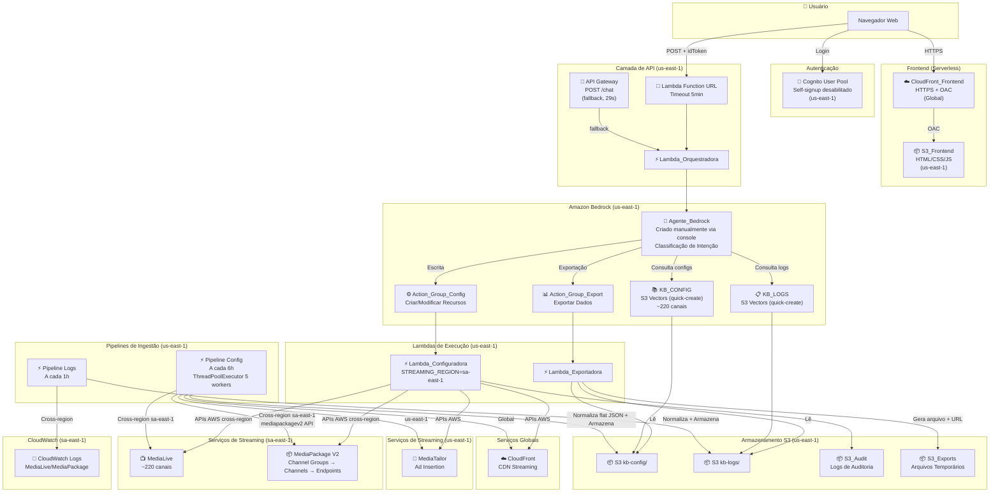
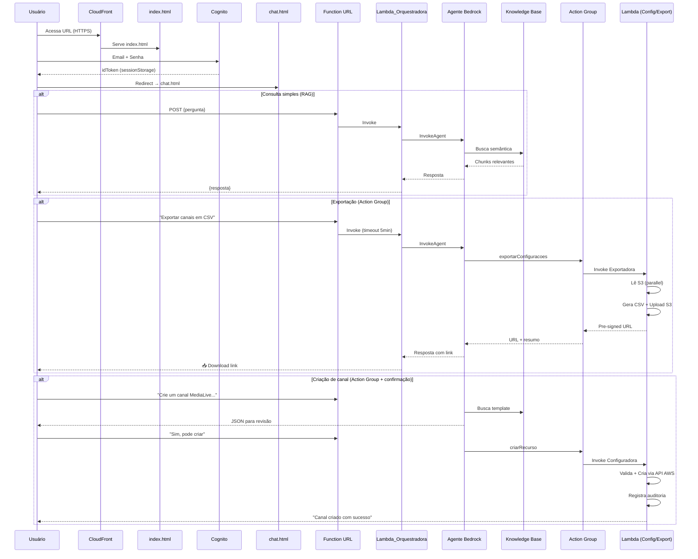
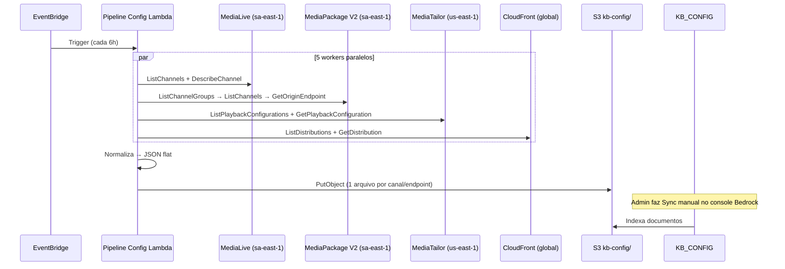

# Documento de Requisitos — Chatbot Inteligente para Gestão de Canais de Streaming

## Introdução

Este documento descreve os requisitos para o desenvolvimento de um chatbot inteligente baseado em IA, utilizando Amazon Bedrock, capaz de responder em linguagem natural sobre configurações de canais ao vivo (MediaLive, MediaPackage, MediaTailor e CloudFront), boas práticas de streaming, diagnóstico de erros e geração de relatórios operacionais. O sistema utiliza duas bases de conhecimento RAG independentes — uma para configurações e documentação técnica (KB_CONFIG) e outra para logs e eventos operacionais (KB_LOGS) — orquestradas por um agente Bedrock criado manualmente via console (não via CloudFormation).

A arquitetura é cross-region: a infraestrutura principal (CDK, Cognito, API Gateway, Lambda, Bedrock, MediaTailor) é implantada em **us-east-1**, enquanto os serviços de streaming (MediaLive, MediaPackage V2) operam em **sa-east-1**. O CloudFront é global. O frontend utiliza autenticação via AWS Cognito User Pool com self-signup desabilitado (apenas administradores criam usuários). A comunicação entre o frontend e a Lambda Orquestradora utiliza Lambda Function URL (timeout de 5 minutos) em vez de API Gateway (limitado a 29 segundos) para suportar chamadas de longa duração dos Action Groups do Bedrock.

## Glossário

- **Chatbot**: Interface conversacional que recebe perguntas em linguagem natural e retorna respostas contextualizadas
- **KB_CONFIG**: Base de conhecimento RAG contendo configurações de canais, documentação AWS e boas práticas de streaming
- **KB_LOGS**: Base de conhecimento RAG contendo logs normalizados, histórico de incidentes e classificação de erros
- **Agente_Bedrock**: Componente de orquestração inteligente do Amazon Bedrock responsável por interpretar perguntas, rotear para a base correta e consolidar respostas. Criado manualmente via console Bedrock com quick-create vector store (não via CloudFormation)
- **Function_URL**: URL de função Lambda que expõe a Lambda_Orquestradora diretamente via HTTPS, sem API Gateway, permitindo timeout de até 5 minutos para suportar chamadas de longa duração dos Action Groups
- **API_Gateway**: Serviço AWS que expõe endpoints REST para comunicação entre o frontend e o backend (mantido como fallback, mas o fluxo principal usa Function_URL)
- **Lambda_Orquestradora**: Função AWS Lambda que recebe requisições via Function_URL e invoca o Agente_Bedrock
- **Cognito_User_Pool**: Pool de usuários AWS Cognito para autenticação do frontend. Self-signup desabilitado — apenas administradores criam usuários
- **Pipeline_Ingestao**: Pipeline automatizado que coleta configurações e logs dos serviços AWS e os normaliza para armazenamento no S3. Utiliza ThreadPoolExecutor com 5 workers para execução paralela e retry adaptativo
- **Evento_Estruturado**: Registro de log normalizado contendo: timestamp, canal, severidade, tipo de erro, descrição, causa provável, impacto e recomendação de correção
- **Config_Enriquecida**: Configuração de canal/recurso em formato JSON **flat** (sem chave "dados" aninhada). Todos os campos no nível raiz: channel_id, servico, tipo, nome_canal, estado, regiao, codec_video, resolucoes, bitrates, audio PIDs, caption PIDs, failover settings, etc. Formato otimizado para melhor performance de RAG
- **MediaLive**: Serviço AWS Elemental MediaLive para processamento de vídeo ao vivo (opera em **sa-east-1**)
- **MediaPackage**: Serviço AWS Elemental MediaPackage **V2** (API mediapackagev2) para empacotamento e distribuição de vídeo (opera em **sa-east-1**). Hierarquia: Channel Groups → Channels → Origin Endpoints
- **MediaTailor**: Serviço AWS Elemental MediaTailor para inserção de anúncios e personalização de conteúdo em streams de vídeo (opera em **us-east-1**)
- **CloudFront**: Serviço Amazon CloudFront (CDN) utilizado para distribuição de conteúdo de streaming com baixa latência e alta velocidade de transferência (global, distinto do CloudFront_Frontend que serve a aplicação web)
- **Action_Group_Config**: Grupo de ações do Agente_Bedrock responsável por operações de escrita (criação, modificação e exclusão) em canais e recursos de streaming, distinto dos grupos de consulta (leitura)
- **Lambda_Configuradora**: Função AWS Lambda invocada pelo Action_Group_Config para executar chamadas de criação e modificação de recursos nas APIs MediaLive, MediaPackage V2, MediaTailor e CloudFront. Utiliza variável STREAMING_REGION=sa-east-1 para chamadas cross-region
- **Config_Template**: Configuração JSON existente na KB_CONFIG utilizada como modelo de referência para geração de novas configurações de canais
- **RAG**: Retrieval-Augmented Generation — técnica que combina recuperação de documentos com geração de texto por IA
- **Frontend_Chat**: Interface web de chat com tema escuro profissional e sidebar com ~45 sugestões de perguntas categorizadas. Composta por página de login (index.html) e página de chat (chat.html), hospedada no S3_Frontend e servida via CloudFront_Frontend
- **S3_Frontend**: Bucket Amazon S3 configurado como hospedagem de site estático (Static Website Hosting) para armazenar os arquivos da aplicação Frontend_Chat (HTML, CSS, JS, assets)
- **CloudFront_Frontend**: Distribuição Amazon CloudFront dedicada exclusivamente a servir a aplicação Frontend_Chat com HTTPS, distinta das distribuições CloudFront utilizadas para entrega de conteúdo de streaming
- **Action_Group_Export**: Grupo de ações do Agente_Bedrock responsável por operações de exportação de dados, gerando arquivos filtrados (CSV, JSON) a partir das bases KB_CONFIG e KB_LOGS com base em consultas em linguagem natural do usuário
- **Lambda_Exportadora**: Função AWS Lambda invocada pelo Action_Group_Export para executar consultas filtradas nas bases de conhecimento, formatar os resultados no formato solicitado (CSV ou JSON) e armazenar o arquivo gerado no S3_Exports
- **S3_Exports**: Bucket Amazon S3 dedicado ao armazenamento temporário de arquivos exportados, com URLs pré-assinadas (pre-signed URLs) geradas para permitir o download pelo usuário por tempo limitado
- **S3_Vectors**: Vector store nativo do Amazon Bedrock utilizado pelas Knowledge Bases. Criado via quick-create no console Bedrock (não via CloudFormation devido a instabilidade do suporte CFN)

## Diagrama da Solução

### Fluxo Principal do Usuário

### Fluxo de Ingestão de Dados

## Requisitos Atualizados

### Requisito 1: Interface de Chat do Usuário

**User Story:** Como operador de NOC, eu quero uma interface de chat web com tema escuro profissional, tela de login via Cognito, e sugestões de perguntas categorizadas, para que eu possa obter respostas rápidas sobre canais de streaming.

#### Critérios de Aceitação

1. THE Frontend_Chat SHALL apresentar uma tela de login (index.html) e uma tela de chat (chat.html) separadas
2. THE Frontend_Chat SHALL utilizar AWS Cognito User Pool para autenticação, com self-signup desabilitado
3. WHEN o usuário fizer login com sucesso, THE Frontend_Chat SHALL redirecionar para chat.html e armazenar o idToken no sessionStorage
4. THE chat.html SHALL apresentar uma sidebar com sugestões de perguntas categorizadas (MediaLive, MediaPackage, MediaTailor, CloudFront, Exportações, Criar/Modificar, Conceitos)
5. THE Frontend_Chat SHALL utilizar tema escuro profissional (dark theme)
6. WHEN a resposta do Chatbot contiver URLs, THE Frontend_Chat SHALL renderizar links clicáveis para download
7. THE Frontend_Chat SHALL comunicar com a Lambda_Orquestradora via Lambda Function URL (não API Gateway) para suportar timeout de até 5 minutos
8. THE Frontend_Chat SHALL ser hospedada no S3_Frontend e servida via CloudFront_Frontend com HTTPS e OAC

### Requisito 2: Normalização Flat de Configurações

**User Story:** Como engenheiro de dados, eu quero que as configurações dos canais sejam normalizadas em formato JSON flat com todos os campos relevantes, para que o RAG e a Exportadora funcionem com máxima precisão.

#### Critérios de Aceitação

1. THE Pipeline_Config SHALL normalizar cada canal MediaLive extraindo: todas as resoluções, todos os bitrates, todos os áudios (PIDs, idiomas, codecs), legendas (tipo, PID, idioma), inputs (IDs, nomes, failover), PIDs de vídeo/áudio/PMT, program ID, GOP, framerate, segment length
2. THE Pipeline_Config SHALL normalizar cada endpoint MediaPackage V2 como arquivo separado, incluindo: container type, segment duration, DRM systems, encryption method, startover window, manifest window
3. THE Pipeline_Config SHALL normalizar cada configuração MediaTailor incluindo: ad server URL, video source URL, CDN segment prefix, avail suppression, preroll, stream conditioning
4. THE Pipeline_Config SHALL normalizar cada distribuição CloudFront incluindo: domain name, aliases, origins (com shield region), cache behaviors, CloudFront Functions, logging, SSL protocol
5. ALL normalized JSONs SHALL be flat (no nested "dados" key) with all fields at root level

### Requisito 15: Estimativa de Custos da Infraestrutura

| Componente | Custo Estimado/Mês |
|-----------|-------------------|
| Bedrock (Nova Pro) | ~$30–100 |
| S3 Vectors (KB) | ~$1–5 |
| S3 (5 buckets) | ~$1–5 |
| Lambda (5 funções) | ~$0–5 |
| Cognito | ~$0 (free tier) |
| CloudFront (Frontend) | ~$1–5 |
| EventBridge | ~$0 |
| **Total** | **~$35–125/mês** |
